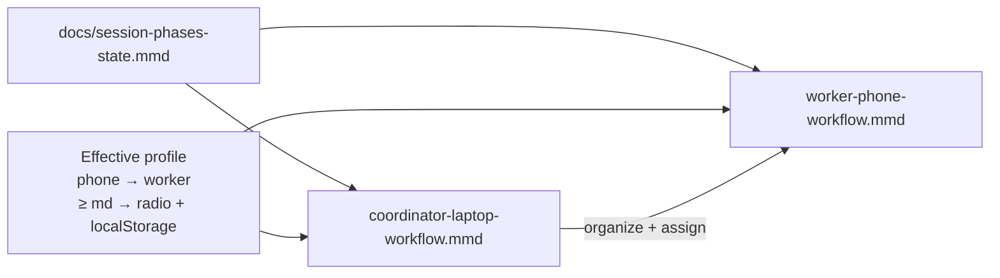
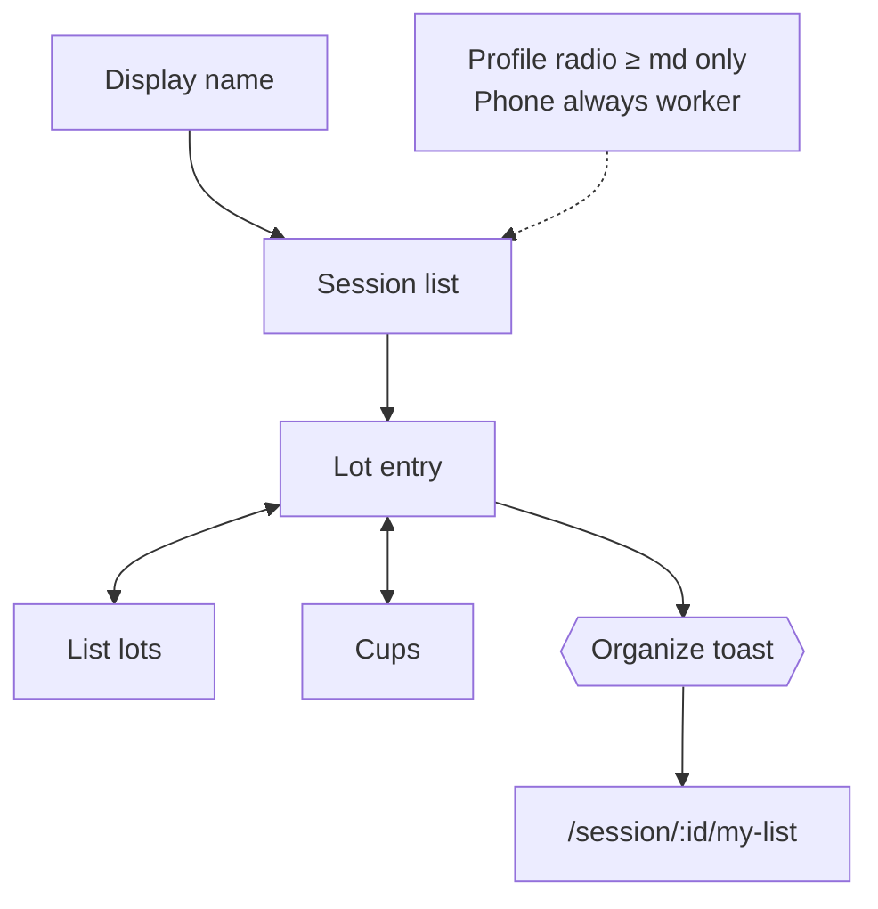

# Workflow diagrams — desktop coordinator vs phone worker

**Feature:** `diff-workflows-for-desktop-and-phone` · [#90](https://github.com/dcvezzani/brick-counter-coordinator-02/issues/90)  
**AIDLC phase:** Plan  
**Last updated:** 2026-06-16 (profile + UX review incorporated)

These diagrams split the **user journey** by **workflow profile**. They complement — not replace — the shared **session phase machine** in [docs/session-phases-state.mmd](../../docs/session-phases-state.mmd).

| Diagram | Profile | When it applies | File |
|---------|---------|-----------------|------|
| **Coordinator workflow** | Coordinator | Default on `≥ md`; user may switch via Home radio | [coordinator-laptop-workflow.mmd](./coordinator-laptop-workflow.mmd) |
| **Worker workflow** | Worker | **Always** on phone (`< md`); or user selects Worker on `≥ md` | [worker-phone-workflow.mmd](./worker-phone-workflow.mmd) |

## Profile rules

| Viewport | Effective profile |
|----------|-------------------|
| **Phone (`< md`)** | **Always worker** — ignores stored preference |
| **Tablet / laptop (`≥ md`)** | Home **radio:** Coordinator (default) \| Worker — stored in **`localStorage`** |

## How they relate

- **Same session, same phases** — Coordinator phase gates unchanged.
- **Worker join** — Display name; coordinator assigns lists; unassigned auto-assign.
- **Worker organize** — Route **`/session/:id/my-list`** (not coordinator organizer URL).
- **Push at organize** — Toast **and** sticky banner on lot entry until My list opened; nav **My list** fallback.

## Coordinator (preview)

Full hub → new session → import → count oversight → reconcile → all organizer lists (assign) → export.

[coordinator-laptop-workflow.mmd](./coordinator-laptop-workflow.mmd)

## Worker (preview)

[worker-phone-workflow.mmd](./worker-phone-workflow.mmd)

## Plan → Design handoff

See [ux-design-notes.md](./ux-design-notes.md) for breakpoint matrix, component mapping, and implementer checklist.
