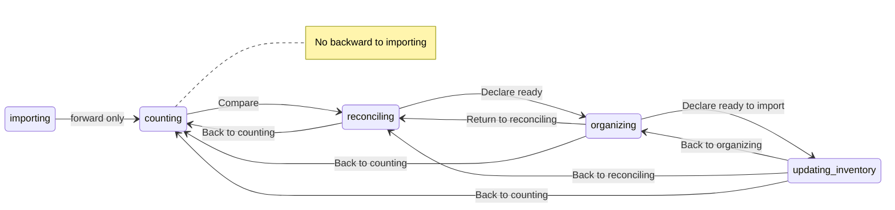

# Tech Spec — Go back to previous state

**AIDLC phase:** Design (one **Unit** per Tech Spec)  
**Grounding:** Implements [product-spec.md](./product-spec.md) (approved 2026-06-15). Aligns with [ADR-0001](../../adr/0001-frontend-vue-js-shadcn-stack.md). Work item: [#53](https://github.com/dcvezzani/brick-counter-coordinator-02/issues/53).

---

## Overview

| Field | Value |
|-------|-------|
| **Unit / scope** | Centralized backward phase navigation in `storyboard-session.js` + `usePhaseNavigation` composable; ViewActions back buttons on Reconciliation, List lots (organizer), List cups; SessionNav phase sync on Lot/Reconcile clicks; ConfirmDialog for multi-step skips; phase diagram + application-views docs; unit tests |
| **Feature** | [go-back-to-previous-state](./) · [#53](https://github.com/dcvezzani/brick-counter-coordinator-02/issues/53) |
| **Product Spec** | [product-spec.md](./product-spec.md) — **Approved** (2026-06-15) |
| **Status** | **Approved for build** |
| **Author** | David Vezzani (with AI draft) |
| **Created** | 2026-06-15 |
| **Last updated** | 2026-06-15 |
| **Approved** | 2026-06-15 — David Vezzani (chat) |

### Product decisions (approved)

Approved in Product Spec Decisions table (2026-06-15). Design implements:

| # | Open question | Proposed default | Rationale |
|---|---------------|------------------|-----------|
| P1 | Full backward chain vs subset | **Full chain** on main lifecycle: `counting` ← `reconciling` ← `organizing` ← `updating_inventory`. **Not** `counting → importing`. **Not** `closed` revival. | Matches coordinator mental model; import is pre-session escape only |
| P2 | SessionNav auto-regress vs dedicated buttons only | **Both:** dedicated ViewActions **"Back to …"** buttons are primary; SessionNav **Lot** and **Reconcile** clicks **auto-regress phase** when nav target phase index &lt; current. **Lots** and **Cups** nav clicks do **not** auto-regress (shared/ambiguous routes). | Fixes desync without guessing organizer vs browse on `/lots` |
| P3 | Confirm on multi-step back | **Yes** when skipping **&gt; 1** phase step (e.g. Export→Organize OK; Export→Count confirm). Reuse `ConfirmDialog` from [#9 ui-feedback-primitives](../00-shipped/ui-feedback-primitives/tech-spec.md). | Reduces accidental long jumps; single-step backs stay frictionless |
| P4 | `importing` backward from `counting` | **Out of scope** — existing import **Back to Home** only. | Product Spec already excludes; no new import regression |

## Context

### Summary

Coordinators can advance session phase (Count → Reconcile → Organize → Export) but cannot reliably **step backward** today. SessionNav still links to earlier routes while `session.phase` stays advanced — e.g. `ListCupsView` "Return to lot entry" calls `router.push(landingRouteLocation(..., 'counting'))` **without** `setPhase`, leaving Reconcile-on-lot desync. Only `organizing → reconciling` is implemented (`returnToReconciling` on organizer List lots).

This Unit adds a **single backward navigation API** (`goBackToPhase`), a **composable** for views and SessionNav (phase set + route push + optional confirm), explicit **ViewActions** back buttons on affected views, **SessionNav** phase sync on Lot/Reconcile, documentation of all allowed backward edges, and unit tests. Forward gates (resolve-all before Organize, etc.) remain unchanged.

### Existing system & documentation

| Artifact | Relevance |
|----------|-----------|
| [product-spec.md](./product-spec.md) | Approved scope — backward transitions, phase+route sync, docs |
| [session-phases-state.mmd](../../docs/session-phases-state.mmd) | Source of truth for phase edges — today only `organizing → reconciling` backward |
| [application-views.md](../../docs/support/application-views.md) | Phase landing routes, SessionNav hide rules, shared-route chapters |
| [storyboard-ui](../00-shipped/storyboard-ui/product-spec.md) | Phase model, SessionNav, SessionProgress |
| [ui-feedback-primitives](../00-shipped/ui-feedback-primitives/tech-spec.md) | `ConfirmDialog.vue` for multi-step confirm |
| [ADR-0001](../../adr/0001-frontend-vue-js-shadcn-stack.md) | Vue 3 JS SFC, Vitest, shadcn-vue |
| `src/lib/storyboard-session.js` | `setPhase`, `landingRouteLocation`, `returnToReconciling`, `sessionNavModel` |
| `src/components/SessionNav.vue` | Plain `RouterLink` — no phase sync |
| `src/components/SessionProgress.vue` | Local duplicate `PHASE_ORDER` — refactor to shared export |
| Bug baseline | `ListCupsView.returnToLotEntry()` — route only, no `setPhase` |

### Out of scope for this Unit

Per approved Product Spec:

- **Forward** arbitrary jumps (Home demo "Jump to phase" unchanged)
- **`closed → anything`** or session restart
- **`counting → importing`** (import remains Home escape only)
- **SessionProgress** clickable past steps (display-only; dedicated buttons + nav sync suffice)
- **Lots / Cups** SessionNav auto-regress
- Wiping session data on backward move
- Coordinator server / WebSocket phase authority
- Playwright e2e

## Architecture

### High-level design

```
┌─────────────────────────────────────────────────────────────────────────┐
│  Views (ViewActions back buttons)                                        │
│  ListCupsView · ReconciliationView · ListLotsView (organizer)          │
└───────────────────────────────┬─────────────────────────────────────────┘
                                │ usePhaseNavigation(sessionId)
                                ▼
┌─────────────────────────────────────────────────────────────────────────┐
│  src/composables/usePhaseNavigation.js                                   │
│  goBack(targetPhase) → confirm if stepDistance > 1 → navigate            │
│  navigateWithPhaseSync(routeLocation) → navTargetPhaseForRoute + goBack   │
└───────────────────────────────┬─────────────────────────────────────────┘
                                │
                                ▼
┌─────────────────────────────────────────────────────────────────────────┐
│  src/lib/storyboard-session.js                                           │
│  PHASE_ORDER · phaseIndex · isEarlierPhase · isAllowedBackwardTarget     │
│  navTargetPhaseForRoute · goBackToPhase · landingRouteLocation           │
│  returnToReconciling → deprecated alias of goBackToPhase(...,'reconciling')│
└───────────────────────────────┬─────────────────────────────────────────┘
                                │
              ┌─────────────────┴─────────────────┐
              ▼                                   ▼
     SessionNav.vue (Lot/Reconcile)      SessionProgress.vue
     @click.prevent + navigateWithPhaseSync   imports PHASE_ORDER
```



### Boundaries

| Layer | Responsibility |
|-------|----------------|
| `src/lib/storyboard-session.js` | Phase ordering, allowed targets, `goBackToPhase`, route→phase mapping for nav |
| `src/composables/usePhaseNavigation.js` | Router integration, confirm orchestration, label helpers |
| `src/components/SessionNav.vue` | Intercept Lot/Reconcile links; phase-sync navigation |
| `src/components/SessionProgress.vue` | Display only; import shared `PHASE_ORDER` / step labels |
| `src/views/ListCupsView.vue` | Fix cups return via composable |
| `src/views/ReconciliationView.vue` | Back buttons per chapter |
| `src/views/ListLotsView.vue` | Organizer back buttons (reconcile + counting) |
| `src/components/ConfirmDialog.vue` (#9) | Multi-step back confirm shell |
| `docs/session-phases-state.mmd` | All backward edges |
| `docs/support/application-views.md` | Backward transition section |
| `tests/unit/**` | Module, view, and SessionNav coverage |

### Integration points

| System | Contract | Notes |
|--------|----------|-------|
| `storyboard-session.js` | `goBackToPhase(sessionId, targetPhase)` → `{ phase, location }` | Sets phase in-memory; returns landing route for router |
| `usePhaseNavigation` | `goBack(targetPhase)`, `navigateWithPhaseSync(to)`, `needsConfirm(current, target)` | Views + SessionNav consume |
| `ConfirmDialog` (#9) | Controlled `v-model:open`, `@confirm` | Copy per transition in composable or view |
| `SessionNav` | Existing `sessionNavModel` visibility rules unchanged | Only click handling changes for `lot` / `reconcile` keys |
| Forward actions | `setPhase` + `landingRouteLocation` in LotEntryView, ReconciliationView, ListLotsView | **Do not modify** gate logic |

## Data

No schema or fixture changes. Backward moves **preserve** lots, reconciliation rows, organizer flags, and cups — same as today's `returnToReconciling` behavior (verified by existing test).

## APIs & contracts

No HTTP API. Module and composable contracts:

### `PHASE_ORDER` (exported constant)

Shared ordered list for progress display and index math:

```javascript
export const PHASE_ORDER = [
  'importing',
  'counting',
  'reconciling',
  'organizing',
  'updating_inventory',
  'closed',
]
```

`SessionProgress.vue` removes local duplicate; imports `PHASE_ORDER` and keeps local `STEPS` labels mapped from phases.

### Phase helpers

| Function | Signature | Behavior |
|----------|-----------|----------|
| `phaseIndex` | `(phase) => number` | Index in `PHASE_ORDER`; `-1` if unknown |
| `isEarlierPhase` | `(targetPhase, currentPhase) => boolean` | `phaseIndex(target) < phaseIndex(current)` |
| `isAllowedBackwardTarget` | `(targetPhase, currentPhase) => boolean` | `isEarlierPhase` **and** target not in `['importing', 'closed']` **and** current not `closed` |
| `backwardStepDistance` | `(targetPhase, currentPhase) => number` | `phaseIndex(current) - phaseIndex(target)` when allowed; else `0` |
| `needsBackwardConfirm` | `(targetPhase, currentPhase) => boolean` | `backwardStepDistance > 1` |

### `navTargetPhaseForRoute(routeName, query = {})`

Maps a SessionNav or router destination to the **phase that route represents** for sync purposes:

| `routeName` | `query` | Target phase |
|-------------|---------|--------------|
| `session-lot` | — | `counting` |
| `session-reconciliation` | — | `reconciling` |
| `session-lots-organizer` | — | `organizing` |
| `session-lots` | `mode !== 'organizer'` | **`null`** (no auto-regress) |
| `session-cups` | — | **`null`** |
| `home`, `session-import`, other | — | **`null`** |

When target phase is `null`, navigation proceeds **without** phase change (current behavior for ambiguous routes).

### `goBackToPhase(sessionId, targetPhase)`

```javascript
/**
 * @returns {{ phase: string, location: RouteLocationRaw } | null}
 *   null if session missing or transition not allowed
 */
export function goBackToPhase(sessionId, targetPhase) {
  const session = getSession(sessionId)
  if (!session || !isAllowedBackwardTarget(targetPhase, session.phase)) {
    return null
  }
  setPhase(sessionId, targetPhase)
  return {
    phase: targetPhase,
    location: landingRouteLocation(sessionId, targetPhase),
  }
}
```

**Deprecation:** `returnToReconciling(sessionId)` becomes a thin wrapper calling `goBackToPhase(sessionId, 'reconciling')` (keep export for minimal diff; mark `@deprecated` in JSDoc). Call sites may migrate to composable directly in same PR.

### `usePhaseNavigation(sessionIdRef)`

Composable (first in repo under `src/composables/`):

| Return | Type | Behavior |
|--------|------|----------|
| `goBack` | `(targetPhase: string) => void` | If `needsBackwardConfirm`, set confirm state and defer; else `goBackToPhase` + `router.push` |
| `navigateWithPhaseSync` | `(to: RouteLocationRaw) => void` | Resolve target phase via `navTargetPhaseForRoute(to.name, to.query)`; if allowed earlier phase, call `goBack`; else `router.push(to)` |
| `confirmOpen` | `Ref<boolean>` | Bound to `ConfirmDialog` |
| `pendingTargetPhase` | `Ref<string \| null>` | Target awaiting confirm |
| `confirmBack` | `() => void` | On confirm: complete pending `goBackToPhase` + navigate |
| `cancelBack` | `() => void` | Close dialog; clear pending |
| `backButtonLabel` | `(targetPhase: string) => string` | e.g. `'Back to counting'` using SessionProgress vocabulary |

**Confirm copy defaults:**

| Transition (examples) | `title` | `description` |
|-----------------------|---------|-----------------|
| Any multi-step | `Go back to an earlier step?` | `You'll return to **{label}**. Your counted lots and progress so far are kept.` |
| Export → Count (3 steps) | same | same (distance &gt; 1) |

Use `confirmVariant="default"` (not destructive) — data is preserved.

### SessionNav click handling

Replace plain `RouterLink` navigation for items where `item.key === 'lot' || item.key === 'reconcile'`:

1. `@click.prevent` on the link
2. Call `navigateWithPhaseSync(item.to)` from composable scoped to `props.sessionId`

Other nav items remain standard `RouterLink` behavior.

### ViewActions back buttons

| View | Phase context | Buttons | Target phase |
|------|---------------|---------|--------------|
| `ListCupsView` | any phase with cups nav | **Return to lot entry** (existing label) | `counting` |
| `ReconciliationView` | `reconciling` | **Back to counting** (`variant="outline"`) | `counting` |
| `ReconciliationView` | `updating_inventory` | **Back to organizing**, **Back to reconciling** (both outline) | `organizing`, `reconciling` |
| `ListLotsView` | organizer (`?mode=organizer`) | **Return to reconciling** (existing), **Back to counting** (new outline) | `reconciling`, `counting` |

Layout: secondary backs use `variant="outline"`; primary forward CTAs unchanged. Stack in `ViewActions` per [ui-rules.md](../../docs/ui-rules.md) (`min-h-11` on buttons).

**Optional:** `ReconciliationView` export chapter includes both organize (1 step) and reconcile (2 steps) backs — reconcile triggers confirm; organize does not.

### Label vocabulary

Align with SessionProgress labels:

| Phase | Button label |
|-------|--------------|
| `counting` | Back to counting |
| `reconciling` | Back to reconciling |
| `organizing` | Back to organizing |
| `updating_inventory` | *(not a back target — export chapter uses organize/reconcile/counting targets)* |

## UI / client

### Stack

| Layer | Choice |
|-------|--------|
| Phase logic | Pure functions in `storyboard-session.js` |
| Navigation UX | `usePhaseNavigation` composable + `ConfirmDialog` |
| Actions | shadcn `Button` in `ViewActions` |
| SessionNav | Existing responsive dual nav (md top / mobile bottom) |

### Accessibility

- Back buttons: visible text labels (not icon-only)
- `ConfirmDialog`: inherits alert-dialog roles from #9
- Keyboard: SessionNav links remain focusable; `@click.prevent` still activates on Enter via native link behavior — verify in SessionNav tests

### Target files (after Build)

```
src/
├── lib/
│   └── storyboard-session.js          # MODIFY — PHASE_ORDER, helpers, goBackToPhase
├── composables/
│   └── usePhaseNavigation.js          # NEW
├── components/
│   ├── SessionNav.vue                 # MODIFY — Lot/Reconcile phase sync
│   └── SessionProgress.vue            # MODIFY — import PHASE_ORDER
└── views/
    ├── ListCupsView.vue               # MODIFY — composable goBack
    ├── ReconciliationView.vue         # MODIFY — back buttons + confirm
    └── ListLotsView.vue               # MODIFY — Back to counting

docs/
├── session-phases-state.mmd           # MODIFY — backward edges
└── support/
    └── application-views.md           # MODIFY — backward transitions section

tests/unit/
├── lib/storyboard-session.test.js     # MODIFY — phase helpers, goBackToPhase
├── composables/usePhaseNavigation.test.js  # NEW
├── components/SessionNav.test.js      # MODIFY — phase sync on Lot/Reconcile
└── views/
    ├── ListCupsView.test.js           # MODIFY — assert phase counting
    ├── ReconciliationView.test.js     # NEW or extend if exists
    └── ListLotsView.test.js           # NEW or extend — organizer back buttons
```

### File ownership

| File | Owner | Change type |
|------|-------|-------------|
| `storyboard-session.js` | This Unit | Add exports; deprecate alias |
| `usePhaseNavigation.js` | This Unit | New |
| `SessionNav.vue` | This Unit | Nav click intercept |
| `SessionProgress.vue` | This Unit | Import shared constant |
| `ListCupsView.vue` | This Unit | Bug fix + composable |
| `ReconciliationView.vue` | This Unit | Back buttons |
| `ListLotsView.vue` | This Unit | Back to counting |
| `session-phases-state.mmd` | This Unit | Diagram edges |
| `application-views.md` | This Unit | Backward section |
| `LotEntryView.vue` | **No change** | Forward only |
| `HomeView.vue` | **No change** | Demo jump unchanged |

## Security & privacy

Client-only storyboard; backward navigation mutates in-memory session state only. No new network surface.

## Acceptance criteria (for Review)

### Phase module

- [ ] `PHASE_ORDER` exported from `storyboard-session.js`; `SessionProgress` imports it (no duplicate constant)
- [ ] `phaseIndex`, `isEarlierPhase`, `isAllowedBackwardTarget`, `backwardStepDistance`, `needsBackwardConfirm` behave per matrix below
- [ ] `goBackToPhase` sets phase and returns correct `landingRouteLocation` for each allowed target
- [ ] `goBackToPhase` returns `null` for disallowed targets (`importing`, `closed`, forward, same phase)
- [ ] `returnToReconciling` delegates to `goBackToPhase(sessionId, 'reconciling')`; organizer flags preserved
- [ ] `navTargetPhaseForRoute('session-lot')` → `counting`; `session-reconciliation` → `reconciling`; `session-lots` without organizer → `null`

### Composable & confirm

- [ ] `usePhaseNavigation.goBack('counting')` from `reconciling` navigates without confirm (1 step)
- [ ] `goBack('counting')` from `updating_inventory` opens `ConfirmDialog` before navigate (3 steps)
- [ ] `goBack('organizing')` from `updating_inventory` navigates without confirm (1 step)
- [ ] Confirm **Cancel** leaves phase unchanged; **Confirm** completes navigation

### Views

- [ ] `ListCupsView` "Return to lot entry" sets phase to `counting` **and** navigates to lot route (fixes desync bug)
- [ ] `ReconciliationView` (`reconciling`) shows **Back to counting**; click regresses phase
- [ ] `ReconciliationView` (`updating_inventory`) shows **Back to organizing** and **Back to reconciling**
- [ ] `ListLotsView` organizer shows **Back to counting** plus existing **Return to reconciling**

### SessionNav

- [ ] From `reconciling`, clicking **Lot** sets phase to `counting` and navigates to lot route
- [ ] From `organizing`, clicking **Reconcile** sets phase to `reconciling`
- [ ] From `updating_inventory`, clicking **Lot** opens confirm (multi-step) before `counting`
- [ ] Clicking **Lots** or **Cups** does **not** change phase when current phase is advanced

### Forward regression guard

- [ ] Existing forward paths unchanged: Compare → reconciling, Declare ready to organize, Declare ready to import, Mark complete → closed
- [ ] No new nav path to skip reconcile gates (e.g. Count → Organize without reconcile)

### Documentation

- [ ] `session-phases-state.mmd` lists all backward edges in § Architecture diagram
- [ ] `application-views.md` has **Backward phase transitions** section with allowed edges and confirm rule

### CI

- [ ] `npm test` and `npm run build` pass
- [ ] PR references [#53](https://github.com/dcvezzani/brick-counter-coordinator-02/issues/53)

### Allowed backward matrix (reference)

| Current phase | Allowed targets | Confirm? |
|---------------|-----------------|----------|
| `reconciling` | `counting` | No |
| `organizing` | `reconciling`, `counting` | No for reconcile; **Yes** for counting |
| `updating_inventory` | `organizing`, `reconciling`, `counting` | No for organize; **Yes** for reconcile and counting |
| `counting` | *(none on main chain)* | — |
| `importing`, `closed` | *(none)* | — |

## Testing approach

| Layer | What we prove | Notes |
|-------|----------------|-------|
| Unit | `PHASE_ORDER` helpers | Pure functions in `storyboard-session.test.js` |
| Unit | `goBackToPhase` + landing routes | Each allowed edge; null on disallowed |
| Unit | `returnToReconciling` preservation | Extend existing organizer flag test |
| Unit | `navTargetPhaseForRoute` | Lot, reconcile, lots browse vs organizer, cups |
| Unit | `usePhaseNavigation` | Mock router; confirm gating by step distance |
| Component | `SessionNav` Lot/Reconcile sync | Mount with phases; spy router push + session phase |
| View | `ListCupsView` | After click, `getSession().phase === 'counting'` |
| View | `ReconciliationView` | Back buttons visible per phase; click handlers |
| View | `ListLotsView` organizer | Back to counting + return to reconciling |
| E2E / manual | Full walkthrough | Validate phase from [#53](https://github.com/dcvezzani/brick-counter-coordinator-02/issues/53) success criteria |
| Integration | N/A | Storyboard in-memory only |

**Test conventions:**

- `beforeEach`: `__resetSessionsForTests()` + `createDemoSession()`
- Advance phase with `setPhase` before backward assertions
- `ConfirmDialog` stub or trigger confirm/cancel via composable refs
- SessionNav tests: `vi.spyOn(router, 'push')` and assert session phase after click

**Example scenarios:**

```javascript
it('goBackToPhase sets counting from reconciling', () => {
  createDemoSession()
  setPhase(DEMO_SESSION_ID, 'reconciling')
  const result = goBackToPhase(DEMO_SESSION_ID, 'counting')
  expect(result.phase).toBe('counting')
  expect(getSession(DEMO_SESSION_ID).phase).toBe('counting')
  expect(result.location).toEqual(landingRouteLocation(DEMO_SESSION_ID, 'counting'))
})

it('needsBackwardConfirm when export to count', () => {
  expect(needsBackwardConfirm('counting', 'updating_inventory')).toBe(true)
  expect(needsBackwardConfirm('organizing', 'updating_inventory')).toBe(false)
})

it('ListCupsView return sets phase to counting', async () => {
  createDemoSession()
  setPhase(DEMO_SESSION_ID, 'reconciling')
  // mount, click Return to lot entry
  expect(getSession(DEMO_SESSION_ID).phase).toBe('counting')
})
```

## Rollout & operations

### Rollout plan

1. ~~Human approves this Tech Spec~~ — **Done** (2026-06-15)
2. Implement on feature branch; `npm test` + `npm run build`
3. `/review` against acceptance criteria
4. Merge to `main` when Validate passes

### Monitoring & observability

N/A — local storyboard client.

### Rollback

Revert merge; backward controls disappear; prior partial behavior (`returnToReconciling` only) restored.

## Risks & open technical questions

| Risk / question | Mitigation or owner |
|-----------------|---------------------|
| First composable in repo | Small, focused API; pattern for future session UX |
| SessionNav `@click.prevent` + RouterLink | Test keyboard activation; keep `href` for middle-click/open-new-tab if feasible (`@click` only prevents default left-click navigation) |
| Shared `/lots` route ambiguity | Explicit `null` in `navTargetPhaseForRoute` — no auto-regress on Lots nav |
| Reconciliation route serves two phases | Nav **Reconcile** always targets `reconciling` phase (regress from export) |
| `returnToReconciling` callers | Wrapper preserved; ListLotsView may call composable directly |

### Open technical questions (for human)

| # | Question | Recommendation |
|---|----------|----------------|
| T1 | Middle-click SessionNav Lot opens new tab without composable — acceptable? | **Yes** — edge case; in-session left-click is primary |
| T2 | Single shared `ConfirmDialog` in composable vs per-view | **Composable-owned** — one dialog instance per view using composable |
| T3 | Rename "Return to lot entry" → "Back to counting"? | **Keep label** on cups view for now; behavior fixes phase (less churn) |
| T4 | Export chapter: show both reconcile + organizing backs? | **Yes** — per product scenarios |

### Blockers

| Blocker | Status |
|---------|--------|
| Product Spec approval (P1–P4) | **Approved** (2026-06-15) |
| Tech Spec approval | **Approved** (2026-06-15) |
| #9 `ConfirmDialog` shipped | **Met** — on `main` |

## Design review passes (merged findings)

### Architecture

- **Single source of truth:** `PHASE_ORDER` and `goBackToPhase` in `storyboard-session.js` keeps phase math next to `setPhase` / `landingRouteLocation` — correct boundary for future server-owned phase sync.
- **Composable as orchestration:** Views should not call `setPhase` + `router.push` ad hoc for backward moves; `usePhaseNavigation` centralizes confirm gating.
- **Nav sync is conservative:** Only Lot and Reconcile map unambiguously to phases; Lots/Cups left unchanged avoids wrong organizer/browse regressions.
- **Deprecation path:** Thin `returnToReconciling` wrapper avoids breaking existing test name while steering new code to `goBackToPhase`.
- **Advisory:** Export `SESSION_PROGRESS_STEPS` from same module later if label duplication becomes painful — not required for this Unit.

### Frontend

- Matches ADR-0001 (Vue 3 JS, composable pattern, shadcn Button, ConfirmDialog #9).
- ViewActions `variant="outline"` for secondary backs matches existing organizer "Return to reconciling" pattern.
- SessionNav intercept limited to two keys — minimal UX behavior change.
- **Advisory:** Consider `data-testid` on back buttons (`back-to-counting`, etc.) for stable view tests.
- **Advisory:** Mobile SessionNav bottom bar — ensure confirm dialog z-index above fixed nav (ConfirmDialog portal should suffice).

### Backend / API

- N/A — skipped (in-memory storyboard only). Future coordinator should mirror `isAllowedBackwardTarget` rules server-side.

### Testing

- Extend existing `storyboard-session.test.js` and `ListCupsView.test.js` — high value for reported bug.
- New `usePhaseNavigation.test.js` proves confirm threshold without mounting full views.
- SessionNav tests critical for nav sync regression — add cases per phase matrix.
- Mock router + real session module preferred over mocking `goBackToPhase` in view tests.
- No Playwright — consistent with repo ADR and Product Spec.

### CI / deploy

- Existing `.github/workflows/ci.yml` runs `npm ci`, `npm test`, `npm run build` on PR — no workflow changes.

## Change history

| Date | Author | Changes |
|------|--------|---------|
| 2026-06-15 | AI draft | Initial Tech Spec for go-back-to-previous-state (#53) |
| 2026-06-15 | David Vezzani | Approved for build (chat) |

## Related documents

- [product-spec.md](./product-spec.md)
- [session-phases-state.mmd](../../docs/session-phases-state.mmd)
- [application-views.md](../../docs/support/application-views.md)
- [storyboard-ui product-spec](../00-shipped/storyboard-ui/product-spec.md)
- [ui-feedback-primitives tech-spec](../00-shipped/ui-feedback-primitives/tech-spec.md)
- [ADR-0001](../../adr/0001-frontend-vue-js-shadcn-stack.md)
- [ui-rules.md](../../docs/ui-rules.md)
- [#53](https://github.com/dcvezzani/brick-counter-coordinator-02/issues/53)
