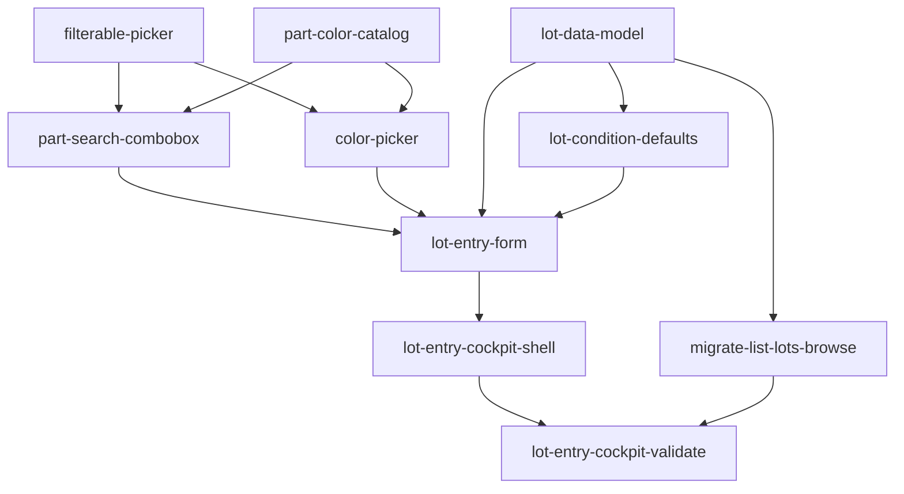

# Lot entry cockpit — sub-features

**Parent:** [#10 Lot entry cockpit](https://github.com/dcvezzani/brick-counter-coordinator-02/issues/10) · [product-spec.md](../product-spec.md)

Ten child features under `feature/lot-entry-cockpit/sub-features/<slug>/`, each with its own Product Spec, GitHub issue, git branch, and worktree — mirroring [#5 consolidate-and-clean-ui](../../00-shipped/consolidate-and-clean-ui/learn-notes.md) parallel delivery.

## Index

| Order | Slug | Wave | Intent | Depends on | Issue | Branch | Worktree |
|-------|------|------|--------|------------|-------|--------|----------|
| 1 | [filterable-picker](./filterable-picker/product-spec.md) | A | Port shared filterable dropdown (search panel, keyboard, deb… | — | [#58](https://github.com/dcvezzani/brick-counter-coordinator-02/issues/58) | `feature/lot-entry-cockpit-filterable-picker` | `/Users/dcvezzani/personal-projects/lego/brick-counter-coordinator-02-worktrees/filterable-picker` |
| 2 | [part-color-catalog](./part-color-catalog/product-spec.md) | A | Storyboard catalog: searchParts, lookupPart, resolvePartId, … | — | [#59](https://github.com/dcvezzani/brick-counter-coordinator-02/issues/59) | `feature/lot-entry-cockpit-part-color-catalog` | `/Users/dcvezzani/personal-projects/lego/brick-counter-coordinator-02-worktrees/part-color-catalog` |
| 3 | [part-search-combobox](./part-search-combobox/product-spec.md) | B | Part picker: search by number/name → stores part id; shows r… | `filterable-picker`, `part-color-catalog` | [#60](https://github.com/dcvezzani/brick-counter-coordinator-02/issues/60) | `feature/lot-entry-cockpit-part-search-combobox` | `/Users/dcvezzani/personal-projects/lego/brick-counter-coordinator-02-worktrees/part-search-combobox` |
| 4 | [color-picker](./color-picker/product-spec.md) | B | Color picker: search by name → stores color id; swatch in tr… | `filterable-picker`, `part-color-catalog` | [#61](https://github.com/dcvezzani/brick-counter-coordinator-02/issues/61) | `feature/lot-entry-cockpit-color-picker` | `/Users/dcvezzani/personal-projects/lego/brick-counter-coordinator-02-worktrees/color-picker` |
| 5 | [lot-data-model](./lot-data-model/product-spec.md) | A | Lot identity part id + color id + condition + qty; saveLot /… | — | [#62](https://github.com/dcvezzani/brick-counter-coordinator-02/issues/62) | `feature/lot-entry-cockpit-lot-data-model` | `/Users/dcvezzani/personal-projects/lego/brick-counter-coordinator-02-worktrees/lot-data-model` |
| 6 | [lot-condition-defaults](./lot-condition-defaults/product-spec.md) | B | Session condition rules (new/used/mixed); resolveDefaultLotC… | `lot-data-model` | [#63](https://github.com/dcvezzani/brick-counter-coordinator-02/issues/63) | `feature/lot-entry-cockpit-lot-condition-defaults` | `/Users/dcvezzani/personal-projects/lego/brick-counter-coordinator-02-worktrees/lot-condition-defaults` |
| 7 | [lot-entry-form](./lot-entry-form/product-spec.md) | C | Four-field form: part, color, condition, count (+/−); Save +… | `part-search-combobox`, `color-picker`, `lot-data-model`, `lot-condition-defaults` | [#64](https://github.com/dcvezzani/brick-counter-coordinator-02/issues/64) | `feature/lot-entry-cockpit-lot-entry-form` | `/Users/dcvezzani/personal-projects/lego/brick-counter-coordinator-02-worktrees/lot-entry-form` |
| 8 | [lot-entry-cockpit-shell](./lot-entry-cockpit-shell/product-spec.md) | D | Replace read-only table on LotEntryView with compact worker … | `lot-entry-form` | [#65](https://github.com/dcvezzani/brick-counter-coordinator-02/issues/65) | `feature/lot-entry-cockpit-lot-entry-cockpit-shell` | `/Users/dcvezzani/personal-projects/lego/brick-counter-coordinator-02-worktrees/lot-entry-cockpit-shell` |
| 9 | [migrate-list-lots-browse](./migrate-list-lots-browse/product-spec.md) | D | List lots shows part / color / condition / qty (drop Lot A/B… | `lot-data-model` | [#66](https://github.com/dcvezzani/brick-counter-coordinator-02/issues/66) | `feature/lot-entry-cockpit-migrate-list-lots-browse` | `/Users/dcvezzani/personal-projects/lego/brick-counter-coordinator-02-worktrees/migrate-list-lots-browse` |
| 10 | [lot-entry-cockpit-validate](./lot-entry-cockpit-validate/product-spec.md) | E | Parent #10 Validate scorecard; update docs/ui-rules.md worke… | `lot-entry-cockpit-shell`, `migrate-list-lots-browse` | [#67](https://github.com/dcvezzani/brick-counter-coordinator-02/issues/67) | `feature/lot-entry-cockpit-lot-entry-cockpit-validate` | `/Users/dcvezzani/personal-projects/lego/brick-counter-coordinator-02-worktrees/lot-entry-cockpit-validate` |

## Dependency graph



## Parallel waves

| Wave | Slugs | Notes |
|------|-------|-------|
| **A** | filterable-picker, part-color-catalog, lot-data-model | No cross-deps; three worktrees in parallel |
| **B** | part-search-combobox, color-picker, lot-condition-defaults | Rebase on merged Wave A PRs as needed |
| **C** | lot-entry-form | Needs Wave B + lot-data-model |
| **D** | lot-entry-cockpit-shell, migrate-list-lots-browse | Parallel after C (shell) and A (list lots data) |
| **E** | lot-entry-cockpit-validate | After integration of D |

## Integration merge order (recommended)

1. Wave **A** (any order): filterable-picker → part-color-catalog → lot-data-model (merge conflicts unlikely — distinct paths).
2. Wave **B**: part-search-combobox, color-picker, lot-condition-defaults.
3. Wave **C**: lot-entry-form.
4. Wave **D**: lot-entry-cockpit-shell, migrate-list-lots-browse (parallel).
5. Wave **E**: lot-entry-cockpit-validate.
6. Parent integration PR: `feature/lot-entry-cockpit` → `main`.

## AIDLC per child

From each worktree (see map below):

| Phase | Command |
|-------|---------|
| Plan | `/plan` — **done** (Product Spec in this folder) |
| Design | `/design <slug>` → `tech-spec.md` in slug folder or parent orchestration |
| Build | `/build` |
| Review | `/review` |
| Ship | `/ship` (child Validate where applicable) |
| Learn | `/learn` |

**PR target:** `feature/lot-entry-cockpit` (parent integration branch), not `main`.

Each worktree includes `AIDLC.md` with file ownership for that child.

## Git worktrees

Create from main repo (on branch `feature/lot-entry-cockpit`):

```bash
cd /Users/dcvezzani/personal-projects/lego/brick-counter-coordinator-02
for slug in filterable-picker part-color-catalog part-search-combobox color-picker lot-data-model lot-condition-defaults lot-entry-form lot-entry-cockpit-shell migrate-list-lots-browse lot-entry-cockpit-validate; do
  git worktree add "../brick-counter-coordinator-02-worktrees/$slug" -b "feature/lot-entry-cockpit-$slug" feature/lot-entry-cockpit
done
```

### `git worktree list`

```
/Users/dcvezzani/personal-projects/lego/brick-counter-coordinator-02                                       631b89a [feature/lot-entry-cockpit]
/Users/dcvezzani/personal-projects/lego/brick-counter-coordinator-02-worktrees/color-picker                f5f7e3a [feature/lot-entry-cockpit-color-picker]
/Users/dcvezzani/personal-projects/lego/brick-counter-coordinator-02-worktrees/filterable-picker           7d3be47 [feature/lot-entry-cockpit-filterable-picker]
/Users/dcvezzani/personal-projects/lego/brick-counter-coordinator-02-worktrees/lot-condition-defaults      4e17062 [feature/lot-entry-cockpit-lot-condition-defaults]
/Users/dcvezzani/personal-projects/lego/brick-counter-coordinator-02-worktrees/lot-data-model              c41cc6c [feature/lot-entry-cockpit-lot-data-model]
/Users/dcvezzani/personal-projects/lego/brick-counter-coordinator-02-worktrees/lot-entry-cockpit-shell     a7822bb [feature/lot-entry-cockpit-lot-entry-cockpit-shell]
/Users/dcvezzani/personal-projects/lego/brick-counter-coordinator-02-worktrees/lot-entry-cockpit-validate  54991c9 [feature/lot-entry-cockpit-lot-entry-cockpit-validate]
/Users/dcvezzani/personal-projects/lego/brick-counter-coordinator-02-worktrees/lot-entry-form              153189f [feature/lot-entry-cockpit-lot-entry-form]
/Users/dcvezzani/personal-projects/lego/brick-counter-coordinator-02-worktrees/migrate-list-lots-browse    e8e4227 [feature/lot-entry-cockpit-migrate-list-lots-browse]
/Users/dcvezzani/personal-projects/lego/brick-counter-coordinator-02-worktrees/part-color-catalog          b248ea0 [feature/lot-entry-cockpit-part-color-catalog]
/Users/dcvezzani/personal-projects/lego/brick-counter-coordinator-02-worktrees/part-search-combobox        9840690 [feature/lot-entry-cockpit-part-search-combobox]
```

### Open in Cursor

```bash
cursor /Users/dcvezzani/personal-projects/lego/brick-counter-coordinator-02-worktrees/<slug>
```

Run AIDLC chat commands in that window; open PRs against `feature/lot-entry-cockpit`.

**GitHub issue spec links:** Use `blob/<branch>/…` URLs in issue bodies — not relative `feature/…` paths. See [docs/github-issues.md](../../../docs/github-issues.md).

## Sibling port map

| Child | Source (brick-counter-coordinator) |
|-------|-----------------------------------|
| filterable-picker | `FilterablePicker.vue`, `filterable-picker.js` |
| part-search-combobox | `PartSearchCombobox.vue` |
| color-picker | `ColorPicker.vue`, `bricklink-colors.js` |
| lot-data-model | `useFixtureSession` saveLot / lotKey |
| lot-condition-defaults | `lot-entry-defaults.js` |
| lot-entry-form | `LotForm.vue` (no swipe input) |