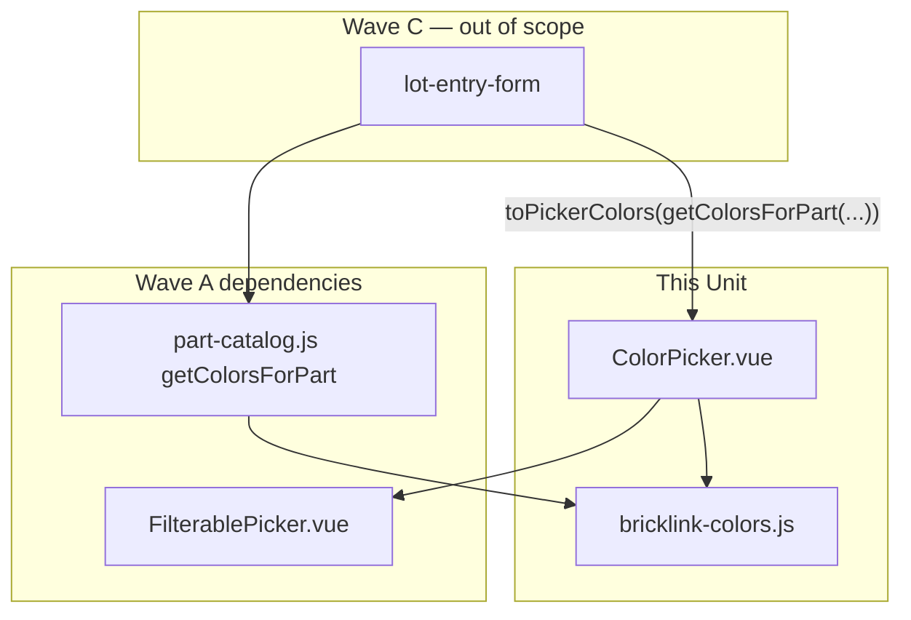

# Tech Spec — Unit 1: Color picker

**AIDLC phase:** Design (one **Unit** per Tech Spec)  
**Grounding:** Implements [product-spec.md](./product-spec.md) (approved 2026-06-15). Aligns with [ADR-0001](../../../../adr/0001-frontend-vue-js-shadcn-stack.md). Parent context: [lot-entry-cockpit product-spec](../../product-spec.md) · [#10](https://github.com/dcvezzani/brick-counter-coordinator-02/issues/10).

---

## Overview

| Field | Value |
|-------|-------|
| **Unit / scope** | Port `ColorPicker.vue` and `bricklink-colors.js` swatch/catalog-mapping helpers; wire to `getColorsForPart` from [#59 part-color-catalog](../part-color-catalog/tech-spec.md); unit tests for disabled state, color id v-model, swatch fallback |
| **Feature** | [color-picker](./) · child of [#10](https://github.com/dcvezzani/brick-counter-coordinator-02/issues/10) |
| **Product Spec** | [product-spec.md](./product-spec.md) — **Approved** |
| **Child work item** | [#61](https://github.com/dcvezzani/brick-counter-coordinator-02/issues/61) |
| **Status** | **Approved for build** |
| **Author** | David Vezzani (with AI draft) |
| **Created** | 2026-06-15 |
| **Last updated** | 2026-06-15 |
| **Approved** | 2026-06-15 — David Vezzani (chat) |
| **PR target** | `feature/lot-entry-cockpit` (integration branch) — **not** `main` |

## Context

### Summary

Deliver a **searchable color picker** for coordinator-02: after a part is chosen, the worker filters colors by name and selects a **BrickLink color id** (`number` v-model) with **swatches** in the trigger and list rows. Port prior art from sibling `ColorPicker.vue` and `bricklink-colors.js`, wrapping Wave A `FilterablePicker` and consuming Wave A `getColorsForPart` from `part-catalog.js`.

This Unit is **Wave B** — no lot save, condition defaults, or `LotEntryView` shell. Parent [#64 lot-entry-form](../lot-entry-form/product-spec.md) composes this picker with `partId` and session context.

### Existing system & documentation

| Artifact | Relevance |
|----------|-----------|
| [product-spec.md](./product-spec.md) | Approved scope — port + catalog wire + swatch |
| [AIDLC.md](./AIDLC.md) | File ownership; branch `feature/lot-entry-cockpit-color-picker` |
| [filterable-picker tech-spec](../filterable-picker/tech-spec.md) | `FilterablePicker.vue`, `defaultContainsFilter`, slots contract |
| [part-color-catalog tech-spec](../part-color-catalog/tech-spec.md) | `getColorsForPart(partId, { session })` → `{ colorId, name, hex? }[]` |
| [sub-features/README.md](../README.md) | Wave B; depends on Wave A filterable-picker + part-color-catalog |
| [ADR-0001](../../../../adr/0001-frontend-vue-js-shadcn-stack.md) | Vue 3 + JS + shadcn-vue + Vitest |
| Sibling prior art | [`ColorPicker.vue`](https://github.com/dcvezzani/brick-counter-coordinator/blob/main/src/components/ColorPicker.vue), [`bricklink-colors.js`](https://github.com/dcvezzani/brick-counter-coordinator/blob/main/src/lib/bricklink-colors.js), sibling tests |

### Out of scope for this Unit

Per approved Product Spec and [AIDLC.md](./AIDLC.md) ownership:

- Part search, lot save, condition defaults, quantity stepper — sibling children
- `LotEntryView` / counting cockpit shell ([#65](../lot-entry-cockpit-shell/product-spec.md))
- `src/lib/part-catalog.js` or fixture files (owned by [#59](../part-color-catalog/tech-spec.md))
- `FilterablePicker.vue` changes (owned by [#58](../filterable-picker/tech-spec.md))
- Live BrickLink API or image URLs
- Playwright e2e
- Clearing `colorId` when `partId` changes (parent form responsibility, per sibling `LotForm`)

## Architecture

### High-level design

```
┌─────────────────────────────────────────────────────────────────┐
│  Consumer (Wave C — not this Unit)                             │
│  lot-entry-form: partId + session → colors computed → ColorPicker │
└───────────────────────────────┬─────────────────────────────────┘
                                │ colors: { id, name, hex? }[]
                                │ v-model: colorId (number | null)
                                ▼
┌─────────────────────────────────────────────────────────────────┐
│  ColorPicker.vue                                                 │
│  ├── wraps FilterablePicker (contains filter, allow-none)        │
│  ├── slots: trigger-leading / option-leading swatches            │
│  └── disabled when colors empty or disabled prop                 │
└───────────────┬─────────────────────────────┬───────────────────┘
                │                             │
                ▼                             ▼
┌───────────────────────────┐   ┌─────────────────────────────────┐
│  FilterablePicker.vue     │   │  bricklink-colors.js            │
│  (#58 — Wave A)           │   │  colorSwatch · toPickerColors   │
└───────────────────────────┘   └─────────────────────────────────┘
                                                ▲
                                                │ catalog rows
┌───────────────────────────────────────────────┴───────────────────┐
│  part-catalog.js — getColorsForPart (#59 — Wave A)                 │
└───────────────────────────────────────────────────────────────────┘
```



### Boundaries

| Layer | Responsibility |
|-------|----------------|
| `src/lib/bricklink-colors.js` | `colorSwatch`, `toPickerColors` — pure helpers; no Vue imports |
| `src/components/ColorPicker.vue` | Presentational picker; maps colors → `PickerOption[]`; swatch slots |
| `src/lib/part-catalog.js` | **Read-only dependency** — `getColorsForPart` (merged from #59) |
| `src/components/FilterablePicker.vue` | **Read-only dependency** — generic dropdown (merged from #58) |
| `lot-entry-form` (#64) | Supplies `colors` from catalog; owns `partId` / `colorId` form state |
| `tests/unit/lib/bricklink-colors.test.js` | Swatch fallback + catalog mapping |
| `tests/unit/components/ColorPicker.test.js` | Picker contract (port sibling) |
| `tests/unit/components/ColorPicker.catalog.test.js` | `getColorsForPart` → `toPickerColors` → mount smoke |

### Integration points

| System | Contract | Notes |
|--------|----------|-------|
| `FilterablePicker` | `v-model`, `options`, `filterOptions`, slots | `defaultContainsFilter` for color name substring match |
| `getColorsForPart` | `(partId, { session }) → { colorId, name, hex? }[]` | Rebase onto #59 merge before Build |
| `toPickerColors` | catalog rows → `{ id, name, hex? }[]` | Maps `colorId` → `id` for sibling parity |
| Downstream form (#64) | `:colors="pickerColors"` `v-model="colorId"` `:disabled` optional | Pass `[]` when `partId` empty → disabled per Product Spec |
| CI | `npm test` / `npm run build` | PR to `feature/lot-entry-cockpit` |

### Port adaptation (sibling → coordinator-02)

| Sibling | Coordinator-02 change |
|---------|------------------------|
| `colors` items use `{ id, name, hex }` | Parent maps via `toPickerColors(getColorsForPart(...))` where catalog uses `colorId` |
| `src/components/__tests__/ColorPicker.spec.js` | Port to `tests/unit/components/ColorPicker.test.js` |
| Full `bricklink-colors.js` (`filterColors`, `colorsForPartPicker`, …) | **Minimal port** — `colorSwatch` + `toPickerColors` only; filtering delegated to `FilterablePicker` / catalog |
| `useSession().getColorsForPart` inside picker | **No** — keep picker presentational like sibling; catalog wire in parent + catalog integration test |

## Data

### Picker color shape (prop to `ColorPicker`)

| Field | Type | Required | Notes |
|-------|------|----------|-------|
| `id` | `number` | yes | BrickLink color id; emitted via `v-model` |
| `name` | `string` | yes | Display name |
| `hex` | `string` | no | Storyboard swatch; `swatch` alias supported in `colorSwatch` |

### Catalog row shape (from `getColorsForPart`)

| Field | Type | Notes |
|-------|------|-------|
| `colorId` | `number` | Mapped to picker `id` by `toPickerColors` |
| `name` | `string` | |
| `hex` | `string` | optional |

### `toPickerColors(catalogRows)`

| Input | Output |
|-------|--------|
| `Array<{ colorId, name, hex? }>` | `Array<{ id: colorId, name, hex? }>` preserving order |

Empty / null input → `[]`.

## APIs & contracts

### `bricklink-colors.js` exports

| Function | Signature | Behavior |
|----------|-----------|----------|
| `colorSwatch` | `(color: { swatch?: string, hex?: string } \| undefined) => string` | Returns `color.swatch ?? color.hex ?? '#cccccc'` — **must not throw** when color or hex missing |
| `toPickerColors` | `(catalogRows: Array<{ colorId, name, hex? }>) => Array<{ id, name, hex? }>` | Maps catalog API to picker prop shape; `null`/`undefined` → `[]` |

### `ColorPicker.vue` — props

| Prop | Type | Default | Notes |
|------|------|---------|-------|
| `colors` | `Array<{ id: number, name: string, hex?: string }>` | `[]` | Colors for selected part; empty → disabled |
| `modelValue` | `Number \| null` | `null` | Selected color id |
| `disabled` | `Boolean` | `false` | Additional disable (e.g. form read-only) |

### Emits

| Event | Payload | When |
|-------|---------|------|
| `update:modelValue` | `number \| null` | Color or None selected |
| `tabForward` / `tabBackward` | — | Forwarded from `FilterablePicker` for form tab order |

### `defineExpose`

| Method | Behavior |
|--------|----------|
| `focus()` | `pickerRef.focusTrigger()` |
| `focusFilter()` | `pickerRef.focusFilter()` |

### FilterablePicker configuration (match sibling)

| Prop | Value |
|------|-------|
| `filterOptions` | `defaultContainsFilter` (substring on label / id) |
| `allowNone` | `true` |
| `placeholder` | `'Select color'` |
| `emptyPlaceholder` | `'Select a part first'` |
| `filterPlaceholder` | `'Filter colors'` |
| `emptyFilterMessage` | `'No colors match'` |
| `testId` | `'color-picker'` |
| `disabled` | `disabled prop \|\| colors.length === 0` |

### Swatch slots

| Slot | Behavior |
|------|----------|
| `trigger-leading` | `size-5` rounded swatch; dashed border when unselected; `backgroundColor: colorSwatch(selected.data)` |
| `option-leading` | `size-4` swatch per row |
| `none-leading` | Dashed empty swatch for None row |

### Parent wiring contract (for #64 — documented, not implemented here)

```javascript
import { getColorsForPart } from '@/lib/part-catalog'
import { toPickerColors } from '@/lib/bricklink-colors'

const pickerColors = computed(() =>
  partId.value
    ? toPickerColors(getColorsForPart(partId.value, { session }))
    : [],
)
```

```html
<ColorPicker v-model="colorId" :colors="pickerColors" />
```

When `partId` is cleared or changes, parent clears `colorId` (sibling `LotForm` watch).

### `data-testid` contract

Inherited from `FilterablePicker` with `test-id="color-picker"`:

| Element | id |
|---------|-----|
| Trigger swatch | `color-picker-trigger-swatch` |
| Trigger / panel / filter / options | `color-picker-trigger`, `color-picker-panel`, `color-picker-filter`, `color-picker-option-{id}` |

## UI / client

### Stack

| Layer | Choice |
|-------|--------|
| Component | Vue 3 `<script setup>` JavaScript SFC |
| Styling | Tailwind + `cn()` from `@/lib/utils` |
| Dropdown | `FilterablePicker` (Wave A) |
| Touch targets | Inherited `min-h-11` on trigger from `FilterablePicker` |

### Accessibility

- Inherits listbox roles from `FilterablePicker`
- Swatches are decorative; color name + id in option label (`${name} (${id})`)
- Disabled state when no part colors — `disabled` attribute on trigger

### Target files (after Build)

```
src/
├── components/
│   └── ColorPicker.vue           # NEW — port from sibling
└── lib/
    └── bricklink-colors.js       # NEW — colorSwatch + toPickerColors

tests/unit/
├── lib/
│   └── bricklink-colors.test.js  # NEW
└── components/
    ├── ColorPicker.test.js       # NEW — port sibling spec
    └── ColorPicker.catalog.test.js # NEW — getColorsForPart wire smoke
```

**Do not modify** paths outside [AIDLC.md](./AIDLC.md) ownership in this child PR.

## Security & privacy

- Client-only UI; no network or PII.
- Static fixture colors via catalog module; Vue text interpolation for labels.

## Acceptance criteria (for Review)

- [ ] `src/lib/bricklink-colors.js` exports `colorSwatch` and `toPickerColors` per contracts above
- [ ] `colorSwatch(undefined)` and `colorSwatch({})` return `'#cccccc'` without throwing
- [ ] `src/components/ColorPicker.vue` ported; wraps `FilterablePicker` with sibling-equivalent props/slots
- [ ] Picker **disabled** when `colors` is `[]` (covers “disabled until part chosen” when parent passes empty list)
- [ ] `v-model` emits **numeric** color id on selection (e.g. `5` for Red)
- [ ] `allow-none` clears selection to `null`
- [ ] Swatches render in trigger and list when `hex` present; fallback gray when absent
- [ ] `defaultContainsFilter` enables substring match (e.g. `'yel'` matches “Brick Yellow”)
- [ ] `defineExpose({ focus, focusFilter })` works
- [ ] `tests/unit/lib/bricklink-colors.test.js` — swatch fallback + `toPickerColors` mapping
- [ ] `tests/unit/components/ColorPicker.test.js` — port sibling tests (panel, debounce, Enter, disabled, focus)
- [ ] `tests/unit/components/ColorPicker.catalog.test.js` — `getColorsForPart('3001', { session })` → `toPickerColors` → mount shows Red option
- [ ] `npm test` and `npm run build` pass after rebasing on merged #58 + #59
- [ ] No changes outside owned paths except lockfile if needed
- [ ] PR targets `feature/lot-entry-cockpit`; references [#61](https://github.com/dcvezzani/brick-counter-coordinator-02/issues/61) and this Tech Spec

## Testing approach

| Layer | What we prove | Notes |
|-------|----------------|-------|
| Unit (lib) | `colorSwatch` fallback; `toPickerColors` maps `colorId` → `id` | `tests/unit/lib/bricklink-colors.test.js` |
| Unit (component) | Filter/debounce/select/disabled/expose | Port sibling `ColorPicker.spec.js` → `ColorPicker.test.js`; `vi.useFakeTimers()` for 150 ms debounce |
| Unit (catalog wire) | `getColorsForPart` + `toPickerColors` + mount | `ColorPicker.catalog.test.js` with `createDemoSessionSeed()` — proves Product Spec “wire to catalog” |
| Integration | N/A | Form composition validated in #64 |
| E2E / manual | Optional Review | Chrome DevTools MCP when embedded in cockpit (#65) |

**Test conventions:**

- Files under `tests/unit/**/*.test.js`
- Stub `FilterablePicker` only if mount flakiness requires it — prefer full mount like sibling
- Exclude `.claude/**` per `vite.config.js`

## Rollout & operations

### Rollout plan

- Rebase `feature/lot-entry-cockpit-color-picker` onto `feature/lot-entry-cockpit` after Wave A (#58, #59) merges
- Merge child PR into integration branch
- #64 lot-entry-form consumes `ColorPicker` + wiring contract

### Monitoring & observability

N/A — local storyboard client.

### Rollback

Revert child merge on integration branch; no data migration.

## Risks & open technical questions

| Risk / question | Mitigation or owner |
|-----------------|---------------------|
| Wave A not merged before Build | Rebase worktree; catalog/filter tests fail until #58/#59 on integration branch |
| `colorId` vs `id` field mismatch | `toPickerColors` single mapping point; document in parent wiring |
| Parallel Wave B `part-search-combobox` | Distinct file ownership — low conflict risk |
| Sibling port drift | Port tests; cite sibling paths in PR |
| `bricklink-colors-subset.js` vs `bricklink-colors.js` | Catalog owns subset fixture; this Unit owns swatch helper module per #59 Design decision |

### Open technical questions (for human)

| # | Question | Recommendation |
|---|----------|----------------|
| T1 | Port full `filterColors` / `getColorById` from sibling `bricklink-colors.js`? | **No** — YAGNI; catalog + `FilterablePicker` cover filtering |
| T2 | Single `ColorPicker.test.js` vs split catalog wire file? | **Split** — keeps port tests clean; catalog test skipped if `part-catalog` absent until rebase |
| T3 | Accept `colorId` on `v-model` as string from HTML inputs? | **No** — emit `number`; parent normalizes if needed |

### Blockers

| Blocker | Status |
|---------|--------|
| #58 `filterable-picker` merged to `feature/lot-entry-cockpit` | Required before Build — import `FilterablePicker` |
| #59 `part-color-catalog` merged to `feature/lot-entry-cockpit` | Required before catalog wire test passes |

## Design review passes (merged findings)

### Architecture

- **Presentation vs catalog:** Keeping `ColorPicker` presentational (colors prop) matches sibling `LotForm` and avoids importing session into the picker — catalog integration lives in parent + one catalog wire test.
- **Single mapping function:** `toPickerColors` isolates `colorId` → `id` at the catalog boundary; prevents duplicate mapping in form and tests.
- **Dependency direction:** `ColorPicker` → `FilterablePicker` + `bricklink-colors`; no reverse deps; no changes to `part-catalog.js` in this PR.
- **Wave B parallelization:** File ownership distinct from `part-search-combobox` (#60).

### Frontend

- Port matches ADR-0001 (JS SFC, Tailwind, shadcn ecosystem via `FilterablePicker`).
- `defaultContainsFilter` aligns with parent spec “search by color name.”
- Swatch sizes (`size-5` trigger, `size-4` rows) match sibling; dashed border for unselected state aids affordance without images.
- `empty-placeholder="Select a part first"` communicates disabled reason when `colors` is empty.
- **Advisory:** Ensure `option-label` default `${name} (${id})` remains for screen reader clarity.

### Backend / API

- N/A — skipped per orchestration (no server surface).

### Testing

- Port sibling’s seven component tests — covers debounce, contains filter, Enter select, disabled empty colors, focus expose.
- Dedicated `colorSwatch` tests satisfy Product Spec criterion #3 (no throw without image URL / hex).
- Catalog wire test proves `getColorsForPart` contract without waiting for #64 form.
- Fake timers mandatory for debounce assertions (150 ms).
- **Advisory:** `attachTo: document.body` + `wrapper.unmount()` in `afterEach` for focus test cleanup.

### CI / deploy

- Existing `.github/workflows/ci.yml` — `npm test` + `npm run build` on PR to `feature/lot-entry-cockpit`.
- No workflow changes required.

## Change history

| Date | Author | Changes |
|------|--------|---------|
| 2026-06-15 | AI draft | Initial Tech Spec for color-picker (#61) |
| 2026-06-15 | David Vezzani | **Approved for build** (chat) |

## Related documents

- [product-spec.md](./product-spec.md)
- [AIDLC.md](./AIDLC.md)
- [Parent product-spec](../../product-spec.md)
- [filterable-picker tech-spec](../filterable-picker/tech-spec.md)
- [part-color-catalog tech-spec](../part-color-catalog/tech-spec.md)
- [sub-features/README.md](../README.md)
- [ADR-0001](../../../../adr/0001-frontend-vue-js-shadcn-stack.md)
- Sibling prior art: [ColorPicker.vue](https://github.com/dcvezzani/brick-counter-coordinator/blob/main/src/components/ColorPicker.vue), [bricklink-colors.js](https://github.com/dcvezzani/brick-counter-coordinator/blob/main/src/lib/bricklink-colors.js)
- [#61](https://github.com/dcvezzani/brick-counter-coordinator-02/issues/61) · [#10](https://github.com/dcvezzani/brick-counter-coordinator-02/issues/10)
