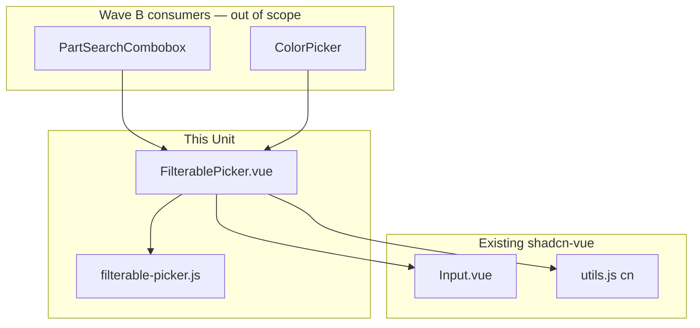

# Tech Spec — Unit 1: Filterable picker (shared dropdown)

**AIDLC phase:** Design (one **Unit** per Tech Spec)  
**Grounding:** Implements [product-spec.md](./product-spec.md) (approved 2026-06-15). Aligns with [ADR-0001](../../../../adr/0001-frontend-vue-js-shadcn-stack.md). Parent context: [lot-entry-cockpit product-spec](../../product-spec.md) · [#10](https://github.com/dcvezzani/brick-counter-coordinator-02/issues/10).

---

## Overview

| Field | Value |
|-------|-------|
| **Unit / scope** | Port shared `FilterablePicker` Vue component and `filterable-picker.js` helpers from sibling [brick-counter-coordinator](https://github.com/dcvezzani/brick-counter-coordinator); unit tests proving filter, debounce, and select contract |
| **Feature** | [filterable-picker](./) · child of [#10](https://github.com/dcvezzani/brick-counter-coordinator-02/issues/10) |
| **Product Spec** | [product-spec.md](./product-spec.md) — **Approved** |
| **Child work item** | [#58](https://github.com/dcvezzani/brick-counter-coordinator-02/issues/58) |
| **Status** | **Approved for build** |
| **Author** | David Vezzani (with AI draft) |
| **Created** | 2026-06-15 |
| **Last updated** | 2026-06-15 |
| **Approved** | 2026-06-15 — David Vezzani (chat) |
| **PR target** | `feature/lot-entry-cockpit` (integration branch) — **not** `main` |

## Context

### Summary

Deliver a **reusable, generic filterable dropdown** for coordinator-02: searchable option panel, debounced filter, keyboard-friendly selection, and slots for downstream part/color pickers. Port prior art from sibling `FilterablePicker.vue` and `filterable-picker.js` with minimal adaptation for coordinator-02 conventions (JavaScript SFCs, `tests/unit/` layout, no `app-config.js` dependency in this child).

This Unit is **Wave A foundation** — no routes, session wiring, or catalog data. Consumers `part-search-combobox` (#60) and `color-picker` (#61) wrap this component in Wave B.

### Existing system & documentation

| Artifact | Relevance |
|----------|-----------|
| [product-spec.md](./product-spec.md) | Approved scope — port + prove filter/select contract |
| [AIDLC.md](./AIDLC.md) | File ownership; branch `feature/lot-entry-cockpit-filterable-picker` |
| [sub-features/README.md](../README.md) | Wave A; no upstream deps; blocks part-search-combobox and color-picker |
| [ADR-0001](../../../../adr/0001-frontend-vue-js-shadcn-stack.md) | Vue 3 + JS + shadcn-vue + Vitest |
| [docs/tech-stack.md](../../../../docs/tech-stack.md) | `tests/unit/` test layout; `@/` alias |
| `src/components/ui/input/` | shadcn-vue `Input` — already installed; used by picker filter field |
| Sibling prior art | [`FilterablePicker.vue`](https://github.com/dcvezzani/brick-counter-coordinator/blob/main/src/components/FilterablePicker.vue), [`filterable-picker.js`](https://github.com/dcvezzani/brick-counter-coordinator/blob/main/src/lib/filterable-picker.js), sibling tests |

### Out of scope for this Unit

Per approved Product Spec and [AIDLC.md](./AIDLC.md) ownership:

- Part-specific or color-specific ranking, swatches, catalog search — `part-search-combobox`, `color-picker`, `part-color-catalog`
- `PartSearchCombobox.vue`, `ColorPicker.vue`, `LotForm.vue`, `LotEntryView` changes
- `config/app-preferences.json` / `src/lib/app-config.js` loader (parent defers; use inline `debounceMs` default here)
- Storybook app or dedicated demo route (unit tests satisfy “minimal demo” criterion)
- BrickLink live API
- Playwright e2e
- Arrow-key list navigation **beyond sibling behavior** (see Risks — product criterion vs prior art)

## Architecture

### High-level design

```
┌─────────────────────────────────────────────────────────────┐
│  Consumer (Wave B — not this Unit)                          │
│  PartSearchCombobox / ColorPicker                           │
│    props: options[], modelValue, filterOptions?, slots       │
└───────────────────────────┬─────────────────────────────────┘
                            │
                            ▼
┌─────────────────────────────────────────────────────────────┐
│  FilterablePicker.vue (presentational)                      │
│  ├── trigger button (min-h-11, aria listbox)                │
│  ├── filter Input (v-model filterQuery)                     │
│  ├── debounced filter → visibleOptions                      │
│  └── option buttons + slots (trigger/option/none leading)   │
└───────────────────────────┬─────────────────────────────────┘
                            │ defaultPrefixFilter / custom
                            ▼
┌─────────────────────────────────────────────────────────────┐
│  filterable-picker.js (pure helpers)                        │
│  defaultPrefixFilter · defaultContainsFilter · findPickerOption │
└─────────────────────────────────────────────────────────────┘
```



### Boundaries

| Layer | Responsibility |
|-------|----------------|
| `src/lib/filterable-picker.js` | Pure filter/lookup helpers — no Vue imports |
| `src/components/FilterablePicker.vue` | Generic picker UI, debounce, panel open/close, v-model |
| `src/components/ui/input` | Generated primitive — do not fork |
| Wave B children | Option lists, custom `filterOptions`, labels, swatches via slots |
| `tests/unit/lib/filterable-picker.test.js` | Helper unit tests |
| `tests/unit/components/FilterablePicker.test.js` | Component contract + debounce |

### Integration points

| System | Contract | Notes |
|--------|----------|-------|
| shadcn-vue `Input` | `v-model` on filter field | `@/components/ui/input` |
| `cn()` | Tailwind class merge | `@/lib/utils.js` |
| Downstream pickers (#60, #61) | `v-model` + `options: PickerOption[]` + optional `filterOptions` | Merge after Wave A lands on `feature/lot-entry-cockpit` |
| CI | `npm test` / `npm run build` | Existing workflow on PR to integration branch |

### Port adaptation (sibling → coordinator-02)

| Sibling | Coordinator-02 change |
|---------|------------------------|
| `import { appConfig } from '@/lib/app-config'` | **Remove** — `debounceMs` prop `default: 150` (same value as sibling `config/app-preferences.json`) |
| `src/components/__tests__/FilterablePicker.spec.js` | Port to `tests/unit/components/FilterablePicker.test.js` |
| `src/lib/__tests__/filterable-picker.spec.js` | Port to `tests/unit/lib/filterable-picker.test.js` |
| TypeScript JSDoc `@import` | Keep JSDoc typedefs; no `lang="ts"` |

All other behavior, props, emits, slots, `data-testid` pattern, and markup should match sibling unless review finds a coordinator-02 convention conflict.

## Data

### `PickerOption` shape (JSDoc typedef in `filterable-picker.js`)

| Field | Type | Required | Notes |
|-------|------|----------|-------|
| `value` | `string \| number` | yes | Stored id emitted via `v-model` |
| `label` | `string` | yes | Display + default filter text |
| `data` | `unknown` | no | Passed on `select` emit as `option.data ?? option` |

No persistence, API payloads, or fixture changes in this Unit.

## APIs & contracts

### `filterable-picker.js` exports

| Function | Signature | Behavior |
|----------|-----------|----------|
| `defaultPrefixFilter` | `(options, query) => PickerOption[]` | Trim/lowercase query; empty query returns all; else label or `String(value)` **starts with** query |
| `defaultContainsFilter` | `(options, query) => PickerOption[]` | Same prep; **includes** match (for color picker Wave B) |
| `findPickerOption` | `(options, value) => PickerOption \| undefined` | `null`/`''` → `undefined` |

### `FilterablePicker.vue` — props

| Prop | Type | Default | Notes |
|------|------|---------|-------|
| `modelValue` | `String \| Number \| null` | `null` | Selected option value |
| `options` | `PickerOption[]` | `[]` | Full list |
| `filterOptions` | `(query, options) => PickerOption[]` | `null` | Overrides `defaultPrefixFilter` |
| `disabled` | `Boolean` | `false` | |
| `allowNone` | `Boolean` | `false` | Shows “None” row |
| `noneLabel` | `String` | `'None'` | |
| `placeholder` | `String` | `'Select…'` | Trigger when unselected |
| `emptyPlaceholder` | `String` | `'No options available'` | When `options` empty |
| `filterPlaceholder` | `String` | `'Filter…'` | |
| `emptyFilterMessage` | `String` | `'No matches for'` | |
| `debounceMs` | `Number` | **`150`** | Inline default (no app-config) |
| `minFilterChars` | `Number` | `0` | Gate visible options |
| `minFilterCharsHint` | `String` | `'Type at least {n} characters to search'` | `{n}` replaced |
| `testId` | `String` | `'filterable-picker'` | Prefix for `data-testid` |

### Emits

| Event | Payload | When |
|-------|---------|------|
| `update:modelValue` | `value \| null` | Option or None selected |
| `select` | `option.data ?? option \| null` | Same as selection |
| `close` | `{ filterQuery, fromSelection }` | Panel closes |
| `tabForward` / `tabBackward` | — | Tab from filter input closes panel and signals focus move |

### Slots

| Slot | Props | Purpose |
|------|-------|---------|
| `trigger-leading` | `{ selected }` | Icon/swatch before trigger label |
| `trigger-label` | `{ selected, label }` | Override trigger text |
| `option-leading` | `{ option }` | Per-row leading (e.g. color swatch) |
| `option-label` | `{ option }` | Override row text |
| `none-leading` | — | Leading for None row |

### `defineExpose`

| Method | Behavior |
|--------|----------|
| `focusTrigger()` | Focus trigger; opens panel |
| `focusFilter()` | Opens panel; focuses filter input |

### Keyboard & pointer behavior (match sibling)

| Input | Action |
|-------|--------|
| Trigger click (closed) | Open panel; focus filter |
| Trigger click (open) | Close panel |
| Trigger focus | Open panel |
| Filter `Enter` | Select **first visible** option (highlighted row uses `bg-accent` on first match) |
| Filter `Escape` | Close panel |
| Filter `Tab` / `Shift+Tab` | Close; emit `tabForward` / `tabBackward` |
| Option click | Select; close |
| Focus leaves root | Close panel |

**Note:** Sibling does **not** implement `ArrowUp`/`ArrowDown` to move highlight — first match is always highlighted. See appendix product ambiguity.

### `data-testid` contract

| Element | Pattern |
|---------|---------|
| Root | `{testId}` |
| Trigger | `{testId}-trigger` |
| Panel | `{testId}-panel` |
| Filter | `{testId}-filter` |
| List | `{testId}-list` |
| Option | `{testId}-option-{value}` |
| None | `{testId}-none` |
| Empty / min-chars | `{testId}-empty`, `{testId}-min-chars` |

## UI / client

### Stack

| Layer | Choice |
|-------|--------|
| Component | Vue 3 `<script setup>` JavaScript SFC |
| Styling | Tailwind + `cn()`; trigger `min-h-11` (mobile touch target per parent policy) |
| Filter control | shadcn-vue `Input` |
| Panel | Absolute positioned popover below trigger (`z-50`, `max-h-40` scroll) |

### Accessibility targets

- Trigger: `aria-expanded`, `aria-haspopup="listbox"`, `role` on list via `role="listbox"` on panel; options `role="option"` + `aria-selected`
- Filter input receives focus on open
- Disabled when `disabled` prop or empty `options`
- Manual a11y spot check in Review (Escape, Enter, focus trap via focusout close)

### Target files (after Build)

```
src/
├── components/
│   └── FilterablePicker.vue      # NEW — port from sibling
└── lib/
    └── filterable-picker.js      # NEW — port from sibling

tests/unit/
├── components/
│   └── FilterablePicker.test.js  # NEW — port + adapt paths
└── lib/
    └── filterable-picker.test.js # NEW — port + adapt paths
```

**Do not modify** paths outside [AIDLC.md](./AIDLC.md) ownership in this child PR.

## Security & privacy

- Client-only UI; no network, auth, or PII.
- Options are caller-supplied data — no HTML injection in labels (Vue text interpolation).

## Acceptance criteria (for Review)

Review traces implementation to this spec. Checklist for Build → Review:

- [ ] `src/lib/filterable-picker.js` exports `defaultPrefixFilter`, `defaultContainsFilter`, `findPickerOption` with sibling-equivalent behavior
- [ ] `src/components/FilterablePicker.vue` ported; **no** `app-config` import; `debounceMs` default `150`
- [ ] `v-model` + `select` + `close` emits match contracts above
- [ ] Custom `filterOptions` prop overrides default filter
- [ ] `minFilterChars` gates visible options and shows hint
- [ ] Trigger `min-h-11`; disabled when options empty or `disabled` prop
- [ ] Slots (`trigger-leading`, `option-leading`, etc.) render for consumers
- [ ] `defineExpose({ focusTrigger, focusFilter })` works
- [ ] `tests/unit/lib/filterable-picker.test.js` — prefix, contains, findPickerOption
- [ ] `tests/unit/components/FilterablePicker.test.js` — panel toggle, debounced filter, Enter select, custom filter, minFilterChars, focusTrigger, click-to-close
- [ ] `npm test` and `npm run build` pass
- [ ] No changes outside owned paths except lockfile if needed
- [ ] PR targets `feature/lot-entry-cockpit`; references [#58](https://github.com/dcvezzani/brick-counter-coordinator-02/issues/58) and this Tech Spec
- [ ] Keyboard: Enter selects; Escape closes (manual or test)
- [ ] Behavior matches sibling for pointer open/close and debounce timing (150 ms)

## Testing approach

| Layer | What we prove | Notes |
|-------|----------------|-------|
| Unit (lib) | Prefix/contains filter and `findPickerOption` | `tests/unit/lib/filterable-picker.test.js` — port sibling spec |
| Unit (component) | Panel open/close, debounce (`vi.useFakeTimers`), Enter selection, custom filter, minFilterChars, exposed focus | `tests/unit/components/FilterablePicker.test.js` — port sibling spec; `attachTo: document.body` for focus tests |
| Integration | N/A | No router/session in this Unit |
| E2E / manual | Optional Review spot check | Chrome DevTools MCP if Review wants visual confirmation; not required for Validate of this child alone |

**Test conventions (coordinator-02):**

- Files under `tests/unit/**/*.test.js` (not `src/**/*.spec.js`)
- `vi.useFakeTimers()` / `vi.advanceTimersByTime(150)` for debounce tests
- Exclude `.claude/**` — already in `vite.config.js`

**Deferred:** Arrow-key navigation tests — not in sibling; add only if product approves enhancement.

## Rollout & operations

### Rollout plan

- Merge child PR into `feature/lot-entry-cockpit`
- Wave B worktrees rebase on integration branch before wrapping pickers
- No feature flag; component unused in routes until #60/#61

### Monitoring & observability

N/A — local storyboard client.

### Rollback

Revert child merge commit on integration branch; no data migration.

## Risks & open technical questions

| Risk / question | Mitigation or owner |
|-----------------|---------------------|
| Sibling port drift over time | Copy tests; cite sibling paths in PR; diff on port |
| `app-config` absent | Inline `150` ms default; centralize later if loader lands |
| Focus tests flaky without `env.d.ts` | Add `jsdom` typing for `document.activeElement` if TS checker complains; or assert panel open without `activeElement` |
| Merge conflict with parallel Wave A children | Distinct paths (`filterable-picker` vs catalog vs lot model) — low risk |
| shadcn `Input` API change | Already used elsewhere in repo; same import path as sibling |

### Open technical questions (for human)

| # | Question | Recommendation |
|---|----------|----------------|
| T1 | Add `env.d.ts` `HTMLElement` narrowing for focus tests? | Optional — port sibling tests as-is; fix only if CI/lint fails |
| T2 | Export `PickerOption` typedef from a shared `types` module for Wave B? | **No** — keep JSDoc in `filterable-picker.js`; consumers import helpers only |
| T3 | Stub `FilterablePicker` in a thin `PickerDemo.vue` on a dev-only route? | **No** — unit tests satisfy Product Spec; avoids route ownership conflict |

### Product ambiguity (not technical — escalate to Product)

| # | Item | Notes |
|---|------|-------|
| P1 | Product Spec success criterion #2: “Arrow keys / Enter select” | Sibling prior art supports **Enter only** (first match highlighted). Confirm whether port should add ArrowUp/ArrowDown or match sibling. |

## Design review passes (merged findings)

### Architecture

- **Single Responsibility:** Pure helpers in `filterable-picker.js`; UI/debounce in SFC — correct split for Wave B reuse.
- **Dependency direction:** Component depends on lib + shadcn primitives only; no session/catalog imports — keeps Wave A parallelizable.
- **No backend:** Correct for this Unit; API contracts are component props/emits only.

### Frontend

- Port matches ADR-0001 (JS SFC, shadcn Input, Tailwind).
- `min-h-11` trigger aligns with parent mobile touch-target policy.
- Slots provide extension points without forking component for color swatches.
- **Advisory:** Consider `aria-activedescendant` if arrow navigation is added later; not required for sibling parity.
- **Advisory:** Panel uses `@mousedown.prevent` on options to avoid focus loss — keep from sibling.

### Backend / API

- N/A — skipped per orchestration instructions.

### Testing

- Port sibling’s seven component tests + three lib tests — appropriate coverage for debounce and selection contract.
- Fake timers mandatory for deterministic debounce assertions.
- Focus tests may need `attachTo: document.body` — include cleanup `wrapper.unmount()` in `afterEach` if added.
- No Playwright — consistent with parent and ADR-0001.

### CI / deploy

- Existing `.github/workflows/ci.yml` runs `npm test` + `npm run build` on PRs — no workflow change required.
- PR base: `feature/lot-entry-cockpit`.

## Change history

| Date | Author | Changes |
|------|--------|---------|
| 2026-06-15 | AI draft | Initial Tech Spec for filterable-picker (#58) |
| 2026-06-15 | David Vezzani | **Approved for build** (chat) |

## Related documents

- [product-spec.md](./product-spec.md)
- [AIDLC.md](./AIDLC.md)
- [Parent product-spec](../../product-spec.md)
- [sub-features/README.md](../README.md)
- [ADR-0001](../../../../adr/0001-frontend-vue-js-shadcn-stack.md)
- [docs/tech-stack.md](../../../../docs/tech-stack.md)
- Sibling prior art: [FilterablePicker.vue](https://github.com/dcvezzani/brick-counter-coordinator/blob/main/src/components/FilterablePicker.vue), [filterable-picker.js](https://github.com/dcvezzani/brick-counter-coordinator/blob/main/src/lib/filterable-picker.js)
- [#58](https://github.com/dcvezzani/brick-counter-coordinator-02/issues/58) · [#10](https://github.com/dcvezzani/brick-counter-coordinator-02/issues/10)
