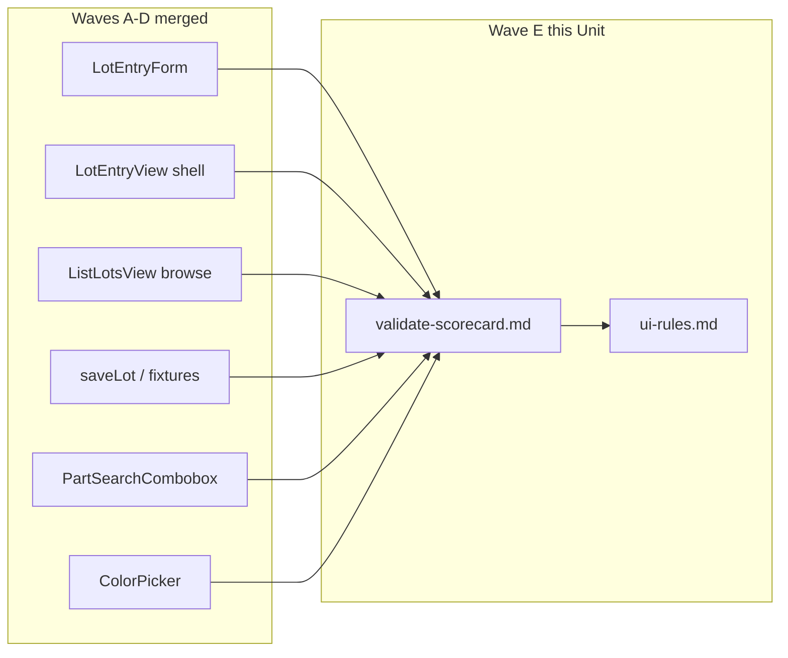

# Tech Spec — Unit 1: Lot entry cockpit validate

**AIDLC phase:** Design (one **Unit** per Tech Spec)  
**Grounding:** Implements [product-spec.md](./product-spec.md) (approved 2026-06-15). Parent context: [lot-entry-cockpit product-spec](../../product-spec.md) · [#10](https://github.com/dcvezzani/brick-counter-coordinator-02/issues/10). Prior art: [consolidate-and-clean-ui validate-scorecard](../../../00-shipped/consolidate-and-clean-ui/validate-scorecard.md).

---

## Overview

| Field | Value |
|-------|-------|
| **Unit / scope** | Parent #10 **Validate scorecard** (`validate-scorecard.md`) mapping all 11 success criteria to tests/evidence; **publish** worker counting rules in `docs/ui-rules.md`; optional `application-views.md` one-liner; close #10 or document debt |
| **Feature** | [lot-entry-cockpit-validate](./) · child of [#10](https://github.com/dcvezzani/brick-counter-coordinator-02/issues/10) |
| **Product Spec** | [product-spec.md](./product-spec.md) — **Approved** |
| **Child work item** | [#67](https://github.com/dcvezzani/brick-counter-coordinator-02/issues/67) |
| **Status** | **Approved for build** |
| **Author** | David Vezzani (with AI draft) |
| **Created** | 2026-06-15 |
| **Last updated** | 2026-06-15 |
| **Approved** | 2026-06-15 — David Vezzani (chat) |
| **PR target** | `feature/lot-entry-cockpit` (integration branch) — **not** `main` |

## Context

### Summary

Wave **E** closes parent [#10](https://github.com/dcvezzani/brick-counter-coordinator-02/issues/10) with **documentation and evidence**, not new product functionality. After Waves **A–D** land on `feature/lot-entry-cockpit`, this Unit produces:

1. **`feature/lot-entry-cockpit/validate-scorecard.md`** — scored PASS/FAIL (or debt) for each parent Product Spec success criterion (#1–#11), with pointers to unit tests, grep checks, and Chrome DevTools MCP screenshots where required.
2. **`docs/ui-rules.md`** — remove the “lot entry out of scope” note; add a **Worker counting (lot entry cockpit)** section encoding parent decisions (compact chrome, four-field identity, touch targets, feedback, browse vs count).
3. **Optional:** one-line lot-entry role in `docs/support/application-views.md`.

`/ship` on this child (or parent) consumes the scorecard; Build implements the artifacts on the integration branch after rebasing onto merged Waves A–D.

### Existing system & documentation

| Artifact | Relevance |
|----------|-----------|
| [product-spec.md](./product-spec.md) | Approved child scope — scorecard + ui-rules |
| [../../product-spec.md](../../product-spec.md) | Parent success criteria #1–#11 (Validate table) |
| [AIDLC.md](./AIDLC.md) | File ownership; branch `feature/lot-entry-cockpit-lot-entry-cockpit-validate` |
| [lot-entry-cockpit-shell tech-spec](../lot-entry-cockpit-shell/tech-spec.md) | Shell wiring, Compare gate, compact chrome — criteria #1, #8, #10 |
| [lot-entry-form tech-spec](../lot-entry-form/tech-spec.md) | Four-field form, save, duplicate, toast, stepper — criteria #1–#3, #6–#7, #9 |
| [migrate-list-lots-browse tech-spec](../migrate-list-lots-browse/tech-spec.md) | Browse identity columns — supports scenario 7 / parent browse vs count |
| [lot-data-model tech-spec](../lot-data-model/tech-spec.md) | `saveLot`, duplicate merge — criterion #3 |
| [part-search-combobox tech-spec](../part-search-combobox/tech-spec.md) | Part-out ranking — criterion #4 |
| [color-picker tech-spec](../color-picker/tech-spec.md) | Color id resolution — criterion #5 |
| [ui-feedback-primitives tech-spec](../../../00-shipped/ui-feedback-primitives/tech-spec.md) | `showSuccessToast` — criterion #6 |
| [consolidate-and-clean-ui validate-scorecard](../../../00-shipped/consolidate-and-clean-ui/validate-scorecard.md) | Scorecard format, gates, debt appendix |
| [docs/ui-rules.md](../../../../docs/ui-rules.md) | Target doc — remove #10 from “Out of scope”; add worker counting section |
| [docs/support/application-views.md](../../../../docs/support/application-views.md) | Optional lot-route description update |
| [INTERACTIVE-UI-VALIDATION.md](../../../../.claude/deps/ai-dlc/docs/INTERACTIVE-UI-VALIDATION.md) | MCP procedure for criteria #1, #10 |

### Out of scope for this Unit

Per approved Product Spec and [AIDLC.md](./AIDLC.md):

- New Vue components, routes, or session API changes (owned by Waves A–D)
- Playwright e2e
- Full accessibility audit (parent defers depth to Design on children)
- Parent `/design` orchestration tech spec on `feature/lot-entry-cockpit/` (separate, post Wave C)
- Closing GitHub #10 before human Validate gate (scorecard may recommend PASS with merge debt)

## Architecture

### High-level design

```
┌────────────────────────────────────────────────────────────────────┐
│  Waves A–D (merged on feature/lot-entry-cockpit)                   │
│  pickers · model · form · shell · list-lots browse                 │
└───────────────────────────────┬────────────────────────────────────┘
                                │ evidence
                                ▼
┌────────────────────────────────────────────────────────────────────┐
│  This Unit (Wave E) — documentation only                           │
│  ├── validate-scorecard.md  ← parent criteria #1–#11 + gates       │
│  ├── docs/ui-rules.md       ← worker counting section              │
│  └── application-views.md   ← optional one-liner (lot cockpit)       │
└───────────────────────────────┬────────────────────────────────────┘
                                │
                                ▼
┌────────────────────────────────────────────────────────────────────┐
│  /ship lot-entry-cockpit-validate → PASS/FAIL → close #67, #10     │
└────────────────────────────────────────────────────────────────────┘
```



### Boundaries

| Layer | Responsibility |
|-------|----------------|
| `feature/lot-entry-cockpit/validate-scorecard.md` | Authoritative parent #10 Validate evidence |
| `docs/ui-rules.md` | Published worker counting presentation rules |
| `docs/support/application-views.md` | Route table only — optional description tweak |
| Child test suites (read-only) | Evidence sources cited in scorecard — **no edits** unless a gap forces a follow-up issue |

### Integration points

| Upstream child | Scorecard criteria | Primary evidence |
|----------------|-------------------|------------------|
| [#65 shell](../lot-entry-cockpit-shell/tech-spec.md) | #1, #8, #10 | `LotEntryView.test.js`; MCP `/session/demo/lot` |
| [#64 form](../lot-entry-form/tech-spec.md) | #1–#3, #6–#7, #9 | `LotEntryForm.test.js` |
| [#62 model](../lot-data-model/tech-spec.md) | #2–#3 | `storyboard-session.test.js` `saveLot` |
| [#60 part search](../part-search-combobox/tech-spec.md) | #4 | `PartSearchCombobox.test.js` |
| [#61 color picker](../color-picker/tech-spec.md) | #5 | `ColorPicker.test.js` |
| [#66 browse](../migrate-list-lots-browse/tech-spec.md) | Parent scenario 7 | `ListLotsView.test.js` browse branch |
| [#9 feedback](../../../00-shipped/ui-feedback-primitives/product-spec.md) | #6 | `feedback.test.js` + form toast test |
| Repo CI | #11 | `npm test`, `npm run build` |

## Data

No schema or fixture changes. Scorecard references **integration branch** state after Waves A–D merge.

## APIs & contracts

No HTTP API. **Documentation contracts:**

### `validate-scorecard.md` structure

Follow [consolidate-and-clean-ui validate-scorecard](../../../00-shipped/consolidate-and-clean-ui/validate-scorecard.md):

| Section | Required content |
|---------|------------------|
| Header | Feature link, parent #10, child #67, product spec link, branch @ SHA, validate date, 90% threshold |
| Result | Criteria passed N/11, score %, verdict PASS/FAIL |
| Scorecard table | One row per parent criterion #1–#11: Result, Evidence |
| Gates exercised | Integration PR, local test/build, UI validation MCP, deploy N/A |
| Remaining debt | Non-blocking items with issue links |
| Human gate | Checklist for approve PASS, merge, `/learn`, close #10 |

### Parent criteria → evidence mapping (Build fills Result column)

| # | Parent criterion | Evidence to collect |
|---|------------------|---------------------|
| 1 | Counting **cockpit** with part, color, condition, count — **not** read-only table | **Unit:** `LotEntryView.test.js` — `LotEntryForm` mounted in counting phase; no `ResponsiveDataTable`; no `Lot A` fixture text. **MCP:** screenshot `session-lot` @ 375px showing form fields (not table). |
| 2 | Save all four fields; session stores part id, color id, condition, count | **Unit:** `LotEntryForm.test.js` — `saveLot` called with `{ partId, colorId, condition, qty }`. **Unit:** `storyboard-session.test.js` — persisted lot shape. |
| 3 | Duplicate triple merges qty | **Unit:** `LotEntryForm.test.js` — duplicate `ConfirmDialog` + merge path. **Unit:** `storyboard-session.test.js` — `mergeDuplicate: true` adds qty, lot count unchanged. |
| 4 | Part search favors part-out lines first | **Unit:** `PartSearchCombobox.test.js` — ranking with demo session fixture. |
| 5 | Color picker resolves color id after part chosen | **Unit:** `ColorPicker.test.js` — `v-model` emits numeric id; disabled when no part/colors. |
| 6 | Save success toast ([#9](https://github.com/dcvezzani/brick-counter-coordinator-02/issues/9)) | **Unit:** `LotEntryForm.test.js` — `showSuccessToast` mocked/called. **Doc:** ui-rules § Feedback cross-ref. |
| 7 | Count another without leaving route | **Unit:** `LotEntryForm.test.js` — save-and-add-another resets fields; route unchanged. **Manual:** same URL after second save. |
| 8 | Compare only in `counting`; advances to `reconciling` | **Unit:** `LotEntryView.test.js` — three existing Compare tests (preserve). |
| 9 | Touch targets — no `size="xs"` on primary cockpit actions | **Grep:** `rg 'size="xs"' src/components/LotEntryForm.vue src/views/LotEntryView.vue` → no primary actions. **Code:** `min-h-11` on Save, stepper, Compare per shell/form tech specs. **Doc:** ui-rules worker counting section. |
| 10 | Usable @ ~375px, no horizontal scroll on core controls | **MCP:** Chrome DevTools mobile viewport walkthrough — part field, color, condition, qty stepper, Save visible without horizontal scroll; attach `validate-lot-entry-mobile.png` beside scorecard. |
| 11 | `npm test` / `npm run build` pass | **Local:** command output in ship-report or scorecard gates table. **CI:** note integration PR run if available; local pass required before PASS. |

### Child success criteria mapping

| Child # | Criterion | How this Unit verifies |
|---------|-----------|------------------------|
| 1 | All parent #10 Validate rows scored | `validate-scorecard.md` table complete (11 rows) |
| 2 | `ui-rules.md` updated | Diff removes out-of-scope #10; adds § Worker counting |
| 3 | `npm test` && `npm run build` | Gates table + local run on rebased branch |

## UI / client

### `docs/ui-rules.md` — Worker counting section (target content)

**Remove** from § Out of scope:

```markdown
- Lot entry worker cockpit ([#10](...))
```

**Add** new section before § Out of scope (or replace out-of-scope entry):

#### Worker counting (lot entry cockpit) — [#10](https://github.com/dcvezzani/brick-counter-coordinator-02/issues/10)

| Topic | Rule |
|-------|------|
| **Route** | `/session/:sessionId/lot` — counting-phase landing; browse saved lots on **Lots** (`/lots`), not on lot entry |
| **Shell** | `SessionCoordinatorShell` with **compact chrome**: short `ViewHeader` description (`"Count parts into lots."`); tighter vertical rhythm (`space-y-3` interior) vs coordinator browse views |
| **Primary content** | `LotEntryForm` during `phase === 'counting'` only — **no** `ResponsiveDataTable` on lot entry |
| **Lot identity** | UI stores **part id + color id + condition**; count is `qty`. Names in pickers; ids in session |
| **Pickers** | `PartSearchCombobox` → part id (part-out lines ranked first); `ColorPicker` → color id (disabled until part chosen) |
| **Condition** | Required every save; read-only label or N/U toggle per `lot-entry-defaults.js` |
| **Quantity** | Large `+` / `−` stepper (`Button` `default` / `min-h-11`) — **no** swipe input in coordinator-02 |
| **Save actions** | **Save** and **Save and add another**; success via `showSuccessToast` — not inline stub text |
| **Duplicate triple** | `ConfirmDialog` before merge — same part + color + condition |
| **Phase gate** | Sticky **Compare with Part-Out List** in `ViewActions` only when `phase === 'counting'`; `min-h-11` on Compare |
| **Wrong phase** | Muted phase note; no form; no Compare |
| **Touch targets** | Primary cockpit actions: `min-h-11` minimum; **ban `size="xs"`** on Save, stepper, Compare |
| **Browse table** | List lots browse shows Part / Color / Condition / Qty — not Lot A/B/C labels ([#66](../feature/lot-entry-cockpit/sub-features/migrate-list-lots-browse/product-spec.md)) |

**Changelog row:** `2026-06-15` — Worker counting section (#10); removed out-of-scope note.

### Optional `application-views.md` update

In Routes table, extend **Lot** row description:

| Route | Current | Target |
|-------|---------|--------|
| `/session/:sessionId/lot` | `LotEntryView` | Add footnote or description column: **Counting cockpit** (four-field form); not lot browse |

Minimal one-line edit in **Last updated** date — skip if product owner prefers ui-rules-only.

### Target files (after Build)

```
feature/lot-entry-cockpit/
└── validate-scorecard.md                    # NEW

docs/
├── ui-rules.md                              # MODIFY — worker counting §
└── support/
    └── application-views.md                 # OPTIONAL — one-liner

feature/lot-entry-cockpit/sub-features/lot-entry-cockpit-validate/
└── (no src/ changes)
```

## Security & privacy

- Documentation only; no new attack surface.
- MCP validation uses local `http://localhost:5173` demo session — no credentials.

## Acceptance criteria (for Review)

- [ ] `feature/lot-entry-cockpit/validate-scorecard.md` exists with **11/11** parent criteria rows
- [ ] Each scorecard row cites at least one **concrete** evidence source (test file, grep, MCP screenshot path, or doc link)
- [ ] Scorecard includes gates table (local test/build at minimum)
- [ ] `docs/ui-rules.md` — #10 removed from “Out of scope”; **Worker counting** section added per table above
- [ ] `rg 'Lot entry worker cockpit' docs/ui-rules.md` — only in new section header / changelog, not out-of-scope
- [ ] Optional `application-views.md` lot-route note — if included, links to ui-rules
- [ ] Branch rebased on `feature/lot-entry-cockpit` with Waves A–D merged before scoring
- [ ] `npm test` and `npm run build` pass on branch when scorecard written
- [ ] PR targets `feature/lot-entry-cockpit`; references [#67](https://github.com/dcvezzani/brick-counter-coordinator-02/issues/67)
- [ ] No application source changes outside docs + scorecard (unless debt issue filed)

## Testing approach

| Layer | What we prove | Notes |
|-------|----------------|-------|
| Unit (cited) | Upstream children — see mapping table | Validate **reads** test results; does not add tests unless gap found |
| Integration | N/A | No new code paths |
| E2E / manual | MCP mobile walkthrough | Criteria #1, #10 — screenshots in `feature/lot-entry-cockpit/` |
| Doc review | ui-rules diff matches parent spec | Child criterion #2 |

**Validate execution checklist (Build / Ship):**

1. `git fetch && git rebase origin/feature/lot-entry-cockpit` on worktree `lot-entry-cockpit-validate`
2. `npm test && npm run build` — capture pass/fail in scorecard
3. Run unit suites listed in mapping; note any missing tests as **debt** with issue link
4. `rg 'ResponsiveDataTable' src/views/LotEntryView.vue` — expect no match
5. MCP: `http://localhost:5173/session/demo/lot` — counting phase; 375px viewport screenshot
6. Draft scorecard with PASS/FAIL per row; human gate before closing #10

**Gap policy:** If a parent criterion lacks automated evidence, score **PASS with debt** only when MCP/manual evidence is attached and a follow-up issue is optional — otherwise **FAIL** and block parent close.

## Rollout & operations

### Rollout plan

1. Merge Waves **A–D** children to `feature/lot-entry-cockpit` (dependency order per [sub-features/README.md](../README.md))
2. Rebase `feature/lot-entry-cockpit-lot-entry-cockpit-validate`
3. Implement scorecard + ui-rules (+ optional application-views)
4. Merge child PR #67 to integration branch
5. Run `/ship` — human approves PASS → close #67; close or debt-note #10
6. Parent merge to `main` and `/learn` — separate milestone

### Monitoring & observability

N/A — local storyboard.

### Rollback

Revert Wave E PR; parent #10 remains open; ui-rules revert removes worker section (restore out-of-scope note if rolling back entire epic).

## Risks & open technical questions

| Risk / question | Mitigation or owner |
|-----------------|---------------------|
| Waves A–D not merged when Build starts | **Block Build** until `LotEntryForm`, shell, browse, model on integration branch |
| CI only on PRs to `main` | Document local test/build in scorecard gates; integration PR may lack GitHub Actions |
| Criterion #10 subjective | MCP screenshot + checklist (part, color, condition, qty, Save visible) |
| Missing unit test for a criterion | File debt issue or add minimal test in owning child — not in Validate PR unless blocking |
| Parallel edit to `ui-rules.md` | This child owns worker counting §; coordinate if another PR touches same file |
| Parent #10 close vs integration-only | Scorecard human gate lists: close #10 after integration PASS or after `main` merge — product choice |

### Open technical questions (for human)

| # | Question | Recommendation |
|---|----------|----------------|
| T1 | Scorecard lives under `feature/lot-entry-cockpit/` vs child folder? | **`feature/lot-entry-cockpit/validate-scorecard.md`** — parent artifact (matches child product-spec touchpoints) |
| T2 | PASS with debt on criterion #10 if Save slightly below fold on 375px? | **FAIL** unless Compare + Save reachable without horizontal scroll; vertical scroll acceptable |
| T3 | Close #10 on integration branch PASS or wait for `main`? | **Integration PASS** closes #10 with note “pending main merge” — same pattern as #5 |
| T4 | Add `ship-report.md` in Build? | **Yes** — optional sibling to scorecard per other shipped features |

### Blockers

| Blocker | Status |
|---------|--------|
| [#65 shell](../lot-entry-cockpit-shell/tech-spec.md) merged | **Required** for criteria #1, #8, #10 |
| [#64 form](../lot-entry-form/tech-spec.md) merged | **Required** for criteria #1–#3, #6–#7, #9 |
| [#66 browse](../migrate-list-lots-browse/tech-spec.md) merged | **Required** for browse vs count scenario evidence |
| Waves A/B upstream | **Required** for picker/model tests cited in scorecard |

## Design review passes (merged findings)

### Architecture

- **Correct Unit boundary:** Validate is evidence aggregation — zero feature code avoids merge conflicts with Waves A–D.
- **Scorecard at parent path** (`feature/lot-entry-cockpit/`) keeps #10 closure artifact discoverable alongside parent product-spec.
- **ui-rules publish** satisfies parent in-scope doc requirement without duplicating route/phase rules (still in `application-views.md`).
- **Advisory:** Link scorecard from parent `product-spec.md` Related documents on Build merge.

### Frontend

- Worker counting ui-rules section encodes parent pattern E (compact chrome, thumb zone) without #11 shell taxonomy.
- Explicit ban on `ResponsiveDataTable` on lot entry prevents regression to read-only table.
- Browse vs count split documented — aligns List lots browse columns ([#66](../migrate-list-lots-browse/tech-spec.md)).
- **Advisory:** Cross-link `dcv/ux-concerns.md` pattern E from ui-rules worker section.

### Backend / API

- N/A — skipped (no server surface).

### Testing

- Mapping table ties each parent criterion to **existing** child tests — no new test files in Wave E unless gap discovered during `/ship`.
- MCP evidence mandatory for #1 and #10 per parent product-spec verification column.
- Grep guard for `size="xs"` on cockpit files supports #9 without new unit test.
- **Advisory:** If `LotEntryForm.test.js` missing after rebase, block PASS until #64 lands.

### CI / deploy

- `.github/workflows/ci.yml` triggers on PRs to `main` only — scorecard gates must record **local** `npm test` / `npm run build`.
- No workflow change in this Unit.
- Integration PR to `feature/lot-entry-cockpit` is the merge target.

## Change history

| Date | Author | Changes |
|------|--------|---------|
| 2026-06-15 | AI draft | Initial Tech Spec for lot-entry-cockpit-validate (#67) |
<<<<<<< HEAD
| 2026-06-15 | David Vezzani | **Approved for build** (chat) |
=======
>>>>>>> origin/feature/lot-entry-cockpit

## Related documents

- [product-spec.md](./product-spec.md)
- [AIDLC.md](./AIDLC.md)
- [Parent product-spec](../../product-spec.md)
- [sub-features/README.md](../README.md)
- [lot-entry-cockpit-shell tech-spec](../lot-entry-cockpit-shell/tech-spec.md)
- [lot-entry-form tech-spec](../lot-entry-form/tech-spec.md)
- [migrate-list-lots-browse tech-spec](../migrate-list-lots-browse/tech-spec.md)
- [consolidate-and-clean-ui validate-scorecard](../../../00-shipped/consolidate-and-clean-ui/validate-scorecard.md)
- [#67](https://github.com/dcvezzani/brick-counter-coordinator-02/issues/67) · [#10](https://github.com/dcvezzani/brick-counter-coordinator-02/issues/10)
