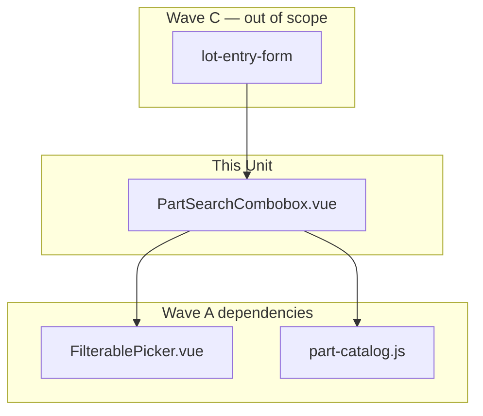

# Tech Spec — Unit 1: Part search combobox

**AIDLC phase:** Design (one **Unit** per Tech Spec)  
**Grounding:** Implements [product-spec.md](./product-spec.md) (approved 2026-06-15). Aligns with [ADR-0001](../../../../adr/0001-frontend-vue-js-shadcn-stack.md). Parent context: [lot-entry-cockpit product-spec](../../product-spec.md) · [#10](https://github.com/dcvezzani/brick-counter-coordinator-02/issues/10).

---

## Overview

| Field | Value |
|-------|-------|
| **Unit / scope** | Port `PartSearchCombobox.vue` from sibling [brick-counter-coordinator](https://github.com/dcvezzani/brick-counter-coordinator); wire to Wave A `FilterablePicker` + `part-catalog.js`; unit tests for v-model part id, resolved name, and FilterablePicker integration |
| **Feature** | [part-search-combobox](./) · child of [#10](https://github.com/dcvezzani/brick-counter-coordinator-02/issues/10) |
| **Product Spec** | [product-spec.md](./product-spec.md) — **Approved** |
| **Child work item** | [#60](https://github.com/dcvezzani/brick-counter-coordinator-02/issues/60) |
| **Status** | **Approved for build** |
| **Author** | David Vezzani (with AI draft) |
| **Created** | 2026-06-15 |
| **Last updated** | 2026-06-15 |
| **Approved** | 2026-06-15 — David Vezzani (chat) |
| **PR target** | `feature/lot-entry-cockpit` (integration branch) — **not** `main` |

## Context

### Summary

Deliver a **part-number search combobox** that stores **part id** (BrickLink-style string) via `v-model`, shows the resolved part **name** after selection, and ranks session **part-out** lines first by delegating search to `part-catalog.js`. The component wraps shared `FilterablePicker` from [#58 filterable-picker](../filterable-picker/tech-spec.md) and consumes catalog APIs from [#59 part-color-catalog](../part-color-catalog/tech-spec.md).

This Unit is **Wave B** — one Vue SFC + unit tests. No routes, lot save, color picker, or `LotEntryView` changes (owned by later children).

### Existing system & documentation

| Artifact | Relevance |
|----------|-----------|
| [product-spec.md](./product-spec.md) | Approved scope — port + catalog + FilterablePicker |
| [AIDLC.md](./AIDLC.md) | File ownership; branch `feature/lot-entry-cockpit-part-search-combobox` |
| [filterable-picker tech-spec](../filterable-picker/tech-spec.md) | `FilterablePicker.vue` props/emits/slots contract |
| [part-color-catalog tech-spec](../part-color-catalog/tech-spec.md) | `searchParts`, `lookupPart`, `resolvePartId` API |
| [sub-features/README.md](../README.md) | Wave B; depends on Wave A merge |
| [ADR-0001](../../../../adr/0001-frontend-vue-js-shadcn-stack.md) | Vue 3 + JS SFCs + shadcn-vue |
| Sibling prior art | [`PartSearchCombobox.vue`](https://github.com/dcvezzani/brick-counter-coordinator/blob/main/src/components/PartSearchCombobox.vue), [sibling tests](https://github.com/dcvezzani/brick-counter-coordinator/blob/main/src/components/__tests__/PartSearchCombobox.spec.js) |

### Out of scope for this Unit

Per approved Product Spec and [AIDLC.md](./AIDLC.md) ownership:

- `ColorPicker.vue`, `LotForm.vue`, `LotEntryView` integration — [#61](../color-picker/product-spec.md), [#64](../lot-entry-form/product-spec.md), [#65](../lot-entry-cockpit-shell/product-spec.md)
- Lot save, merge-on-duplicate, condition defaults — [#62](../lot-data-model/product-spec.md), [#63](../lot-condition-defaults/product-spec.md)
- Catalog fixture content or ranking algorithm changes — [#59 part-color-catalog](../part-color-catalog/tech-spec.md)
- `FilterablePicker` implementation — [#58](../filterable-picker/tech-spec.md)
- Live BrickLink API, `config/app-preferences.json` loader
- Playwright e2e
- Dedicated demo route (unit tests satisfy Validate for this child alone)

## Architecture

### High-level design

```
┌─────────────────────────────────────────────────────────────────┐
│  Consumer (Wave C — not this Unit)                               │
│  lot-entry-form (#64) — v-model partId, session prop, @tab-*     │
└───────────────────────────────┬─────────────────────────────────┘
                                │
                                ▼
┌─────────────────────────────────────────────────────────────────┐
│  PartSearchCombobox.vue                                          │
│  ├── Label + resolved name (data-testid part-search-resolved)    │
│  ├── maps catalog rows → PickerOption { value, label, data }     │
│  ├── filterPartOptions → searchParts(query, { session })         │
│  └── onClose blur-resolve via resolvePartId                      │
└───────────────┬─────────────────────────────┬───────────────────┘
                │                             │
                ▼                             ▼
┌───────────────────────────┐   ┌───────────────────────────────┐
│  FilterablePicker.vue      │   │  part-catalog.js (#59)         │
│  (#58)                     │   │  searchParts · lookupPart ·      │
│                            │   │  resolvePartId                   │
└───────────────────────────┘   └───────────────────────────────┘
```



### Boundaries

| Layer | Responsibility |
|-------|----------------|
| `src/components/PartSearchCombobox.vue` | Part-specific picker wrapper; session-scoped search; v-model part id |
| `src/components/FilterablePicker.vue` | Generic filter UI — **not owned**; must exist on integration branch from #58 |
| `src/lib/part-catalog.js` | Search/rank/resolve — **not owned**; must exist from #59 |
| `src/components/ui/label/` | shadcn-vue `Label` primitive — add if missing (see Risks) |
| `tests/unit/components/PartSearchCombobox.test.js` | Component contract + catalog wiring |

### Integration points

| System | Contract | Notes |
|--------|----------|-------|
| `FilterablePicker` | `v-model`, `options`, `filterOptions`, `minFilterChars`, slots, `test-id="part-search"` | Match [#58 tech-spec](../filterable-picker/tech-spec.md) |
| `part-catalog.js` | `searchParts(query, { session })`, `lookupPart(partId)`, `resolvePartId(input)` | Session required for part-out ranking per [#59](../part-color-catalog/tech-spec.md) |
| Storyboard session | `session` prop — object with `partOutLines` | Parent passes `getSession()` result; tests use `createDemoSessionSeed()` |
| [#64 lot-entry-form](../lot-entry-form/product-spec.md) | `v-model` string part id; `@select` part object; `@tabForward` / `@tabBackward`; `defineExpose({ focus })` | Same surface as sibling `LotForm` usage |
| CI | `npm test` / `npm run build` | PR to `feature/lot-entry-cockpit` |

### Port adaptation (sibling → coordinator-02)

| Sibling | Coordinator-02 change |
|---------|------------------------|
| `useSession()` composable (`searchParts`, `lookupPart`, `resolvePartId`) | Import from `@/lib/part-catalog.js`; pass `session` via **required prop** |
| `appConfig.partSearch.minFilterChars` | Inline prop `minFilterChars` default **`2`** on `FilterablePicker` (matches sibling `config/app-preferences.json`) |
| `src/components/__tests__/PartSearchCombobox.spec.js` | Port to `tests/unit/components/PartSearchCombobox.test.js`; mock `part-catalog` or use fixture session |
| `@/components/ui/label` | Add shadcn-vue `Label` if not on integration branch after Wave A merges |

All other markup, emits, `onClose` resolve behavior, option-label slot (part id + name), and `data-testid` values should match sibling unless review finds a coordinator-02 convention conflict.

## Data

### v-model

| Field | Type | Notes |
|-------|------|-------|
| `modelValue` / `update:modelValue` | `string` | Part id (e.g. `3001`, `3069b`); empty string when cleared |

### `select` emit payload

`{ partId: string, name: string, source?: 'part-out' | 'catalog' }` — catalog row shape from `searchParts` / `lookupPart`.

No persistence or fixture changes in this Unit.

## APIs & contracts

No HTTP API. Component contract:

### Props

| Prop | Type | Default | Notes |
|------|------|---------|-------|
| `modelValue` | `String` | `''` | Selected part id |
| `session` | `Object` | **required** | Storyboard session; forwarded to `searchParts` |

### Emits

| Event | Payload | When |
|-------|---------|------|
| `update:modelValue` | `string` | Selection, clear, or blur-resolve |
| `select` | `part` object | User selects option or blur resolves known part |
| `tabForward` / `tabBackward` | — | Forwarded from `FilterablePicker` for lot-form focus chain |

### `defineExpose`

| Method | Behavior |
|--------|----------|
| `focus()` | Calls `pickerRef.focusFilter()` — opens panel and focuses filter |

### Internal mapping

```javascript
// partOptions (empty query — full ranked list for picker baseline)
searchParts('', { session }).map((part) => ({
  value: part.partId,
  label: part.partId,
  data: part,
}))

// filterPartOptions(query)
searchParts(query.trim(), { session }).map(/* same shape */)
```

`onUpdate(value)` emits `resolvePartId(String(value))` (or `''` when null).  
`onClose({ filterQuery, fromSelection })` — when not from selection, resolve typed text via `resolvePartId` and emit if non-null (sibling parity).

### `data-testid` contract (inherited + owned)

| Element | id |
|---------|-----|
| Resolved name | `part-search-resolved` |
| Picker root/trigger/filter/… | `part-search`, `part-search-trigger`, etc. (via `FilterablePicker` `test-id`) |

## UI / client

### Stack

| Layer | Choice |
|-------|--------|
| Component | Vue 3 `<script setup>` JavaScript SFC |
| Wrapper | `FilterablePicker` with custom `filterOptions` (not default prefix filter — catalog does substring + ranking) |
| Label | shadcn-vue `Label` with muted resolved name span |
| Styling | Tailwind; `gap-2` field stack matching sibling |

### Accessibility

- Label associates with picker trigger via visual grouping (sibling pattern); resolved name in muted text beside label
- FilterablePicker provides `aria-expanded`, listbox roles — see [#58](../filterable-picker/tech-spec.md)
- `defineExpose({ focus })` supports programmatic focus from lot form

### Target files (after Build)

```
src/
└── components/
    └── PartSearchCombobox.vue      # NEW — port from sibling

tests/unit/
└── components/
    └── PartSearchCombobox.test.js  # NEW — port + part-out ranking case
```

Optional (if Label missing on integration branch):

```
src/components/ui/label/            # shadcn-vue Label primitive
```

**Do not modify** paths outside [AIDLC.md](./AIDLC.md) ownership except Label primitive if required.

## Security & privacy

- Client-only; no network beyond existing storyboard fixtures.
- Vue text interpolation for part names — no `v-html`.

## Acceptance criteria (for Review)

- [ ] `PartSearchCombobox.vue` ported; uses `FilterablePicker` + `part-catalog.js` (no `useSession`, no `app-config`)
- [ ] `session` prop required; catalog calls include `{ session }` for ranking
- [ ] `v-model` emits **part id string** on list select and blur-resolve (not display name alone)
- [ ] Trigger / label shows resolved part **name** via `lookupPart` when `modelValue` set (`part-search-resolved`)
- [ ] Option rows show part id (medium) + name (muted xs) — `#option-label` slot
- [ ] `minFilterChars` **2** on `FilterablePicker` (options hidden until 2 chars typed)
- [ ] `test-id="part-search"` preserved
- [ ] `defineExpose({ focus })` delegates to `focusFilter`
- [ ] `tabForward` / `tabBackward` forwarded
- [ ] Unit test: Enter after filter selects first match; resolved name visible; `v-model` is part id
- [ ] Unit test: blur with typed part id emits `update:modelValue` with id
- [ ] Unit test: with real `part-catalog` + demo session fixture, query matching part-out `partId` lists that part **first** in filter results (product criterion #1)
- [ ] `npm test` and `npm run build` pass after rebase on merged Wave A (#58, #59)
- [ ] PR targets `feature/lot-entry-cockpit`; references [#60](https://github.com/dcvezzani/brick-counter-coordinator-02/issues/60)

## Testing approach

| Layer | What we prove | Notes |
|-------|----------------|-------|
| Unit (component) | v-model part id, resolved label, Enter vs blur-resolve, FilterablePicker wiring | Port sibling tests; `vi.mock('@/lib/part-catalog')` or inject fixture session + real catalog |
| Unit (catalog ranking) | Part-out line favored in search | One test using `createDemoSessionSeed()` from `demo-session.js` — proves component passes session through (catalog owns algorithm) |
| Integration | N/A | No route in this Unit |
| E2E / manual | Deferred | lot-entry-form + shell validate end-to-end |

**Test conventions:**

- `tests/unit/components/PartSearchCombobox.test.js`
- `vi.useFakeTimers()` + `vi.advanceTimersByTime(150)` for debounce (FilterablePicker)
- `attachTo: document.body` for blur test; `wrapper.unmount()` in `afterEach`

**Mock strategy (recommended):**

- Default tests: mock `part-catalog` exports (sibling parity, fast)
- One additional test: unmocked catalog + demo session seed for part-out ranking smoke

## Rollout & operations

### Rollout plan

1. Merge Wave A: `filterable-picker` (#58) and `part-color-catalog` (#59) to `feature/lot-entry-cockpit`
2. Rebase this worktree; implement `PartSearchCombobox.vue`
3. Merge child PR to integration branch
4. Wave C `lot-entry-form` consumes component

### Monitoring & observability

N/A — local storyboard client.

### Rollback

Revert child merge commit; no data migration.

## Risks & open technical questions

| Risk / question | Mitigation or owner |
|-----------------|---------------------|
| Build before Wave A lands | **Block Build** until #58 + #59 on integration branch; rebase worktree |
| `Label` primitive missing | Add shadcn-vue `Label` in this PR (small) or use `FormField`-style `<span class="font-medium">` — see T1 |
| `resolvePartId` returns `null` vs empty string | Catalog spec returns `null`; component normalizes to `''` on clear only |
| Sibling `resolvePartId` test returns raw trimmed string on miss | Coordinator catalog returns `null` on ambiguous input — component must not emit invalid id on blur |
| Parallel Wave B `color-picker` | Distinct paths — low conflict risk |

### Open technical questions (for human)

| # | Question | Recommendation |
|---|----------|----------------|
| T1 | Add shadcn `Label` vs inline label markup? | **Add Label** — matches sibling; one primitive file |
| T2 | `session` prop required vs optional with `getSession()` fallback? | **Required prop** — explicit contract for tests and lot-form |
| T3 | Export thin `usePartSearch(session)` composable? | **No** — keep logic in SFC; catalog is already pure |
| T4 | Component-level test for part-out ranking vs catalog-only tests? | **One smoke test** with real catalog + demo session in this PR |

### Resolved decisions

| # | Decision | Resolved |
|---|----------|----------|
| 1 | Search backend | `part-catalog.js` (#59), not composable `useSession` |
| 2 | `minFilterChars` | **2** inline (no app-config) |
| 3 | Option `label` field | **part id** (display name in slot only — sibling parity) |
| 4 | Ranking ownership | Catalog module; component passes `session` |

## Design review passes (merged findings)

### Architecture

- **Single Responsibility:** Thin adapter over `FilterablePicker` + catalog — correct; no lot or color logic in this SFC.
- **Dependency direction:** Component → FilterablePicker + part-catalog + optional Label; no imports from `storyboard-session.js` inside SFC if `session` is a prop (parent owns session lookup).
- **Wave ordering:** Hard dependency on Wave A APIs — document rebase gate in Build checklist.
- **Advisory:** Avoid duplicating catalog filter logic in the component; all query handling stays in `searchParts`.

### Frontend

- Port matches ADR-0001 (JS SFC, shadcn Label, Tailwind).
- Custom `filterOptions` bypasses `defaultPrefixFilter` — correct because catalog uses **contains** + part-out ranking, not prefix-only.
- `minFilterChars: 2` reduces noise for large fixture catalogs — matches sibling UX.
- **Advisory:** Keep `option-label` two-line layout for thumb-friendly scan on mobile.
- **Advisory:** Forward tab events unchanged for [#64](../lot-entry-form/product-spec.md) focus chain.

### Backend / API

- N/A — skipped per orchestration (no server surface).

### Testing

- Port sibling’s two behavioral tests (Enter select, blur resolve) — high value for `onClose` / debounce interaction bugs.
- Add catalog ranking smoke test — satisfies Product Spec success criterion #1 at component boundary.
- Mock catalog for deterministic id tests; use fake timers for debounce.
- No Playwright — consistent with parent and child Product Spec.

### CI / deploy

- Existing `.github/workflows/ci.yml` — PR to `feature/lot-entry-cockpit` runs `npm ci`, `npm test`, `npm run build`.
- No workflow changes required.

## Change history

| Date | Author | Changes |
|------|--------|---------|
| 2026-06-15 | AI draft | Initial Tech Spec for part-search-combobox (#60) |
| 2026-06-15 | David Vezzani | **Approved for build** (chat) |

## Related documents

- [product-spec.md](./product-spec.md)
- [AIDLC.md](./AIDLC.md)
- [Parent product-spec](../../product-spec.md)
- [filterable-picker tech-spec](../filterable-picker/tech-spec.md)
- [part-color-catalog tech-spec](../part-color-catalog/tech-spec.md)
- [sub-features/README.md](../README.md)
- [ADR-0001](../../../../adr/0001-frontend-vue-js-shadcn-stack.md)
- Sibling prior art: [PartSearchCombobox.vue](https://github.com/dcvezzani/brick-counter-coordinator/blob/main/src/components/PartSearchCombobox.vue)
- [#60](https://github.com/dcvezzani/brick-counter-coordinator-02/issues/60) · [#10](https://github.com/dcvezzani/brick-counter-coordinator-02/issues/10)
