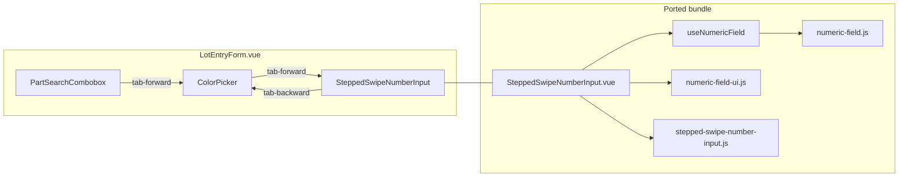

# Tech Spec — Unit 1: Stepped swipe quantity on lot form

**AIDLC phase:** Design (one **Unit** per Tech Spec)  
**Grounding:** Implements [product-spec.md](./product-spec.md) (approved 2026-06-15). Aligns with [ADR-0001](../../adr/0001-frontend-vue-js-shadcn-stack.md). Supersedes lot-entry-form Tech Spec exclusion of swipe input ([#64](https://github.com/dcvezzani/brick-counter-coordinator-02/issues/64)).

---

## Overview

| Field | Value |
|-------|-------|
| **Unit / scope** | Port sibling `SteppedSwipeNumberInput` stack into coordinator-02; replace `LotEntryForm` `+`/`−` stepper; wire tab chain; port unit tests |
| **Feature** | [new-counter-input-control](./) · [#83](https://github.com/dcvezzani/brick-counter-coordinator-02/issues/83) |
| **Product Spec** | [product-spec.md](./product-spec.md) — **Approved** |
| **Status** | **Approved for build** |
| **Author** | David Vezzani (with AI draft) |
| **Created** | 2026-06-15 |
| **Last updated** | 2026-06-15 |
| **Approved** | 2026-06-15 — David Vezzani |
| **PR target** | `main` |

## Context

### Summary

Ship the sibling app's **stepped swipe number input** as the lot entry **Quantity** control. Copy the proven component bundle from [brick-counter-coordinator](https://github.com/dcvezzani/brick-counter-coordinator) (no redesign). Integrate into existing `LotEntryForm.vue` with `min: 1`, `v-model` on `qty`, and keyboard tab parity with sibling `LotForm.vue`. Save, duplicate confirm, validation, and toasts remain untouched.

### Existing system & documentation

| Artifact | Relevance |
|----------|-----------|
| [product-spec.md](./product-spec.md) | Approved scope, min 1, no max, tab backward, label "Quantity" |
| [lot-entry-form tech-spec](../00-shipped/lot-entry-cockpit/sub-features/lot-entry-form/tech-spec.md) | Baseline form — **swipe exclusion reversed** by this Feature |
| `src/components/LotEntryForm.vue` | Integration target — replace qty stepper block |
| `tests/unit/components/LotEntryForm.test.js` | Update helpers/assertions for new control |
| [ADR-0001](../../adr/0001-frontend-vue-js-shadcn-stack.md) | Vue 3 JS SFCs, Vitest, Lucide, shadcn tokens |
| [docs/ui-rules.md](../../docs/ui-rules.md) | `min-h-11` touch targets (control already complies) |
| Sibling prior art | `SteppedSwipeNumberInput.vue`, `useNumericField.js`, `numeric-field*.js`, `stepped-swipe-number-input.js`, tests |

### Out of scope for this Unit

- Dev demo route (`SteppedSwipeNumberInputDemoView`) — optional follow-up
- `config/app-preferences.json` / `appConfig.lotEntry` loader
- Quantity controls on other views
- Lot data model / `saveLot` API changes
- Playwright e2e

## Architecture

### High-level design

```
┌──────────────────────────────────────────────────────────────┐
│  LotEntryView.vue (unchanged)                                 │
│  └── LotEntryForm.vue                                         │
│        ├── PartSearchCombobox                                 │
│        ├── ColorPicker                                        │
│        ├── Condition (read-only / N·U toggle)                 │
│        ├── SteppedSwipeNumberInput  ← NEW (replaces +/− UI)   │
│        ├── Save · Save and add another                        │
│        └── ConfirmDialog                                      │
└──────────────────────────────────────────────────────────────┘

New modules (ported from sibling, paths unchanged):
  src/components/SteppedSwipeNumberInput.vue
  src/composables/useNumericField.js
  src/lib/numeric-field.js
  src/lib/numeric-field-ui.js
  src/lib/stepped-swipe-number-input.js
```



### Integration points

| System | Contract | Notes |
|--------|----------|-------|
| `LotEntryForm` `qty` ref | `v-model` number, default `1` | Same as today; reset on save-and-add-another |
| `SteppedSwipeNumberInput` | `modelValue`, `name`, `min`, `max?`, `testId`, `@tab-backward` | Pass `:min="1"`; no `max` (uncapped) |
| `saveLot` | `{ partId, colorId, condition, qty }` | Unchanged |
| `ColorPicker` | `focusFilter()`, `@tab-forward` | Add `@tab-forward` → focus qty |
| `PartSearchCombobox` | `@tab-forward` → color | Unchanged |
| `cn` (`@/lib/utils`) | Tailwind merge | Already in repo |
| `@lucide/vue` `GripVertical` | Icon on handle | Already in `package.json` |

### Port strategy

**Copy verbatim** from sibling `main` (adapt only if coordinator-02 path/import drift requires it — none expected):

| Source (sibling) | Destination (coordinator-02) |
|------------------|------------------------------|
| `src/components/SteppedSwipeNumberInput.vue` | `src/components/SteppedSwipeNumberInput.vue` |
| `src/composables/useNumericField.js` | `src/composables/useNumericField.js` |
| `src/lib/numeric-field.js` | `src/lib/numeric-field.js` |
| `src/lib/numeric-field-ui.js` | `src/lib/numeric-field-ui.js` |
| `src/lib/stepped-swipe-number-input.js` | `src/lib/stepped-swipe-number-input.js` |
| `src/lib/__tests__/stepped-swipe-number-input.spec.js` | `tests/unit/lib/stepped-swipe-number-input.test.js` |
| `src/components/__tests__/SteppedSwipeNumberInput.spec.js` | `tests/unit/components/SteppedSwipeNumberInput.test.js` |

Do **not** port `SwipeNumberInput`, `swipe-number-input.js`, or dev demo views.

## Data

No schema, fixture, or session model changes. `qty` remains a positive integer on the lot payload per [ADR-0004](../../adr/0004-lot-identity-and-counting-model.md).

## APIs & contracts

No HTTP/API changes. Client-only.

### `SteppedSwipeNumberInput` props (inherited from sibling)

| Prop | Lot form value |
|------|----------------|
| `v-model` | `qty` |
| `name` | `"qty"` |
| `min` | `1` |
| `max` | omitted (no ceiling) |
| `allowNegative` | default `false` |
| `testId` | `"lot-entry-qty"` |
| `disabled` | not used (always enabled) |

### Emits / expose

| Event / method | Lot form wiring |
|----------------|-----------------|
| `@tab-backward` | `colorPickerRef?.focusFilter()` |
| `defineExpose({ focus })` | `qtyInputRef` for tab-forward from color |

### Tab order chain (match sibling `LotForm.vue`)

| From | Action | To |
|------|--------|-----|
| Part combobox | tab forward | Color filter (`focusFilter`) — **existing** |
| Color picker | tab forward | Qty control `focus()` — **add** |
| Qty handle / field | shift-tab / `@tab-backward` | Color filter — **add** |

## UI / client

### `LotEntryForm.vue` changes

1. **Import** `SteppedSwipeNumberInput`; add `qtyInputRef = ref(null)`.
2. **Remove** `decrementQty`, `incrementQty`, and the `+`/`−`/`span` template block.
3. **Replace** quantity `FormField` inner content with:

```vue
<SteppedSwipeNumberInput
  ref="qtyInputRef"
  v-model="qty"
  name="qty"
  :min="1"
  test-id="lot-entry-qty"
  @tab-backward="onTabBackwardFromQty"
/>
```

4. **Add** handlers:

```js
function onTabForwardFromColor() {
  qtyInputRef.value?.focus()
}

function onTabBackwardFromQty() {
  colorPickerRef.value?.focusFilter()
}
```

5. **Wire** `ColorPicker`: `@tab-forward="onTabForwardFromColor"`.

6. Keep **label** `"Quantity"` on `FormField` (product decision).

### Test id migration

| Legacy (remove) | New (sibling pattern with prefix) |
|-----------------|-----------------------------------|
| `lot-entry-qty` (span text) | `lot-entry-qty-input` (text field) |
| `lot-entry-qty-plus` | `lot-entry-qty-plus` (unchanged name) |
| `lot-entry-qty-minus` | `lot-entry-qty-minus` (unchanged name) |
| — | `lot-entry-qty-handle`, `lot-entry-qty-slide`, `lot-entry-qty-hidden-input` |

Assertions on displayed value: read `lot-entry-qty-input` `element.value` (or hidden input) instead of span `.text()`.

### Accessibility (frontend review)

- Preserve sibling `role="slider"`, `aria-valuenow`, directional `aria-label` on handle.
- Text field: `inputmode="numeric"`, arrow up/down stepping on field focus.
- `prefers-reduced-motion`: handle snap animation skipped when set.
- Hidden `<input name="qty">` for form semantics (unused by storyboard save path but kept for parity).

## Security & privacy

No new auth, storage, or network surface. Client-only numeric input; no injection path beyond existing Vue binding.

## Acceptance criteria (for Review)

- [ ] Ported files exist at paths in **Port strategy** table
- [ ] `LotEntryForm` renders `SteppedSwipeNumberInput`; no `lot-entry-qty` span stepper remains
- [ ] `:min="1"` on control; save still rejects `qty < 1` with `"Quantity must be at least 1"`
- [ ] Tab forward: color → qty; tab backward: qty → color filter
- [ ] `fillForm` test helper sets qty via control (typed input or `+` clicks)
- [ ] Ported `SteppedSwipeNumberInput` unit tests pass (pointer drag, ±1/±10, hold-repeat spot checks)
- [ ] All existing `LotEntryForm` scenarios pass (save, duplicate, save-and-add-another, condition modes)
- [ ] `npm test` and `npm run build` pass on PR branch
- [ ] Manual smoke on `http://localhost:5173` session lot entry — swipe and type on phone-width viewport

## Testing approach

| Layer | What we prove | Notes |
|-------|----------------|-------|
| Unit — lib | `stepped-swipe-number-input.js` slot math, deltas, axis config | Port sibling spec to `tests/unit/lib/` |
| Unit — component | `SteppedSwipeNumberInput.vue` pointer, keyboard, hold, min/max | Port sibling spec; `stubMatchMedia`, mock `getBoundingClientRect` |
| Unit — integration | `LotEntryForm` save/validation with new control | Update `fillForm`, qty assertions, tab tests if added |
| Manual / MCP | Swipe ±1/±10, hold at extreme, typed entry on lot route | [INTERACTIVE-UI-VALIDATION.md](../../.claude/deps/ai-dlc/docs/INTERACTIVE-UI-VALIDATION.md) |

### `LotEntryForm.test.js` updates

| Test | Change |
|------|--------|
| `fillForm` | Set qty via `[data-testid="lot-entry-qty-input"]` `.setValue(String(qty))` **or** `+` button clicks |
| `updates qty with stepper buttons` | Keep; targets `lot-entry-qty-plus` / `minus` (still valid) |
| `disables decrement at qty 1` | Replace with: minus at min does not go below 1 (sibling uses hold-to-floor; at min, tap minus steps clamped — assert value stays `1`) |
| `save and add another resets fields` | Assert qty input shows `1` after reset |

Optional new test: `@tab-backward` from qty calls color `focusFilter` (mock expose).

## Rollout & operations

### Rollout plan

Single PR to `main`. No feature flag. Immediate replacement of stepper UI for all counting sessions.

### Monitoring & observability

N/A — storyboard SPA; no production telemetry.

### Rollback

Revert PR. Restores `+`/`−` stepper with no data migration.

## Design review passes

### Architecture

| Finding | Severity | Resolution |
|---------|----------|------------|
| Port-as-is minimizes drift from sibling | OK | Copy bundle; no wrapper abstraction |
| No new cross-cutting config surface | OK | Hard-code `min: 1` at call site per product spec |
| Reverses #64 tech decision | Advisory | Documented in this spec; no ADR change needed (product-level reversal) |

### Frontend

| Finding | Severity | Resolution |
|---------|----------|------------|
| `cn`, Lucide, shadcn tokens already present | OK | No new deps |
| Tab chain incomplete today | Blocking for build | Add color→qty and qty→color handlers |
| Control width on narrow phones | Advisory | Full-width control inside `FormField`; verify in manual UI pass |
| `ColorPicker.focus()` vs `focusFilter()` | Advisory | Use `focusFilter()` for backward tab (filter is first focusable); forward from part already uses `focusFilter` |

### Backend / API

N/A — no server changes.

### Testing

| Finding | Severity | Resolution |
|---------|----------|------------|
| Sibling component spec is large (~880 lines) | OK | Port wholesale — proves gesture math |
| `getBoundingClientRect` must be mocked | OK | Keep sibling test helpers |
| LotEntryForm tests mock pickers | OK | Real `SteppedSwipeNumberInput` mounts in form tests (not mocked) |

### CI / deploy

| Finding | Severity | Resolution |
|---------|----------|------------|
| `.github/workflows/ci.yml` runs `npm test` + `npm run build` | OK | No workflow change |
| Node 24.x | OK | Matches `package.json` engines |

## Risks & open technical questions

| Risk / question | Mitigation |
|-----------------|------------|
| Sibling file drift over time | Copy from sibling `main` at build time; note commit hash in PR description |
| Ported tests flaky on CI without pointer/layout mocks | Reuse sibling `mockSlideTrackSize` / `pointerOnHandle` helpers |
| Min 1 vs sibling `countMin: 0` | `:min="1"` on component + existing `validate()` — dual guard |
| Hold-to-floor at min shows clamp at 1 | Sibling behavior with finite floor; acceptable per product spec |

## Change history

| Date | Author | Changes |
|------|--------|---------|
| 2026-06-15 | David Vezzani (AI draft) | Initial Tech Spec |
| 2026-06-15 | David Vezzani | Approved for build |

## Retrospective (Learn 2026-06-16)

- **Port-as-is worked** — sibling bundle copied without API changes; only `LotEntryForm` integration and `tests/setup.js` added.
- **Test helper pattern** — ± buttons need `pointerdown` on button + `pointerup` on `window` (not `click`).
- **Reversed #64 exclusion** — lot-entry-cockpit intentionally deferred swipe; #83 product reversal documented in specs.
