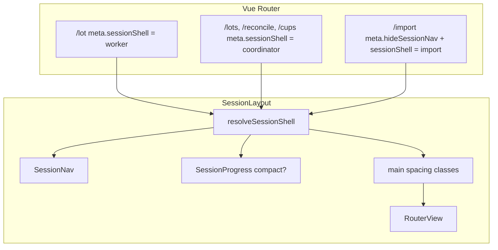

# Tech Spec — Unit 1: Role-aware session shells

**AIDLC phase:** Design (one **Unit** per Tech Spec)  
**Grounding:** Implements [product-spec.md](./product-spec.md) (approved 2026-06-16). Amends [ADR-0002](../../adr/0002-shared-session-ui-chrome.md) via [ADR-0006](../../adr/0006-role-aware-shell-taxonomy.md).

---

## Overview

| Field | Value |
|-------|-------|
| **Unit / scope** | Router-driven **session shell** assignment; **SessionWorkerShell** for lot entry; compact layout chrome; ui-rules + ADR updates |
| **Feature** | [role-aware-shells](./) · [#11](https://github.com/dcvezzani/brick-counter-coordinator-02/issues/11) |
| **Product Spec** | [product-spec.md](./product-spec.md) — **Approved** |
| **Status** | **Approved for build** |
| **Author** | David Vezzani (with AI draft) |
| **Created** | 2026-06-16 |
| **Last updated** | 2026-06-16 |
| **Approved** | 2026-06-16 — David Vezzani |
| **PR target** | `feature/role-aware-shells` → `main` |

## Context

### Summary

Formalize the **four-shell taxonomy** (Marketing, ImportFocus, SessionCoordinator, SessionWorker) with **explicit route → shell** mapping via Vue Router `meta`. Implement **SessionWorkerShell** on `/session/:sessionId/lot` by:

1. Adding `meta.sessionShell` on session child routes (default `coordinator`).
2. Teaching `SessionLayout` to apply **worker layout density** (compact progress strip, tighter main padding, hide demo phase controls on phone).
3. Extending `SessionViewFrame` with a **`worker` variant** (tighter frame spacing).
4. Migrating `LotEntryView` to worker shell — **title-only** `ViewHeader` (drop description line); preserve #10 cockpit + Compare gate.

Coordinator routes, import focus, nav visibility, and phase machine are **unchanged**.

### Existing system & documentation

| Artifact | Relevance |
|----------|-----------|
| [product-spec.md](./product-spec.md) | Approved scope, route table, success criteria |
| [ADR-0002](../../adr/0002-shared-session-ui-chrome.md) | Current 3-shell taxonomy — **superseded for session routes by ADR-0006** |
| [ADR-0005](../../adr/0005-progress-strip-backward-navigation.md) | Progress strip click + confirm — must work on worker routes |
| [docs/ui-rules.md](../../docs/ui-rules.md) | Shell table, worker counting section — **update in this Unit** |
| [docs/support/application-views.md](../../docs/support/application-views.md) | Route map — add shell column note |
| [#10 lot-entry-cockpit](../00-shipped/lot-entry-cockpit/product-spec.md) | Cockpit content unchanged |
| [lot-entry-cockpit-shell tech-spec](../00-shipped/lot-entry-cockpit/sub-features/lot-entry-cockpit-shell/tech-spec.md) | Prior compact-hack — **replaced by shell variant** |
| `SessionLayout.vue`, `SessionProgress.vue`, `SessionViewFrame.vue`, `LotEntryView.vue` | Primary touchpoints |

### Out of scope for this Unit

Per approved Product Spec:

- Authentication / RBAC / route blocking by user
- Worker shell on List cups or other routes (future)
- `LotEntryForm` behavior, pickers, save merge
- Phase machine, landing routes, SessionNav hide rules
- Playwright e2e
- Backend / production sync

## Architecture

### High-level design

```
Router meta.sessionShell
        │
        ▼
┌───────────────────────────────────────────────────────────────┐
│  SessionLayout                                                 │
│  resolveSessionShell(route.meta)                               │
│    ├── SessionNav (unchanged visibility)                       │
│    ├── SessionProgress (:compact="shell === worker")           │
│    ├── StoryboardPhaseControls (hidden on phone when worker)   │
│    └── RouterView                                              │
│          └── View (e.g. LotEntryView)                          │
│                └── SessionViewFrame variant="worker"           │
│                      ├── ViewHeader (title only)               │
│                      ├── LotEntryForm                          │
│                      └── ViewActions (Compare gate)            │
└───────────────────────────────────────────────────────────────┘
```



### Shell resolution module

**New file:** `src/lib/session-shell.js`

| Export | Purpose |
|--------|---------|
| `SESSION_SHELL` | `{ COORDINATOR: 'coordinator', WORKER: 'worker', IMPORT: 'import' }` |
| `resolveSessionShell(routeMeta)` | Returns shell enum from meta; `hideSessionNav === true` → `IMPORT`; else `meta.sessionShell ?? COORDINATOR` |
| `isWorkerShell(shell)` | Convenience for layout classes |
| `isCoordinatorShell(shell)` | Convenience for tests |

**Router assignment** (`src/router/index.js`):

| Route name | `meta` |
|------------|--------|
| `session-import` | `{ hideSessionNav: true, sessionShell: 'import' }` |
| `session-lot` | `{ sessionShell: 'worker' }` |
| `session-lots`, `session-cups`, `session-reconciliation` | `{ sessionShell: 'coordinator' }` (explicit for documentation; default would match) |

Marketing routes (`/`, `/session/new`) are outside `SessionLayout` — **MarketingShell** unchanged (`ViewFrame`).

### SessionLayout worker density

`SessionLayout.vue` reads `resolveSessionShell(route.meta)` and applies:

| Element | Coordinator (default) | Worker (`session-lot`) |
|---------|----------------------|-------------------------|
| `SessionProgress` | default padding | `:compact="true"` |
| `<main>` vertical rhythm | `space-y-4 pt-4` | `space-y-2 pt-2` |
| `StoryboardPhaseControls` | always when `sessionId` | `hidden md:block` when worker (demo controls off phone fold) |
| Bottom nav clearance | unchanged | unchanged |

**No changes** to `SessionNav` visibility, items, or phase gating.

### SessionProgress compact mode

**New prop:** `compact: Boolean` (default `false`)

| Aspect | Default | Compact |
|--------|---------|---------|
| `<ol>` padding | `py-2` | `py-1` |
| Text size | `text-xs sm:text-sm` | `text-xs` only |
| Step buttons | unchanged min-h-11 | unchanged (touch + #80) |

All click/confirm behavior from [#80](../00-shipped/go-back-to-previous-state-02/tech-spec.md) **unchanged** — compact is visual only.

### SessionViewFrame worker variant

**New prop:** `variant: { type: String, default: 'coordinator', validator: (v) => ['coordinator', 'worker'].includes(v) }`

| Aspect | `coordinator` (default) | `worker` |
|--------|-------------------------|----------|
| Outer wrapper | `space-y-4` | `space-y-2` |
| Inner frame padding | `p-3 md:p-4` | `p-2 md:p-3` |

Existing consumers omit prop → no regression.

### LotEntryView migration

| Before (#10 compact hack) | After (#11 worker shell) |
|---------------------------|--------------------------|
| `<SessionViewFrame>` + inner `div.space-y-3` | `<SessionViewFrame variant="worker">` — no extra spacing wrapper |
| `ViewHeader` title + description `"Count parts into lots."` | `ViewHeader title="Lot entry"` only — **no description** |
| Compare gate | **Unchanged** |

Compare handler contract (from lot-entry-cockpit-shell tech-spec):

```js
setPhase(sessionId, 'reconciling')
router.push(landingRouteLocation(sessionId, 'reconciling'))
```

Visible only when `session.phase === 'counting'`.

### Boundaries

| Layer | Responsibility |
|-------|----------------|
| `src/lib/session-shell.js` | Shell enum + resolver — single source for layout/tests |
| `src/router/index.js` | Route → shell meta |
| `SessionLayout.vue` | Shell-aware outer chrome |
| `SessionProgress.vue` | Optional compact presentation |
| `SessionViewFrame.vue` | Coordinator vs worker frame density |
| `LotEntryView.vue` | Worker frame + title-only header |
| `docs/ui-rules.md` | Taxonomy table, recipes, worker section update |
| `adr/0006-role-aware-shell-taxonomy.md` | Architectural decision record |

**Views not modified:** `ListLotsView`, `ListCupsView`, `ReconciliationView`, `PartOutImportView`, `HomeView`, `NewSessionView` — coordinator/import/marketing unchanged.

## Data

No session shape, fixture, or API changes.

## APIs & contracts

No HTTP API.

### Router meta contract

```js
// session child routes
meta: {
  hideSessionNav?: boolean,      // import only
  sessionShell?: 'coordinator' | 'worker' | 'import',
}
```

### Component props

```js
// SessionProgress.vue
compact: { type: Boolean, default: false }

// SessionViewFrame.vue
variant: { type: String, default: 'coordinator' } // 'coordinator' | 'worker'
```

## UI / client

### Route → shell map (canonical)

| Route | Shell | Router meta |
|-------|-------|-------------|
| `/` | MarketingShell | — |
| `/session/new` | MarketingShell | — |
| `/session/:sessionId/import` | ImportFocusShell | `hideSessionNav`, `sessionShell: 'import'` |
| `/session/:sessionId/lot` | **SessionWorkerShell** | `sessionShell: 'worker'` |
| `/session/:sessionId/lots` | SessionCoordinatorShell | `sessionShell: 'coordinator'` |
| `/session/:sessionId/cups` | SessionCoordinatorShell | `sessionShell: 'coordinator'` |
| `/session/:sessionId/reconciliation` | SessionCoordinatorShell | `sessionShell: 'coordinator'` |

### Chrome reduction target (Validate criterion #3)

On **375×667** viewport with demo session in `counting` phase:

- Measure `offsetTop` of first interactive control in `LotEntryForm` (e.g. part combobox input) on **lot entry**.
- Compare to first primary content row on **List lots browse** (table/card list).
- **Expect:** lot entry control `offsetTop` **≥ 24px less** than list lots (documents visible chrome reduction).

Manual/MCP screenshot acceptable for Validate; optional Vitest + `jsdom` geometry test if stable.

### Accessibility

- One `<h1>` per route preserved (`ViewHeader` title on lot entry).
- Progress strip compact mode keeps `aria-label="Session progress"` and step button labels.
- Worker shell does not remove keyboard path to nav or progress.

## Security & privacy

Presentation-only change. No auth, secrets, or PII handling changes.

## Acceptance criteria (for Review)

- [ ] `src/lib/session-shell.js` exports `SESSION_SHELL` and `resolveSessionShell`
- [ ] `session-lot` route has `meta.sessionShell: 'worker'`
- [ ] `SessionLayout` applies worker density when shell is worker
- [ ] `SessionProgress` supports `compact` prop; worker route uses it
- [ ] `SessionViewFrame` supports `variant="worker"`; lot entry uses it
- [ ] `LotEntryView` has title-only header (no description); Compare gate unchanged
- [ ] `docs/ui-rules.md` lists four shells + route table; worker counting section references `SessionWorkerShell`
- [ ] [ADR-0006](../../adr/0006-role-aware-shell-taxonomy.md) accepted; [ADR-0002](../../adr/0002-shared-session-ui-chrome.md) links to it
- [ ] Coordinator views visually unchanged (no accidental worker meta)
- [ ] Import focus shell unchanged (nav hidden, Back, confirm CTA)
- [ ] `SessionProgress` backward navigation tests pass on worker layout mount
- [ ] `npm test` and `npm run build` pass

## Testing approach

| Layer | What we prove | Files |
|-------|----------------|-------|
| Unit | Shell resolver maps meta correctly | `tests/unit/lib/session-shell.test.js` (new) |
| Unit | Router lot route has worker meta | `tests/unit/router/index.test.js` (extend) |
| Unit | `SessionViewFrame` worker variant classes | `tests/unit/components/SessionViewFrame.test.js` (extend) |
| Unit | `SessionProgress` compact prop classes | `tests/unit/components/SessionProgress.test.js` (extend) |
| Unit | `SessionLayout` passes compact to progress on worker route | `tests/unit/components/SessionLayout.test.js` (new) |
| Unit | Lot entry: no description, worker frame, Compare gate | `tests/unit/views/LotEntryView.test.js` (update) |
| Regression | Progress strip click + confirm | existing `SessionProgress.test.js`, `usePhaseNavigation.test.js` |
| Manual / MCP | Phone chrome reduction vs list lots | Validate scorecard evidence |

**LotEntryView test change:** Replace assertion `toContain('Count parts into lots.')` with assertion that description paragraph is absent and `SessionViewFrame` receives `variant="worker"`.

## Rollout & operations

### Rollout plan

Single PR to `main` on branch `feature/role-aware-shells`. No feature flag — storyboard demo.

### Monitoring & observability

N/A (static SPA storyboard).

### Rollback

Revert PR. Shell meta and layout classes are isolated; no data migration.

## Risks & open technical questions

| Risk / question | Mitigation |
|-----------------|------------|
| Compact progress still too tall on very short phones | Validate criterion #3; further trim in follow-up only if evidence fails |
| Hiding `StoryboardPhaseControls` on worker phone blocks demo | Controls remain on `md+`; storyboard phase dropdown still on laptop |
| ADR-0002 drift | ADR-0006 + ui-rules update in same PR |
| LotEntryView test expects description | Update test in same PR as view change |

## Design review passes

### Architecture / boundaries

**Pass.** Shell selection at router meta + pure resolver keeps views dumb. `SessionLayout` owns outer chrome; `SessionViewFrame` owns inner frame density. No Pinia store. Aligns with ADR-0002 compositional pattern.

### Frontend

**Pass.** Tailwind utility deltas only; reuses existing components. Worker optimizations scoped to `< md` where noted. No new shadcn primitives.

### Backend / API

**N/A** — client-only.

### Testing

**Pass.** Unit coverage on resolver, router meta, layout wiring, and lot entry regression. Manual viewport check for criterion #3.

### CI / DevOps

**Pass.** Existing `npm test` + `npm run build` in CI; no workflow changes.

## Documentation deliverables

| Doc | Change |
|-----|--------|
| [docs/ui-rules.md](../../docs/ui-rules.md) | Add `SessionWorkerShell` to taxonomy table; route assignment table; update worker counting § Shell row; remove “out of scope #11” note |
| [docs/support/application-views.md](../../docs/support/application-views.md) | Optional one-line shell column or pointer to ui-rules |
| [adr/0006-role-aware-shell-taxonomy.md](../../adr/0006-role-aware-shell-taxonomy.md) | New ADR — amends session shell list in ADR-0002 |
| [feature/ux-roadmap.md](../ux-roadmap.md) | Move to Design/Build when PR opens |

## Change history

| Date | Author | Changes |
|------|--------|---------|
| 2026-06-16 | David Vezzani (AI draft) | Initial Tech Spec from approved Product Spec |
| 2026-06-16 | David Vezzani | **Approved for build** — ready for `/build role-aware-shells` |
