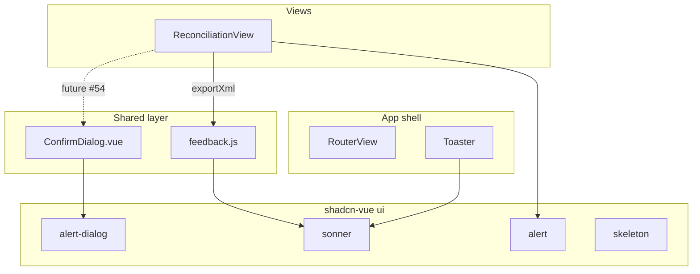

# Tech Spec — Unit 1: Feedback primitives foundation

**AIDLC phase:** Design (one **Unit** per Tech Spec)  
**Grounding:** Implements [product-spec.md](./product-spec.md) (approved 2026-06-14). Aligns with [ADR-0001](../../adr/0001-frontend-vue-js-shadcn-stack.md), [ADR-0002](../../adr/0002-shared-session-ui-chrome.md), and [docs/ui-rules.md](../../docs/ui-rules.md).

---

## Overview

| Field | Value |
|-------|-------|
| **Unit / scope** | Install shadcn-vue feedback primitives, global toast host, shared helpers/wrappers, Export XML toast migration, ui-rules feedback section |
| **Feature** | [ui-feedback-primitives](./) · [GitHub issue #9](https://github.com/dcvezzani/brick-counter-coordinator-02/issues/9) |
| **Product Spec** | [product-spec.md](./product-spec.md) — **Approved** |
| **Status** | **Complete** — Validate PASS · Learn 2026-06-14 · [PR #55](https://github.com/dcvezzani/brick-counter-coordinator-02/pull/55) |
| **Author** | David Vezzani (with AI draft) |
| **Created** | 2026-06-14 |
| **Last updated** | 2026-06-14 |

## Context

### Summary

Add the missing **feedback layer** on top of #5 shell primitives: install shadcn-vue `alert-dialog`, `sonner`, `alert`, and `skeleton`; mount `<Toaster />` in `App.vue`; expose a small `src/lib/feedback.js` API and `ConfirmDialog.vue` wrapper; migrate Reconciliation export stub from inline text to an info toast; publish feedback rules in `docs/ui-rules.md`. **Session complete confirm + celebration** remain in [#54](../../acknowledge-mission-complete/product-spec.md) — that Feature consumes this Unit’s primitives rather than duplicating CLI installs.

### Existing system & documentation

| Artifact | Relevance |
|----------|-----------|
| [feature/00-shipped/consolidate-and-clean-ui/product-spec.md](../consolidate-and-clean-ui/product-spec.md) | `FormField`, `ViewActions`, shells — feedback sits above these |
| [feature/00-shipped/view-actions/product-spec.md](../view-actions/product-spec.md) | Confirm dialogs explicitly deferred to #9 |
| [feature/acknowledge-mission-complete/tech-spec.md](../../acknowledge-mission-complete/tech-spec.md) | First confirm+toast consumer — **update dependency** to use #9 installs |
| [docs/ui-rules.md](../../docs/ui-rules.md) | Lines 290–311 defer feedback to #9 — this Unit publishes the section |
| [dcv/ux-concerns.md](../../dcv/ux-concerns.md) | Pattern G component matrix |
| [ADR-0002](../../adr/0002-shared-session-ui-chrome.md) | Follow-up item for alert-dialog, sonner — resolved by this Unit |
| `src/views/ReconciliationView.vue` | `exportMessage` inline stub → toast migration target |
| `src/App.vue` | Bare `RouterView` — add global Toaster |

### Out of scope for this Unit

Per approved Product Spec:

- Session complete confirm + celebration ([#54](../../acknowledge-mission-complete/product-spec.md))
- Confirm on other phase CTAs
- Real export/API/network error handling
- Mandatory skeleton migration in every view (pattern only until async exists)
- `sheet` primitive
- Playwright e2e

## Architecture

### High-level design

```
App.vue
  ├── RouterView
  └── Toaster (sonner)

Views (e.g. ReconciliationView)
  ├── Inline Alert (persistent chapter context)
  ├── ConfirmDialog (controlled — wired by consumer Features like #54)
  └── call feedback.js helpers → toast

src/lib/feedback.js
  ├── showInfoToast / showSuccessToast / showErrorToast
  ├── DEFAULT_TOAST_DURATION_MS (+ re-export for consumers)
  └── thin wrappers over vue-sonner `toast`

src/components/ConfirmDialog.vue
  └── wraps shadcn alert-dialog (controlled open, slots for copy)

src/components/ui/
  ├── alert-dialog/   (CLI)
  ├── sonner/         (CLI)
  ├── alert/          (CLI)
  └── skeleton/       (CLI)
```



### Boundaries

| Layer | Responsibility |
|-------|----------------|
| `src/components/ui/*` | Generated shadcn-vue primitives — **do not** edit generated files except theme tokens via CSS vars |
| `src/lib/feedback.js` | App-level toast API, duration constants, message formatting helpers |
| `src/components/ConfirmDialog.vue` | Reusable controlled confirm shell — copy and confirm handler owned by parent view |
| `src/App.vue` | Single global `<Toaster />` |
| Consumer Features (#54, etc.) | Business logic (e.g. `completion-celebration.js`) + view wiring |
| `docs/ui-rules.md` | When to use toast vs alert vs FormField error vs confirm |

### Integration points

| System | Contract | Notes |
|--------|----------|-------|
| shadcn-vue CLI | `npx shadcn-vue@latest add alert-dialog sonner alert skeleton` | Adds `vue-sonner` dep via sonner recipe |
| vue-sonner | `toast()`, `<Toaster />` | Import from `@/components/ui/sonner` per CLI output |
| Reka UI (alert-dialog) | Focus trap, ESC dismiss | Cancel = no side effects — parent clears `open` |
| Vitest / CI | `npm test`, `npm run build` | Mock `vue-sonner` in view tests |
| [#54](../../acknowledge-mission-complete/tech-spec.md) | Imports `ConfirmDialog`, `showSuccessToast`, duration constant | Remove duplicate CLI steps from #54 spec |

## Data

No schema changes. No new persisted state. Toast and confirm state are **ephemeral** (in-memory, component refs).

## APIs & contracts

No HTTP API. Internal contracts:

### `src/lib/feedback.js`

| Export | Signature | Behavior |
|--------|-----------|----------|
| `DEFAULT_TOAST_DURATION_MS` | `6000` | Default auto-dismiss for info/success/error |
| `showInfoToast(message, options?)` | `(string, { duration? }) => void` | Sonner info toast |
| `showSuccessToast(message, options?)` | `(string, { duration? }) => void` | Sonner success toast |
| `showErrorToast(message, options?)` | `(string, { duration? }) => void` | Sonner error toast |
| `EXPORT_STUB_TOAST_MESSAGE` | constant string | Locked copy for export stub |

**Export stub message (locked):**

```
Storyboard: XML export stub — no file generated.
```

Implementation wraps `toast()` from the shadcn sonner module; passes `{ duration: options?.duration ?? DEFAULT_TOAST_DURATION_MS }`.

### `ConfirmDialog.vue`

Controlled component — parent owns `open` ref and side effects.

| Prop | Type | Default | Notes |
|------|------|---------|-------|
| `open` | `boolean` | required | v-model |
| `title` | `string` | required | Dialog title |
| `description` | `string` | optional | Body copy |
| `cancelLabel` | `string` | `'Cancel'` | Maps to `AlertDialogCancel` |
| `confirmLabel` | `string` | `'Confirm'` | Maps to `AlertDialogAction` |
| `confirmVariant` | `'default' \| 'destructive'` | `'default'` | Destructive for session-ending actions (#54) |

| Event | Payload | When |
|-------|---------|------|
| `update:open` | `boolean` | Dialog open state changes |
| `confirm` | none | User clicks confirm action |
| `cancel` | none | User clicks cancel, ESC, or overlay dismiss |

**Pattern:** Parent sets `open = true` from sticky CTA `@click` — **do not** wrap sticky `Button` in `AlertDialogTrigger` (preserves test selectors and #54 spec).

### Skeleton reference

Document `Skeleton` usage for table/card loading placeholders. Optional demo component `TableLoadingSkeleton.vue` (3–5 skeleton rows) colocated under `src/components/` for tests and ui-rules reference — **not** wired into live views until async data exists.

## UI / client

### shadcn primitive install

```bash
npx shadcn-vue@latest add alert-dialog sonner alert skeleton
```

Expected additions:

- `src/components/ui/alert-dialog/*`
- `src/components/ui/sonner/*` (+ `vue-sonner` in `package.json`)
- `src/components/ui/alert/*`
- `src/components/ui/skeleton/*`

### Global toast host (`App.vue`)

```vue
<script setup>
import { RouterView } from 'vue-router'
import { Toaster } from '@/components/ui/sonner'
</script>

<template>
  <RouterView />
  <Toaster position="bottom-right" :offset="{ bottom: '1rem' }" />
</template>
```

Adjust `offset` if bottom session nav overlap is observed in Review — Home has no bottom nav; session routes may need larger bottom offset in a follow-up.

### `ConfirmDialog.vue` structure

Wraps shadcn `AlertDialog`, `AlertDialogContent`, header, footer, cancel, action. Emits `confirm` on action click; parent runs async/sync work then sets `open = false`.

### ReconciliationView migration

| Before | After |
|--------|-------|
| `exportMessage` ref + `<p v-if="exportMessage">` | Remove ref and paragraph |
| `exportXml()` sets ref | `exportXml()` calls `showInfoToast(EXPORT_STUB_TOAST_MESSAGE)` |

Keep existing bordered `role="status"` div for **persistent** export chapter context — that is inline alert territory, not toast.

Optional refinement: replace the hand-rolled bordered div with shadcn `Alert` + `AlertDescription` for consistency (same copy, improved semantics). If done, use `variant="default"` and preserve `role="status"` via alert root if needed.

### Feedback vocabulary (for ui-rules)

| Need | Primitive | Example |
|------|-----------|---------|
| Transient outcome | Toast via `feedback.js` | Export stub, future save success |
| Irreversible / high-stakes | `ConfirmDialog` | Session complete (#54) |
| Persistent page context | shadcn `Alert` inline | Export chapter banner |
| Field validation | `FormField` `:error` | New session required fields |
| Submit/network failure | `showErrorToast` | Future API errors |
| Loading placeholder | `Skeleton` | Future coordinator fetch |

### Accessibility

| Concern | Requirement |
|---------|-------------|
| Toasts | Sonner polite live region; message self-contained |
| Confirm | Reka focus trap; ESC = cancel; return focus to trigger on dismiss |
| Inline alert | Use `Alert` title/description; don`t rely on color alone |
| FormField errors | Existing `role="alert"` on error paragraph — unchanged |
| Sticky `ViewActions` + dialog | Dialog portals above footer; verify z-index on phone |

### Mobile / layout

- Confirm dialog: shadcn full-width margins on narrow viewports
- Toaster: `bottom-right` with safe-area-aware offset on session routes (tune in Review if overlap with `SessionNav`)

## Security & privacy

No auth, no PII, no network. Storyboard only. No new env vars.

## Acceptance criteria (for Review)

- [ ] `alert-dialog`, `sonner`, `alert`, `skeleton` installed under `src/components/ui/`
- [ ] `<Toaster />` mounted in `App.vue`
- [ ] `src/lib/feedback.js` exports toast helpers + `DEFAULT_TOAST_DURATION_MS` + `EXPORT_STUB_TOAST_MESSAGE`
- [ ] `ConfirmDialog.vue` exists with controlled `open`, title/description props, cancel/confirm events
- [ ] `TableLoadingSkeleton.vue` (or equivalent reference) demonstrates skeleton pattern
- [ ] Reconciliation **Export XML** shows info toast; **no** inline `exportMessage` paragraph
- [ ] Export chapter persistent context remains visible (alert or existing status div)
- [ ] `docs/ui-rules.md` feedback section published; “deferred to #9” lines updated
- [ ] `src/lib/feedback.spec.js` covers toast helper wiring (mock sonner)
- [ ] `ReconciliationView.spec.js` updated — export triggers toast mock, no exportMessage text in DOM
- [ ] `npm test` and `npm run build` pass
- [ ] [#54 tech-spec](../../acknowledge-mission-complete/tech-spec.md) dependency note: consumes #9 primitives (no duplicate CLI in #54 Build)

## Testing approach

| Layer | What we prove | File(s) |
|-------|----------------|---------|
| Unit | Toast helpers call sonner with correct duration and message | `src/lib/feedback.spec.js` |
| Unit | `EXPORT_STUB_TOAST_MESSAGE` constant stable | `src/lib/feedback.spec.js` |
| Component | `ConfirmDialog` emits confirm/cancel; v-model open | `src/components/ConfirmDialog.spec.js` |
| Component | Export XML invokes info toast; inline message removed | `src/views/ReconciliationView.spec.js` |
| Component | Optional: `TableLoadingSkeleton` renders N skeleton rows | `src/components/TableLoadingSkeleton.spec.js` |
| Regression | Phase gates and ViewActions unchanged except export handler | `ReconciliationView.spec.js` |
| Manual / Review UI | Toast visible on export; dismisses; confirm dialog keyboard (#54 when built) | Chrome DevTools MCP |

### Test conventions

- Mock sonner: `vi.mock('@/components/ui/sonner', () => ({ toast: { info: vi.fn(), success: vi.fn(), error: vi.fn() } }))` — adjust path to match CLI export
- Or mock `vue-sonner` if that is the direct import in generated sonner wrapper
- `beforeEach`: existing `__resetSessionsForTests()` in view specs
- Assert toast via mock call, not DOM text for transient messages

## Rollout & operations

### Rollout plan

Single frontend PR on `main`. No feature flag. Ship before or in parallel with #54; **#54 should merge after #9** (or rebase #54 to drop duplicate primitive install).

### Monitoring & observability

N/A — storyboard SPA.

### Rollback

Revert PR. Remove shadcn components and `vue-sonner` dep if needed. Restore inline export message if reverting view-only.

## Risks & open technical questions

| Risk / question | Mitigation |
|-----------------|------------|
| #54 tech spec duplicates primitive install | Update #54 spec to depend on #9; Build #9 first |
| Sonner import path varies by shadcn-vue version | Follow CLI output; fix imports in `feedback.js` during Build |
| Toast hidden behind sticky nav | Tune `Toaster` offset; verify in Review on session route |
| Over-toasting when real API arrives | ui-rules: one toast per user action; errors dedupe in future Feature |
| ConfirmDialog vs raw alert-dialog in views | ui-rules mandate wrapper for all confirms |

## Design review passes (appendix)

Findings merged into this spec.

| Pass | Finding | Resolution |
|------|---------|------------|
| **Architecture** | Feedback is presentation-only; no new state store | Module `feedback.js` + component refs; matches storyboard pattern |
| **Architecture** | Single global Toaster | `App.vue` host; avoid per-view Toaster |
| **Architecture** | Separate #9 foundation from #54 business flow | Clear boundary; celebration module stays in #54 |
| **Frontend** | Controlled confirm on sticky CTAs | `ConfirmDialog` + parent `open` ref — no Trigger wrapper |
| **Frontend** | Transient vs persistent split | Toast for export stub; inline Alert for chapter banner |
| **Frontend** | FormField errors stay inline | Documented in ui-rules; no toast for field validation |
| **Backend / API** | N/A | Confirmed frontend-only |
| **Testing** | Mock sonner in unit/view tests | Listed in conventions |
| **Testing** | Skeleton pattern without async | Reference component + spec only |
| **CI / deploy** | Existing `ci.yml` sufficient | `npm ci` → test → build unchanged |

## Follow-up for consumer Features

| Feature | Uses from #9 |
|---------|----------------|
| [#54](../../acknowledge-mission-complete/product-spec.md) | `ConfirmDialog`, `showSuccessToast`, override duration 8s in celebration module |
| [#53 go-back](../../go-back-to-previous-state/product-spec.md) | `ConfirmDialog` if product approves confirm on multi-step back |
| [#10 lot-entry-cockpit](../../lot-entry-cockpit/product-spec.md) | Toasts for count actions; skeleton when async |
| Future API | `showErrorToast`, `TableLoadingSkeleton` |

## Change history

| Date | Author | Changes |
|------|--------|---------|
| 2026-06-14 | David Vezzani (AI draft) | Initial Design draft from approved Product Spec + codebase review |
| 2026-06-14 | David Vezzani | Approved for build (chat) |
| 2026-06-14 | David Vezzani | Validate PASS — shipped [PR #55](https://github.com/dcvezzani/brick-counter-coordinator-02/pull/55) |

## Learn retrospective (2026-06-14)

| Topic | Note |
|-------|------|
| Product spec gap | `product-spec.md` missing at Design start; recovered from issue #9 + roadmap |
| PR scope | Design docs for #54/#47 bundled in #55; code correctly scoped to #9 |
| Export banner | Optional shadcn `Alert` skipped; `role="status"` retained |
| Testing | `ConfirmDialog` tests stub alert-dialog due to jsdom portals |
| Consumers | #54 must import `ConfirmDialog` + `feedback.js` — no duplicate CLI |

See [learn-notes.md](./learn-notes.md) and [ADR-0003](../../adr/0003-ui-feedback-layer.md).
