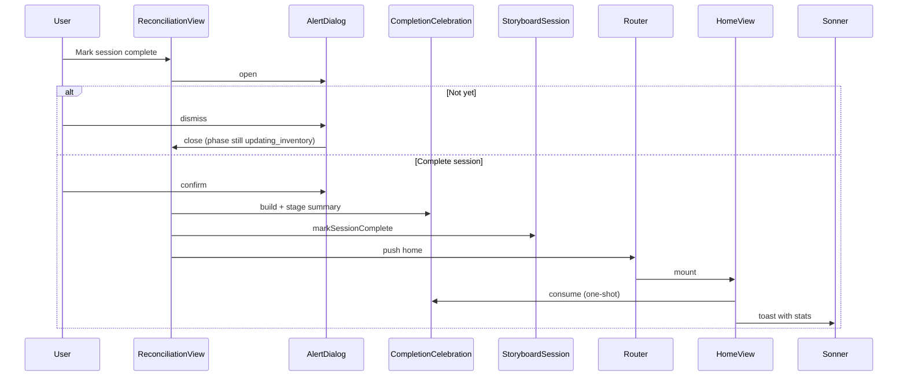

# Tech Spec — Unit 1: Confirm before close + celebration toast

**AIDLC phase:** Design (one **Unit** per Tech Spec)  
**Grounding:** Implements [product-spec.md](./product-spec.md) (approved 2026-06-13). Aligns with [ADR-0001](../../adr/0001-frontend-vue-js-shadcn-stack.md), [ADR-0002](../../adr/0002-shared-session-ui-chrome.md), and [docs/ui-rules.md](../../docs/ui-rules.md).

---

## Overview

| Field | Value |
|-------|-------|
| **Unit / scope** | Confirm dialog on **Mark session complete**, one-shot celebration toast on Home, minimal shadcn feedback primitives, session completion summary helper |
| **Feature** | [acknowledge-mission-complete](./) · [GitHub issue #54](https://github.com/dcvezzani/brick-counter-coordinator-02/issues/54) |
| **Product Spec** | [product-spec.md](./product-spec.md) — **Approved** |
| **Status** | **Approved for build** |
| **Author** | David Vezzani (with AI draft) |
| **Created** | 2026-06-14 |
| **Last updated** | 2026-06-14 |
| **Approved** | 2026-06-14 — David Vezzani (chat) |

## Context

### Summary

Gate the **Mark session complete** CTA on `ReconciliationView` (export chapter) with a shadcn **alert-dialog** using locked product copy. On confirm, close the session (`phase → closed`), navigate to Home, and show a **one-shot celebration toast** (shadcn **sonner**) with set number, lot count, total pieces, and average part-out value. Add a small completion-summary module and fixture field for storyboard avg part-out value; do not change `markSessionComplete` semantics or closed-session router guards.

### Existing system & documentation

| Artifact | Relevance |
|----------|-----------|
| [feature/00-shipped/storyboard-ui/tech-spec.md](../00-shipped/storyboard-ui/tech-spec.md) | Phase machine, `markSessionComplete`, `ReconciliationView` dual-mode, in-memory session module |
| [feature/00-shipped/consolidate-and-clean-ui/product-spec.md](../00-shipped/consolidate-and-clean-ui/product-spec.md) | `ViewActions` sticky CTA on export chapter — confirm attaches here |
| [docs/support/application-views.md](../../docs/support/application-views.md) | `updating_inventory` export chapter; closed → Home redirect |
| [docs/session-phases-state.mmd](../../docs/session-phases-state.mmd) | `updating_inventory → closed` transition |
| [docs/ui-rules.md](../../docs/ui-rules.md) | Shell taxonomy; feedback primitives deferred to [#9](https://github.com/dcvezzani/brick-counter-coordinator-02/issues/9) — this Unit is the first minimal adopter |
| [docs/personas/accessibility-designer.md](../../docs/personas/accessibility-designer.md) | Focus trap, live region for toast |
| [ADR-0001](../../adr/0001-frontend-vue-js-shadcn-stack.md) | JS-only Vue 3 + shadcn-vue |
| [ADR-0002](../../adr/0002-shared-session-ui-chrome.md) | `ViewHeader` / `ViewActions` / `SessionViewFrame` composition |

### Out of scope for this Unit

Per approved Product Spec:

- Confirm on other phase CTAs (import, organize, etc.)
- Full [#9](https://github.com/dcvezzani/brick-counter-coordinator-02/issues/9) feedback catalog (loading skeletons, generic error toasts, sheets)
- Changing `markSessionComplete` behavior beyond existing `setPhase(..., 'closed')`
- Undo / reopen closed session
- Backend, persistence, BrickLink export implementation
- Playwright e2e (Vitest + optional Chrome DevTools MCP in Review)

## Architecture

### High-level design

```
ReconciliationView (updating_inventory)
  │
  │  tap "Mark session complete"
  ▼
AlertDialog (controlled open state)
  │  Not yet → close dialog, phase unchanged
  │  Complete session →
  │      1. buildSessionCompletionSummary(sessionId)
  │      2. stageCompletionCelebration(summary)   ← one-shot module flag
  │      3. markSessionComplete(sessionId)        ← unchanged API
  │      4. router.push({ name: 'home' })
  ▼
HomeView (onMounted)
  │
  │  consumeCompletionCelebration() → summary | null
  ▼
toast.success(formatCelebrationMessage(summary))   ← sonner, auto-dismiss
```



### Boundaries

| Layer | Responsibility |
|-------|----------------|
| `ReconciliationView.vue` | Owns confirm dialog UI and confirm/cancel handlers only in `updating_inventory` chapter |
| `src/lib/completion-celebration.js` | Summary computation, one-shot staging/consumption, toast duration constant, message formatter |
| `src/lib/storyboard-session.js` | **Unchanged** `markSessionComplete` — still `setPhase(sessionId, 'closed')` |
| `src/App.vue` | Global `<Toaster />` host (sonner) |
| `src/fixtures/demo-session.js` | Storyboard `avgPartOutValueUsd` display field |
| `src/components/ui/alert-dialog/`, `sonner/` | shadcn-vue primitives via CLI |

### Integration points

| System | Contract | Notes |
|--------|----------|-------|
| Vue Router | `{ name: 'home' }` after confirm | Existing `sessionGuard` continues to redirect closed sessions |
| shadcn-vue alert-dialog | Reka UI dialog primitives | Focus trap, ESC dismiss = cancel |
| shadcn-vue sonner | `toast()` API + `<Toaster />` | `aria-live="polite"` via sonner defaults |
| Vitest / CI | `npm test`, `npm run build` | No workflow changes |

## Data

### Session completion summary (computed + fixture)

New pure helper `buildSessionCompletionSummary(sessionId)` returns:

| Field | Source | Demo value (fixture) |
|-------|--------|----------------------|
| `setNumber` | `session.setNumber` | `"10281"` |
| `lotCount` | `session.lots.length` | `3` |
| `totalPieces` | `sum(session.lots[].quantity)` | `21` (10 + 8 + 3) |
| `avgPartOutValueUsd` | `session.avgPartOutValueUsd` | `127.50` |

**Design decision — average part-out value:** No pricing exists on `partOutLines` today. For storyboard, add a **display-only fixture field** `avgPartOutValueUsd` (number, USD) on the session seed in `demo-session.js`. This is explicit demo data (not computed from lines) so the toast is stable in tests and demos. Future coordinator/backend can replace the field with a real aggregate without changing the summary shape.

```js
// src/fixtures/demo-session.js (addition)
avgPartOutValueUsd: 127.5,
```

### One-shot celebration channel

Module: `src/lib/completion-celebration.js`

| Export | Behavior |
|--------|----------|
| `COMPLETION_TOAST_DURATION_MS` | Default **8000** (8 seconds); single constant for Build to use in `toast.success(..., { duration })` |
| `buildSessionCompletionSummary(sessionId)` | Returns summary object or `null` if session missing |
| `formatCelebrationMessage(summary)` | Returns toast string (see UI section) |
| `stageCompletionCelebration(summary)` | Stores summary in module-scoped variable |
| `consumeCompletionCelebration()` | Returns stored summary and **clears** flag (one-shot) |
| `__resetCompletionCelebrationForTests()` | Clears flag; called from test `beforeEach` |

**Why module flag (not router state or query param):** Matches existing in-memory storyboard pattern (no Pinia); easy to unit test; no URL pollution; survives SPA navigation to Home but not tab refresh (acceptable — product requires toast only immediately after complete, not on later visits).

## APIs & contracts

No HTTP API. Internal contracts:

### `buildSessionCompletionSummary(sessionId)`

```js
// Returns null if session not found
{
  setNumber: string,
  lotCount: number,
  totalPieces: number,
  avgPartOutValueUsd: number,
}
```

### Confirm flow (ReconciliationView)

| Step | Precondition | Postcondition |
|------|------------|---------------|
| Open dialog | `phase === 'updating_inventory'` | Dialog visible; phase unchanged |
| **Not yet** | Dialog open | Dialog closed; still `updating_inventory`; user on Reconciliation |
| **Complete session** | Dialog open | `phase === 'closed'`; navigated to `/`; celebration staged |

`markSessionComplete(sessionId)` signature and implementation **unchanged**.

## UI / client

### shadcn primitive install

```bash
npx shadcn-vue@latest add alert-dialog sonner
```

Generates under `src/components/ui/`. Register `<Toaster />` in `App.vue` (sibling to `<RouterView />`).

### Confirm dialog (`ReconciliationView.vue`)

Only in `updating_inventory` template branch. **Controlled** dialog (`open` ref); **Mark session complete** button sets `open = true` (do not use `AlertDialogTrigger` on the sticky CTA — keeps test selectors stable).

| Element | Copy (locked) |
|---------|---------------|
| Title | Are you sure? |
| Description | You are about to finish this session. Once you do, the session will be closed. |
| Cancel | Not yet |
| Confirm | Complete session |

Structure (conceptual):

```vue
<AlertDialog :open="confirmOpen" @update:open="confirmOpen = $event">
  <AlertDialogContent>
    <AlertDialogHeader>
      <AlertDialogTitle>Are you sure?</AlertDialogTitle>
      <AlertDialogDescription>…</AlertDialogDescription>
    </AlertDialogHeader>
    <AlertDialogFooter>
      <AlertDialogCancel>Not yet</AlertDialogCancel>
      <AlertDialogAction @click="confirmCompleteSession">Complete session</AlertDialogAction>
    </AlertDialogFooter>
  </AlertDialogContent>
</AlertDialog>
```

`confirmCompleteSession` runs staging → `markSessionComplete` → `router.push({ name: 'home' })`.

### Celebration toast (`HomeView.vue`)

On `onMounted`:

1. `const summary = consumeCompletionCelebration()`
2. If `summary`, `toast.success(formatCelebrationMessage(summary), { duration: COMPLETION_TOAST_DURATION_MS })`
3. Else no toast

**Message format** (light celebration, emoji OK):

```
🎉 Set {setNumber} complete! {lotCount} lots · {totalPieces} pieces · avg part-out value ${avgPartOutValueUsd formatted to 2 decimals}
```

Example: `🎉 Set 10281 complete! 3 lots · 21 pieces · avg part-out value $127.50`

Use `Intl.NumberFormat('en-US', { style: 'currency', currency: 'USD' })` for the value segment.

### Accessibility

| Concern | Requirement |
|---------|-------------|
| Confirm dialog | shadcn/Reka focus trap; **Not yet** and ESC dismiss without closing session; return focus to trigger after dismiss |
| Confirm actions | `AlertDialogCancel` / `AlertDialogAction` — use primitive buttons, not raw `<button>` without roles |
| Toast | Sonner polite live region; message self-contained (stats in text, not color-only) |
| Sticky `ViewActions` | Dialog portals above footer (`z-index`); no focus trap in sticky bar while dialog open |
| Home after redirect | Toast announcement sufficient; no extra focus move required |

### Mobile / layout

- Dialog: full-width on phone within safe margins (shadcn default)
- Toaster: `position` default bottom-right; ensure `env(safe-area-inset-bottom)` clearance — use sonner `toastOptions` / `Toaster` `offset` if bottom nav overlap in future; for Home (no bottom nav) defaults are fine

## Security & privacy

No auth, no PII, no network. Storyboard fixture data only. No new env vars or secrets.

## Acceptance criteria (for Review)

Mirrors Product Spec success criteria in testable form:

- [ ] Tapping **Mark session complete** in export chapter opens confirm dialog with title **Are you sure?** before `phase` becomes `closed`
- [ ] Dialog body matches approved copy; buttons **Not yet** and **Complete session**
- [ ] **Not yet** / ESC / overlay dismiss closes dialog; session remains `updating_inventory`; user stays on Reconciliation
- [ ] **Complete session** sets `phase` to `closed`, navigates to Home (`/`)
- [ ] Home shows celebration toast with set number, lot count, total pieces, and formatted avg part-out value
- [ ] Toast does **not** appear on ordinary Home visits (direct navigation, refresh, resume hub)
- [ ] `markSessionComplete` and closed-session router guard behavior unchanged
- [ ] `alert-dialog` and `sonner` installed under `src/components/ui/`
- [ ] `npm test` and `npm run build` pass in CI

## Testing approach

| Layer | What we prove | File(s) |
|-------|----------------|---------|
| Unit | `buildSessionCompletionSummary` counts lots/pieces; reads `avgPartOutValueUsd`; `formatCelebrationMessage` output | `src/lib/completion-celebration.spec.js` |
| Unit | `stage` / `consume` one-shot; `__resetCompletionCelebrationForTests` | `src/lib/completion-celebration.spec.js` |
| Component | Confirm opens on complete click; cancel leaves phase `updating_inventory` | `src/views/ReconciliationView.spec.js` |
| Component | Confirm proceeds → `closed` + `router.push` home + celebration staged | `src/views/ReconciliationView.spec.js` |
| Component | Home shows toast when celebration consumed; no toast without staging | `src/views/HomeView.spec.js` (new or extended) |
| Regression | Closed session still redirects from `/session/:id/*` | `src/router/index.spec.js` (existing — must still pass) |

### Test conventions

- `beforeEach`: `__resetSessionsForTests()` and `__resetCompletionCelebrationForTests()`
- Mount with Vue Router test plugin; stub `HomeView` or use minimal route table as in existing specs
- Assert dialog via approved copy strings; assert toast via `formatCelebrationMessage` output or sonner mock
- Optional sonner mock: `vi.mock('vue-sonner', () => ({ toast: { success: vi.fn() } }))` in `HomeView.spec.js`

### Manual / Review UI (Chrome DevTools MCP)

1. Jump to `updating_inventory` on demo session → Reconciliation export chapter
2. Tap **Mark session complete** → verify dialog copy and keyboard (Tab, ESC)
3. **Not yet** → still on Reconciliation
4. Repeat → **Complete session** → Home toast with stats → wait for auto-dismiss
5. Navigate away and return to Home → no toast

## Rollout & operations

### Rollout plan

Single frontend PR; no feature flag. Static SPA rebuild.

### Monitoring & observability

N/A (storyboard, no production telemetry).

### Rollback

Revert PR; remove shadcn components if desired. No data migration.

## Risks & open technical questions

| Risk / question | Mitigation |
|-----------------|------------|
| Sonner + sticky `ViewActions` z-index clash | Use default portal; verify on phone in Review UI pass |
| `avgPartOutValueUsd` is stub data | Document in fixture; replace when real pricing exists |
| [#9](https://github.com/dcvezzani/brick-counter-coordinator-02/issues/9) may refactor feedback primitives later | Keep celebration logic in `completion-celebration.js`; thin view wiring |
| Test flakiness with dialog animations | Use `@vue/test-utils` `flushPromises`; avoid timing assertions |

## Design review passes (appendix)

Findings merged into this spec; no blocking issues.

| Pass | Finding | Resolution |
|------|---------|------------|
| **Architecture** | Single Unit appropriate; no new state library | Module-scoped celebration flag in `completion-celebration.js` |
| **Architecture** | `markSessionComplete` must stay thin | Staging happens in view before call; no API change |
| **Frontend** | Controlled dialog preferred over trigger wrapper on sticky CTA | Specified controlled `open` ref pattern |
| **Frontend** | Global toast host required | `<Toaster />` in `App.vue` |
| **Backend / API** | N/A — frontend-only storyboard | Confirmed no backend changes |
| **Testing** | Co-located Vitest; mock sonner for Home | Listed in testing table |
| **CI / deploy** | Existing `.github/workflows/ci.yml` sufficient | `npm ci` → `npm test` → `npm run build` unchanged |

## Change history

| Date | Author | Changes |
|------|--------|---------|
| 2026-06-14 | David Vezzani (AI draft) | Initial Design draft from approved Product Spec |
| 2026-06-14 | David Vezzani | Approved for build (chat) |
