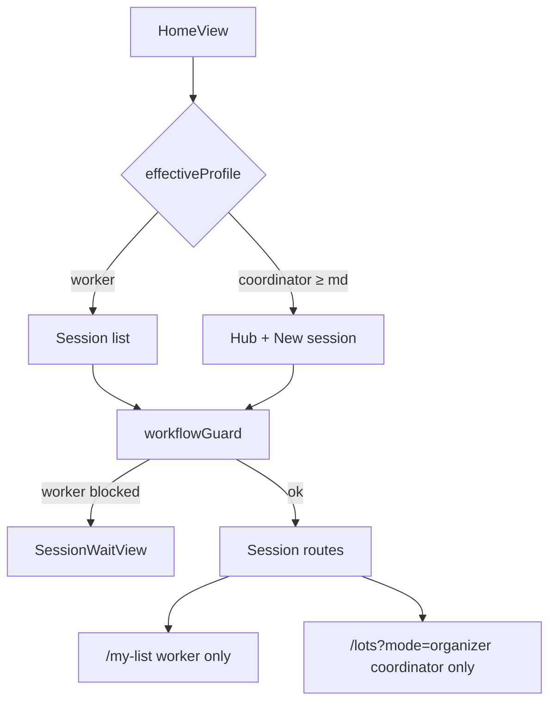

# Tech Spec — Different workflows for desktop and phone

**AIDLC phase:** Design  
**Grounding:** Implements approved [product-spec.md](./product-spec.md) (2026-06-16). Extends [ADR-0002](../../adr/0002-shared-session-ui-chrome.md) / [ADR-0006](../../adr/0006-role-aware-shell-taxonomy.md) presentation rules; no new ADR unless Learn records profile storage conventions.

---

## Overview

| Field | Value |
|-------|-------|
| **Unit / scope** | Workflow **profile** + **display name**; worker/coordinator surfaces; My list route; assignment; organize prompts; storyboard multi-session fixtures; docs |
| **Feature** | [diff-workflows-for-desktop-and-phone](./) · [#90](https://github.com/dcvezzani/brick-counter-coordinator-02/issues/90) |
| **Product Spec** | [product-spec.md](./product-spec.md) — **Approved** 2026-06-16 |
| **UX notes** | [ux-design-notes.md](./ux-design-notes.md) |
| **Status** | Draft — awaiting approval |
| **Author** | David Vezzani (with AI draft) |
| **Created** | 2026-06-16 |
| **Last updated** | 2026-06-16 |
| **PR target** | `feature/diff-workflows-for-desktop-and-phone` → `main` |

## Context

### Summary

Split the SPA into **coordinator** and **worker** workflow profiles driven by viewport + `localStorage`, without changing the session **phase machine**. Phones (`< md`) always resolve to **worker**. On `≥ md`, Home exposes a **Coordinator | Worker** radio (default coordinator) persisted in `localStorage`.

All users set a **display name** on Home (separate `localStorage` key; save on navigate away). Workers join from a **session list**, use **filtered nav/progress**, browse lots/cups with **worker shell density**, and put parts away on a new **`/session/:id/my-list`** route with **virtualized** rows. Coordinators keep the full lifecycle; organizer lists gain **`Select`** assignee + auto-assign on organize phase enter. Workers receive **toast + sticky banner** on lot entry when the session enters organizing (storyboard-simulated push).

### Existing system & documentation

| Artifact | Relevance |
|----------|-----------|
| [product-spec.md](./product-spec.md) | Approved scope + success criteria #1–16 |
| [ux-design-notes.md](./ux-design-notes.md) | Breakpoint matrix, component mapping |
| [ADR-0002](../../adr/0002-shared-session-ui-chrome.md), [ADR-0006](../../adr/0006-role-aware-shell-taxonomy.md) | Shell taxonomy — extend with profile-aware browse + My list |
| [ADR-0003](../../adr/0003-ui-feedback-layer.md) | Toast for organize prompt |
| [ADR-0005](../../adr/0005-progress-strip-backward-navigation.md) | Progress strip — worker subset must preserve click rules on visible steps |
| `src/lib/storyboard-session.js` | Phase, nav model, organizer lists — **extend** |
| `src/lib/session-shell.js` | Shell resolution — **extend** for profile-aware browse |
| `src/composables/` | New `useWorkflowProfile`, `useDisplayName` |
| `@vueuse/core` | `useMediaQuery`, `useStorage` (already in `package.json`) |
| `SessionNav`, `SessionProgress`, `SessionLayout`, `HomeView`, `ListLotsView`, `ListCupsView`, `LotEntryView` | Primary touchpoints |

### Out of scope (Product Spec)

- Coordinator Node server / real WebSockets
- Auth / RBAC
- BrickLink API, reconciliation algorithm changes, lot entry cockpit redesign
- Phase transition rule changes (gates unchanged)
- Playwright e2e (Vitest + MCP/manual UI validation)

## Build units (recommended order)

| Unit | Deliverable | Depends on |
|------|-------------|------------|
| **U1** | Profile + display name composables; storyboard session extensions; multi-session fixtures | — |
| **U2** | Home layout (name, radio, session list); route guards; `SessionWaitView` | U1 |
| **U3** | Filtered `SessionNav` + `SessionProgress`; profile-aware shell on lots/cups browse | U1 |
| **U4** | `MyListView` + virtual scroll; assignment UI; organize toast/banner; `setPhase` hooks | U1, U3 |
| **U5** | `application-views.md` + `ui-rules.md` updates | U2–U4 |

Units may ship in one PR if CI stays green; trace Review to Unit sections below.

---

## Architecture

### High-level design

```
┌─────────────────────────────────────────────────────────────────┐
│  useWorkflowProfile()                                            │
│    useMediaQuery('(min-width: 768px)')                           │
│    useStorage('bcc.workflowProfile', 'coordinator')  [≥ md only] │
│    effectiveProfile = phone ? 'worker' : storedProfile           │
├─────────────────────────────────────────────────────────────────┤
│  useDisplayName()                                                │
│    useStorage('bcc.displayName', '')                             │
│    saveDisplayName() on Home beforeRouteLeave                    │
├─────────────────────────────────────────────────────────────────┤
│  Vue Router                                                      │
│    workflowGuard — coordinator-only routes blocked for worker    │
│    + sessionGuard (existing)                                     │
├─────────────────────────────────────────────────────────────────┤
│  storyboard-session.js (extended)                                │
│    sessions{}, joinedWorkers[], assignee on organizerLists       │
│    sessionNavModel(id, { effectiveProfile, phase })            │
│    progressStepsForProfile(profile, phase)                       │
│    autoAssignOrganizerLists(id) on phase → organizing            │
│    organizePromptState per session                               │
└─────────────────────────────────────────────────────────────────┘
```



### Integration points

| System | Contract | Notes |
|--------|----------|-------|
| **localStorage** | `bcc.workflowProfile`: `'coordinator'` \| `'worker'`; `bcc.displayName`: string | `@vueuse/core` `useStorage` |
| **Vue Router** | New route `session-my-list`; guards on session children | See § Routing |
| **storyboard-session** | In-memory reactive state | Future coordinator server replaces transport, keeps shapes |
| **feedback.js** | Toast with action button | Organize prompt; extend if action API missing |
| **Session shell** | `resolveSessionShell(meta, { effectiveProfile })` | Worker density on browse when profile worker OR `< md` |

---

## U1 — Profile, display name, session model

### Composables

**`src/composables/useWorkflowProfile.js`**

| Export | Behavior |
|--------|----------|
| `storedProfile` | `useStorage('bcc.workflowProfile', 'coordinator')` — read/write on `≥ md` only |
| `isMdUp` | `useMediaQuery('(min-width: 768px)')` — matches Tailwind `md` |
| `effectiveProfile` | `computed`: if `!isMdUp.value` → `'worker'`; else `storedProfile.value` |
| `isWorkerProfile` / `isCoordinatorProfile` | Convenience booleans |
| `setStoredProfile(value)` | Sets storage when `isMdUp` |

**`src/composables/useDisplayName.js`**

| Export | Behavior |
|--------|----------|
| `displayName` | `useStorage('bcc.displayName', '')` — bound to Home input |
| `saveDisplayName()` | Writes current ref to storage (called on Home leave) |
| `hasDisplayName` | `computed` trimmed non-empty |

Home **`onBeforeRouteLeave`**: call `saveDisplayName()`.

### Storyboard session extensions

**`src/lib/storyboard-session.js`** — additive changes:

```javascript
// Session shape additions (fixtures + runtime)
{
  joinedWorkers: ['Alice', 'Bob'],  // display names registered for session
  organizerLists: [{
    id, title,
    assigneeDisplayName: null | string,  // null = Unassigned
    lines: [...]
  }],
  organizePromptAcknowledged: false,  // worker cleared banner for this session
}
```

| Function | Purpose |
|----------|---------|
| `registerJoinedWorker(sessionId, displayName)` | Add unique trimmed name when worker opens session |
| `listStoryboardSessions()` | Return `{ id, setNumber, phase, label }[]` for Home (2–3 fixtures) |
| `ensureStoryboardFixtures()` | Seed demo + 2 extra sessions at import/reconcile phases if missing |
| `assignOrganizerList(sessionId, listId, displayName \| null)` | Coordinator Select handler |
| `autoAssignOrganizerLists(sessionId)` | On enter organizing: assign unassigned lists round-robin to joined workers without a list |
| `getAssignedOrganizerList(sessionId, displayName)` | List assigned to worker or `null` |
| `joinedWorkerDisplayNames(sessionId)` | Names for Select options |
| `acknowledgeOrganizePrompt(sessionId)` | Set flag; hide banner |
| `shouldShowOrganizePrompt(sessionId, effectiveProfile)` | `organizing` phase + worker profile + !acknowledged + has assigned list |

**`setPhase` hook:** when `phase === 'organizing'`, call `autoAssignOrganizerLists(sessionId)` and reset `organizePromptAcknowledged = false`.

**`landingRouteLocation(sessionId, phase, { effectiveProfile })`:**

| Phase | Coordinator | Worker |
|-------|-------------|--------|
| `organizing` | `{ name: 'session-lots', query: { mode: 'organizer' } }` | `{ name: 'session-my-list' }` |
| others | unchanged | unchanged |

**`navTargetPhaseForRoute`:** add `session-my-list` → `'organizing'`.

### Fixtures

**`src/fixtures/storyboard-sessions.js`** (new) — export seeds:

| Session ID | Phase (initial) | Purpose |
|------------|-----------------|---------|
| `demo` | `importing` (existing seed) | Coordinator happy path |
| `session-counting` | `counting` | Worker join target |
| `session-reconciling` | `reconciling` | Worker wait state |

**`src/fixtures/my-list-lines.js`** (new) — generator for **≥50** organizer lines for virtual-scroll Validate fixture on one list assigned to demo worker.

---

## U2 — Home, guards, waiting states

### HomeView

Split template by `effectiveProfile` + `isMdUp`:

| Block | Coordinator (`≥ md` or phone N/A for hub) | Worker |
|-------|-------------------------------------------|--------|
| Display name | `FormField` + `Input` — always | same |
| Profile radio | `RadioGroup` Coordinator \| Worker — **`hidden` when `!isMdUp`** | same (hidden on phone) |
| Primary content | Existing hub cards + Start demo / Resume | **Session list** (`Card` rows: set #, phase `Badge`, tap → join) |
| Join action | — | Requires `hasDisplayName`; `registerJoinedWorker`; navigate to `landingRouteLocation(..., { effectiveProfile: 'worker' })` or wait view |

Coordinator **Start demo** / **New session** unchanged; name still saved on leave.

### Routing

**`src/router/index.js`**

New child route:

```javascript
{
  path: 'my-list',
  name: 'session-my-list',
  component: () => import('@/views/MyListView.vue'),
  meta: { sessionShell: 'worker', workerOnly: true },
}
```

**`src/lib/workflow-guard.js`** (new):

```javascript
export function workflowGuard(to, effectiveProfile) {
  if (effectiveProfile !== 'worker') return true
  const coordinatorOnly =
    to.name === 'session-import' ||
    to.name === 'session-new' ||
    to.name === 'session-reconciliation' ||
    (to.name === 'session-lots' && to.query.mode === 'organizer')
  if (coordinatorOnly) {
    return { name: 'session-wait', params: to.params, query: { reason: '...' } }
  }
  return true
}
```

**`SessionWaitView.vue`** (new) — MarketingShell-style frame **outside** `SessionLayout` or as child with `meta: { hideSessionNav: true, standalone: true }`:

- `Alert` info copy by `reason`: `importing` | `reconciling`
- `Button` → `{ name: 'home' }`
- No `SessionNav`, no tables

Alternative: register `/session/:sessionId/wait` with `hideSessionNav: true`.

Worker opening session in **importing/reconciling** from Home list → navigate to wait route directly (skip coordinator views).

### Route guard wiring

Global `beforeEach` or per-route `beforeEnter` reads `effectiveProfile` from composable singleton / pinia-less module export `getEffectiveProfile()` for use outside setup.

---

## U3 — Nav, progress, profile-aware shells

### SessionNav

**`sessionNavModel(sessionId, { effectiveProfile })`**

Coordinator profile: **existing** model unchanged.

Worker profile:

| Session phase | Nav items (keys) |
|---------------|------------------|
| `counting` (and `reconciling` if somehow in session layout — prefer wait route) | `home`, `lot`, `lots`, `cups` |
| `organizing`, `updating_inventory` | `home`, `lot`, `my-list` — **no** `lots`, `reconcile`, `cups` |
| `importing` | nav hidden (same as today) |

Add nav item:

```javascript
{ key: 'my-list', label: 'My list', to: { name: 'session-my-list', params: { sessionId } } }
```

**SessionNav.vue:** icon map entry for `my-list` (e.g. `ListChecks` from Lucide).

### SessionProgress

**`src/lib/session-progress-model.js`** (new):

```javascript
const COORDINATOR_STEPS = [/* existing STEPS */]
const WORKER_STEPS = [
  { phase: 'counting', label: 'Count' },
  { phase: 'organizing', label: 'Organize' },
  { phase: 'closed', label: 'Done' },
]

export function progressStepsForProfile(effectiveProfile, sessionPhase) {
  if (effectiveProfile === 'coordinator') return COORDINATOR_STEPS
  // Hide Organize until session.phase is organizing or later
  if (sessionPhase === 'counting') {
    return WORKER_STEPS.filter((s) => s.phase === 'counting')
  }
  return WORKER_STEPS.filter((s) => s.phase !== 'closed' || sessionPhase === 'closed')
}
```

**SessionProgress.vue:** accept `effectiveProfile` prop (from `SessionLayout` via `useWorkflowProfile`); iterate `progressStepsForProfile(...)` instead of hard-coded `STEPS`. Backward click rules: only phases returned by `isAllowedBackwardTarget` **and** present in worker subset.

**SessionLayout.vue:** pass `:effective-profile="effectiveProfile"` to `SessionNav` and `SessionProgress`.

### Profile-aware shell on browse routes

**`src/lib/session-shell.js`:**

```javascript
export function resolveSessionShell(routeMeta, { effectiveProfile } = {}) {
  // existing import + meta.sessionShell
  const base = routeMeta.sessionShell ?? 'coordinator'
  if (base === 'coordinator' && effectiveProfile === 'worker') {
    return 'worker' // List lots browse + cups — worker density
  }
  return base
}
```

**ListLotsView.vue** / **ListCupsView.vue:**

- `const { effectiveProfile } = useWorkflowProfile()`
- `SessionViewFrame :variant="frameVariant"` where `frameVariant = isOrganizerMode ? 'coordinator' : (effectiveProfile === 'worker' ? 'worker' : 'coordinator')`
- Organizer **coordinator** mode unchanged (assign UI only when `effectiveProfile === 'coordinator'` — worker never lands here due to guard)

**LotEntryView** on coordinator profile @ `≥ md`: keep `variant="worker"` or switch to coordinator per ux-notes (“Coordinator shell oversight”) — **use coordinator frame on lot entry when `effectiveProfile === 'coordinator'`**, worker frame when worker profile. Update `LotEntryView` to compute variant from profile.

---

## U4 — My list, assignment, organize prompts

### MyListView

**`src/views/MyListView.vue`**

- Worker shell; `ViewHeader` with list title + assignee badge (display name)
- If no assigned list: `Alert` “No list assigned yet” + back to lot
- Line actions: reuse organizer row pattern (`toggleOrganizerLineFlag`) on **assigned list only**
- **Virtual list:** `@vueuse/core` **`useVirtualList`** on a scroll container (`ScrollArea` or overflow div)

```javascript
const { list, containerProps, wrapperProps } = useVirtualList(lines, {
  itemHeight: 56, // fixed row height for cards
})
```

Do **not** mount all 50+ rows in DOM. Mobile card row markup matches organizer mobile cards (part, name, qty, Moved / Needs location buttons `size="sm"`).

### Coordinator assignment (ListLotsView organizer mode)

Per list section header:

- `Badge` showing assignee when set
- `Select` + `SelectItem` for each `joinedWorkerDisplayNames(sessionId)` plus **Unassigned** → calls `assignOrganizerList`

Only rendered when `effectiveProfile === 'coordinator'`.

### Organize prompt (LotEntryView)

When `shouldShowOrganizePrompt(sessionId, effectiveProfile)`:

1. **Toast** (once per organize entry): extend `feedback.js` with `showActionToast(message, { actionLabel, onAction })` using vue-sonner action API
2. **Sticky banner** below header / above form: `Alert` or bordered bar + `Button` “Go to my put-away list” — same navigation as toast
3. On navigate to `session-my-list` or button click: `acknowledgeOrganizePrompt(sessionId)` + `router.push(landingRouteLocation(...))`

Banner uses `ViewActions`-like sticky positioning at top of worker content (not bottom) for visibility; Design may tune classes to match `ui-rules.md`.

### Simulated push

No WebSocket: **`setPhase(..., 'organizing')`** triggers auto-assign + prompt flags. Reconciliation “Declare ready to organize” and storyboard phase controls use existing `setPhase` — hook covers both.

---

## Data model summary

| Entity | Storage | Fields |
|--------|---------|--------|
| Workflow profile | `localStorage` `bcc.workflowProfile` | `'coordinator'` \| `'worker'` |
| Display name | `localStorage` `bcc.displayName` | string |
| Session | in-memory `state.sessions` | + `joinedWorkers`, `organizePromptAcknowledged`, list `assigneeDisplayName` |
| Join registry | per session | array of display name strings |

---

## UI / client file map

| File | Action |
|------|--------|
| `src/composables/useWorkflowProfile.js` | **Add** |
| `src/composables/useDisplayName.js` | **Add** |
| `src/lib/workflow-guard.js` | **Add** |
| `src/lib/session-progress-model.js` | **Add** |
| `src/lib/storyboard-session.js` | **Extend** |
| `src/lib/session-shell.js` | **Extend** |
| `src/lib/feedback.js` | **Extend** (action toast) |
| `src/fixtures/storyboard-sessions.js` | **Add** |
| `src/fixtures/my-list-lines.js` | **Add** |
| `src/views/HomeView.vue` | **Modify** |
| `src/views/MyListView.vue` | **Add** |
| `src/views/SessionWaitView.vue` | **Add** |
| `src/views/LotEntryView.vue` | **Modify** (banner, shell variant) |
| `src/views/ListLotsView.vue` | **Modify** (assign Select, shell) |
| `src/views/ListCupsView.vue` | **Modify** (shell) |
| `src/components/SessionNav.vue` | **Modify** (my-list item, profile prop) |
| `src/components/SessionProgress.vue` | **Modify** (filtered steps) |
| `src/components/SessionLayout.vue` | **Modify** (pass profile) |
| `src/components/OrganizePromptBanner.vue` | **Add** (optional extract) |
| `src/router/index.js` | **Modify** |
| `docs/support/application-views.md` | **Modify** |
| `docs/ui-rules.md` | **Modify** |

---

## Acceptance criteria (for Review)

### Profile & Home

- [ ] Phone (`< md`): `effectiveProfile === 'worker'` even if `localStorage` says coordinator
- [ ] `≥ md`: radio visible; default coordinator; persists across refresh
- [ ] Display name on Home all profiles; pre-filled; saved on leave Home
- [ ] Worker Home shows 2–3 sessions; coordinator Home shows hub + create

### Guards & waiting

- [ ] Worker cannot open import, reconcile, coordinator organizer URLs — redirected to wait or blocked at Home
- [ ] Wait view: Alert + back; no SessionNav

### Nav & progress

- [ ] Worker counting nav: Home, Lot, Lots, Cups
- [ ] Worker organizing nav: Home, Lot, My list (Lots hidden)
- [ ] Coordinator nav unchanged
- [ ] Worker progress: Count only until organizing; then Count → Organize → Done
- [ ] Coordinator progress: full strip unchanged

### Shells

- [ ] List lots browse + cups: worker frame when worker profile
- [ ] Lot entry: worker frame on worker profile; coordinator frame on coordinator profile @ `≥ md`

### My list & assignment

- [ ] `/session/:id/my-list` shows single assigned list for current display name
- [ ] Coordinator organizer: Select assign + Unassigned; Badge assignee
- [ ] Auto-assign on phase → organizing
- [ ] ≥50 lines: virtual list (DOM node count bounded in test or manual)
- [ ] Line moved / needs location toggles work

### Organize prompt

- [ ] Enter organizing: toast + sticky banner on lot entry until My list opened
- [ ] Nav My list works as fallback

### Docs & CI

- [ ] `application-views.md` worker nav table + my-list route
- [ ] `ui-rules.md` profile + My list sections
- [ ] `npm test` / `npm run build` pass

---

## Testing approach

| Layer | What we prove | Files |
|-------|----------------|-------|
| **Unit** | `useWorkflowProfile` phone override; `progressStepsForProfile`; `autoAssignOrganizerLists`; `workflowGuard`; `sessionNavModel` worker vs coordinator; virtual list renders subset | `tests/unit/composables/useWorkflowProfile.test.js`, `tests/unit/lib/session-progress-model.test.js`, `tests/unit/lib/workflow-guard.test.js`, `tests/unit/lib/storyboard-session.test.js` (extend), `tests/unit/views/MyListView.test.js` |
| **Component** | Home name save; SessionProgress worker subset; SessionNav my-list swap; OrganizePromptBanner visibility | `HomeView.test.js`, `SessionProgress.test.js`, `SessionNav.test.js`, `LotEntryView.test.js` |
| **Integration** | Worker join counting session; guard redirect wait; my-list route | `tests/integration/workflow-profile.test.js` |
| **Manual / MCP** | Product spec success criteria #1–15 @ 375px and laptop | Validate phase |

**Test setup:** extend `tests/setup.js` with `matchMedia` stubs for md breakpoint (pattern from `new-counter-input-control`).

---

## Rollout & operations

Storyboard-only — no deploy flags. Rollback: revert PR; clear `localStorage` keys optional in learn-notes.

### Rollback

Revert feature branch; `bcc.workflowProfile` / `bcc.displayName` keys harmless if left in browser.

---

## Risks & open technical questions

| Risk / question | Mitigation |
|-----------------|------------|
| `effectiveProfile` outside Vue setup in router guards | Export read-only getter from small module synced by composable on mount |
| `useVirtualList` row height drift | Fixed min-height card rows; test with 50-line fixture |
| Coordinator on phone forced worker — cannot run full demo on phone | Accepted product decision |
| Duplicate display names | Storyboard: treat as one worker; document in fixture |
| `setPhase` hook side effects | Unit test organizing transition triggers auto-assign |

---

## Design review passes (appendix)

| Pass | Finding | Action |
|------|---------|--------|
| **Architecture** | Profile state in composables + session in storyboard module — no Pinia | Accepted; matches #11 |
| **Frontend** | Reuse `@vueuse/core`, shadcn Select/Alert/RadioGroup, existing shells | No new npm deps |
| **Backend** | N/A — storyboard simulation | WebSocket contract documented in product spec for future Feature |
| **Testing** | Guard + profile composables unit-testable | Integration for join flow |
| **DevOps** | Existing CI `npm test` + build | No workflow changes |

---

## Change history

| Date | Author | Changes |
|------|--------|---------|
| 2026-06-16 | AI + Dave | Initial Tech Spec draft from approved Product Spec |
