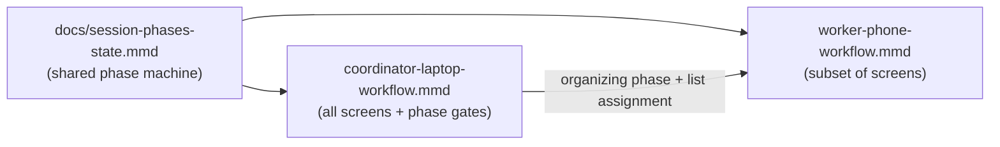
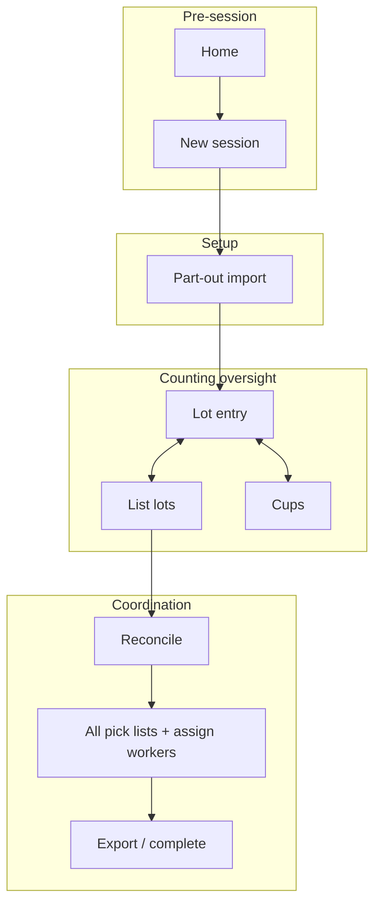
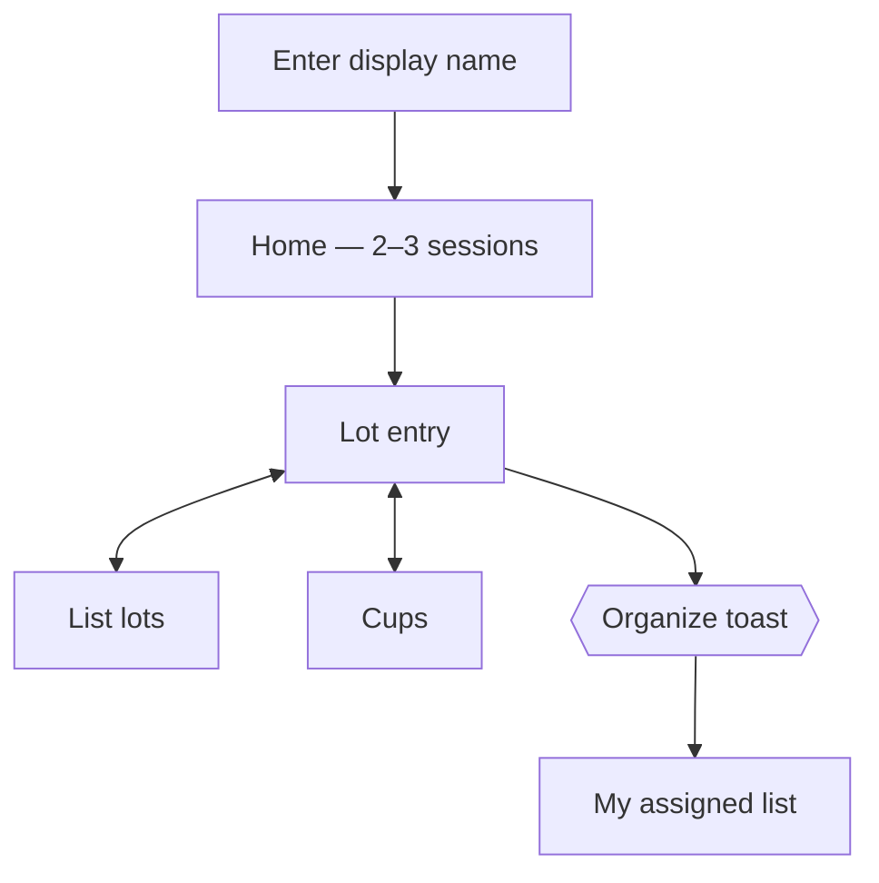

# Workflow diagrams — desktop coordinator vs phone worker

**Feature:** `diff-workflows-for-desktop-and-phone` · [#90](https://github.com/dcvezzani/brick-counter-coordinator-02/issues/90)  
**AIDLC phase:** Plan  
**Last updated:** 2026-06-16 (product decisions recorded)

These diagrams split the **user journey** by persona. They complement — not replace — the shared **session phase machine** in [docs/session-phases-state.mmd](../../docs/session-phases-state.mmd), which still defines valid phase transitions for the whole session.

| Diagram | Persona | Primary device | Profile rule | File |
|---------|---------|----------------|--------------|------|
| **Coordinator laptop workflow** | Session coordinator | Laptop / desktop | Viewport **≥ md** | [coordinator-laptop-workflow.mmd](./coordinator-laptop-workflow.mmd) |
| **Worker phone workflow** | Counter / put-away worker | Phone | Viewport **< md** + display name on join | [worker-phone-workflow.mmd](./worker-phone-workflow.mmd) |

## How they relate

- **Same session, same phases** — Coordinator actions (e.g. Declare ready to organize) still advance the session per the phase machine.
- **Viewport profiles** — Same URL; `< md` shows worker nav (Lot, Lots, Cups) and surfaces; `≥ md` shows full coordinator workflow.
- **Worker join** — Display name on join (storyboard); coordinator assigns pick lists on laptop; unassigned lists auto-assign to workers without a list.
- **Push at organize** — Dismissible toast with “Go to my put-away list”; nav fallback if dismissed.

## Coordinator laptop (preview)

Full detail: [coordinator-laptop-workflow.mmd](./coordinator-laptop-workflow.mmd)

## Worker phone (preview)

Full detail: [worker-phone-workflow.mmd](./worker-phone-workflow.mmd)

## Plan → Design handoff

On Product Spec approval:

1. **Learn / ship:** Move or link canonical copies under `docs/` if the team wants repo-wide diagrams (optional — Design decision).
2. **Design:** Tech Spec maps each diagram node to routes, components, and storyboard fixtures.
3. **Validate:** Walk coordinator laptop path and worker phone path against [product-spec.md](./product-spec.md) success criteria.
