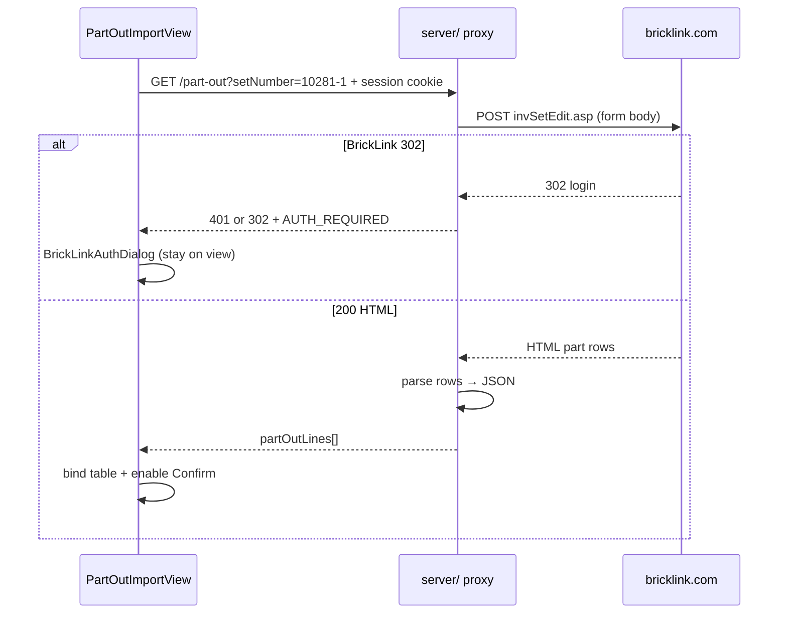

# BrickLink part-out reference — `invSetEdit.asp`

**Feature:** [load-part-out-import](./product-spec.md)  
**Audience:** `/design` and `/build` — implementation reference for the part-out service  
**Status:** Captured from live BrickLink capture (2026-06-16)

This document summarizes how BrickLink’s **“Part out a Set into My Store Inventory”** flow works for scraping purposes. The counting app only needs the **preview HTML** (parts list) — it does **not** submit to `invSetVerify.asp`.

---

## Source artifacts (in this folder)

| File | Purpose |
|------|---------|
| [invSetEdit.asp.request.md](./invSetEdit.asp.request.md) | `curl` example + POST body field breakdown |
| [invSetEdit.asp.html](./invSetEdit.asp.html) | Full HTML response for set **10281-1** (889 items) — use for parser fixtures |
| [invSetEdit.asp.html.md](./invSetEdit.asp.html.md) | Minimal single-row HTML fragment — quick parser contract |

---

## Endpoint

| | |
|--|--|
| **URL** | `https://www.bricklink.com/invSetEdit.asp` |
| **Method** | `POST` |
| **Content-Type** | `application/x-www-form-urlencoded` |
| **Auth** | User session cookie (`-b "$COOKIE"` in curl) — forwarded by app `server/` proxy |
| **Success** | `200` + HTML containing part rows |
| **Auth failure** | BrickLink **`302`** redirect to login — app API returns **`AUTH_REQUIRED`** as HTTP **`401` and/or `302`**; client opens authentication dialog (see Product Spec) |

Recommended request headers (mirror browser): `origin`, `referer` (`https://www.bricklink.com/invSet.asp?utm_content=subnav`), `user-agent`, `accept: text/html,...`.

---

## Set number → POST fields

App stores normalized set numbers as `{base}-{variant}` (e.g. `10281-1` from [set-catalog](../../00-shipped/new-session-use-filterable-picker/product-spec.md)).

| App `session.setNumber` | `itemNo` | `itemSeq` |
|-------------------------|----------|-----------|
| `10281` or `10281-1` | `10281` | `1` |
| `10281-2` | `10281` | `2` |

Parse with the same rules as `normalizeSetNumber` / split on `-`.

---

## POST body — required & typical values

From [invSetEdit.asp.request.md](./invSetEdit.asp.request.md). Values below are what the counting app should send to obtain a **parts-only preview** aligned with coordinator workflow.

### Must vary per request

| Field | Example | Description |
|-------|---------|-------------|
| `itemNo` | `10281` | Set base number |
| `itemSeq` | `1` | Set variant (from `-1`, `-2`, …) |
| `itemQty` | `1` | Number of sets to part out |
| `itemCondition` | `U` | Default condition (Used) |

### Typically non-default (coordinator preference)

| Field | Value | Notes |
|-------|-------|-------|
| `incInstr` | `N` | Exclude instructions from part-out list |
| `incParts` | `N` | Exclude spare/extra parts handling flags where applicable |
| `invAdjustPrice` | `N` | Old price / tier pricing |
| `invAdjustRemarks` | `N` | Remarks |
| `ItemInvSort` | `1` | Sort by item name |
| `ItemInvAsc` | `A` | Ascending |

### Leave at defaults (from capture)

`itemType=S`, `itemBulk=1`, `breakType=M`, `breakSets=Y`, `itemPrice=I`, `itemRound=2`, `invDup=Y`, `invAdjustBulk=O`, `invAdjustSale=O`, `invAdjustExtended=O`, `invAdjustStock=O`, `invAdjustRetain=O`, `invAdjustCost=O`, `invAdjustWeight=O`, empty `sellerOption*`, `itemDesc`, `itemRemarks`, `TQ1`–`TS3`.

Full example body (canonical — matches [invSetEdit.asp.request.md](./invSetEdit.asp.request.md)):

```
itemType=S&sellerOptionCost=&sellerOptionMyWeight=&sellerOptionStock=&itemNo=10281&itemSeq=1&incInstr=N&incParts=N&itemQty=1&breakType=M&breakSets=Y&itemCondition=U&itemPrice=I&itemRound=2&itemBulk=1&itemDesc=&itemRemarks=&TQ1=&TS1=&TQ2=&TS2=&TQ3=&TS3=&invDup=Y&invAdjustPrice=N&invAdjustBulk=O&invAdjustSale=O&invAdjustRemarks=N&invAdjustExtended=O&invAdjustStock=O&invAdjustRetain=O&invAdjustCost=O&invAdjustWeight=O&ItemInvSort=1&ItemInvAsc=A
```

**Confirmed (2026-06-16):** Always send `incInstr=N` and `incParts=N` — exclude instructions and spare-parts extras from the part-out list used for counting.

---

## Response HTML — part row structure

Each part line in the response uses a **numeric index** `{n}` starting at `0`. See [invSetEdit.asp.html.md](./invSetEdit.asp.html.md) for one row.

### Fields to parse per row

| HTML source | Example | Maps to app |
|-------------|---------|-------------|
| `input[name="itemNo{n}"]` | `88292` | `partId` |
| `input[name="colorID{n}"]` | `88` | `colorId` (number) |
| `input[name="colorName{n}"]` | `Reddish Brown` | `color` |
| `input[name="nQ{n}"]` | `2` | `quantity` |
| Description cell text after `<b>Description:</b><br>` | `Reddish Brown Arch 1 x 3 x 2 with Curved End` | `name` — strip leading color prefix or derive from catalog later |
| `img` `alt` / `title` | `Part No: 88292  Name: Arch 1 x 3 x 2 with Curved End` | Fallback for `name` (parse after `Name:`) |

### Hidden metadata (optional for v1)

| Field | Example | Notes |
|-------|---------|-------|
| `itemType{n}` | `P` | Part |
| `itemTypeName{n}` | `Part` | |
| `itemWeight{n}` | `1.04` | Not needed for import table |
| `nC{n}` | `U` | Condition per line — session uses `partOutOptions.condition` today |

### Rows to skip / edge cases

- **Section headers** — not indexed part rows.
- **“Extra part” advisory rows** — checkbox `nE{n}`; with `incParts=N` these should be rare or absent; if present, use posted qty as-is unless a future Feature adds exclude behavior.
- **“Already in store inventory”** warning rows — still valid part lines; include in list.
- **Instructions / non-part rows** — excluded by `incInstr=N` and `incParts=N`.

### Row count

Capture for `10281-1` with `incInstr=N` & `incParts=N`: see [invSetEdit.asp.html](./invSetEdit.asp.html) footer for item/lot totals. App flattens to one table row per indexed `{n}`.

---

## Transform → app `partOutLines` JSON

Target shape (matches existing [demo-session.js](../../../src/fixtures/demo-session.js) and `PartOutImportView` columns):

```json
{
  "id": "po-{n}",
  "partId": "88292",
  "name": "Arch 1 x 3 x 2 with Curved End",
  "color": "Reddish Brown",
  "colorId": 88,
  "quantity": 2
}
```

| Rule | Detail |
|------|--------|
| `id` | Stable per row index in response, e.g. `po-0`, `po-1`, … |
| `partId` | String, preserve BrickLink ids like `3069b` |
| `colorId` | Integer from `colorID{n}` |
| `name` | Prefer parsing `alt`/`title` `Name:` segment; else description minus color prefix |
| `quantity` | Integer parse of `nQ{n}` |

Server returns JSON array to client; client writes `session.partOutLines`.

---

## Service flow (for Tech Spec)



---

## Testing notes

- **Fixture HTML:** use [invSetEdit.asp.html](./invSetEdit.asp.html) for parser unit tests (large file — consider extracting a 3-row snippet for fast tests).
- **Minimal row:** [invSetEdit.asp.html.md](./invSetEdit.asp.html.md) for single-row parser contract.
- **Request builder:** assert POST body includes correct `itemNo` / `itemSeq` from `10281-1`, `10281-2`.
- **Auth:** mock upstream **`302`** or app API **`401`/`302`** → client opens auth dialog without route change; `fetch` uses `redirect: 'manual'`.
- **Do not commit** real `$COOKIE` values to the repo.

---

## Related app contracts

- Import table columns: `partId`, `name`, `color`, `quantity` — [PartOutImportView.vue](../../../src/views/PartOutImportView.vue)
- Part search ranks `partOutLines` first — [part-catalog.js](../../../src/lib/part-catalog.js)
- Set normalization — [set-catalog.js](../../../src/lib/set-catalog.js)
