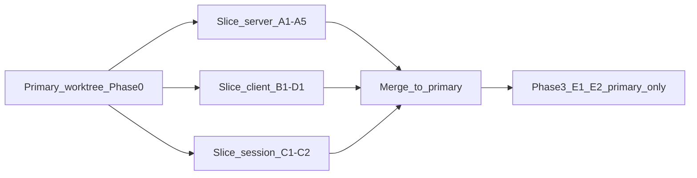
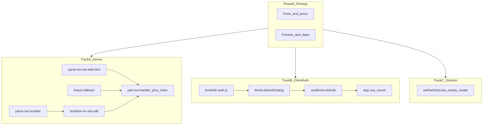

# Execution plan — load-part-out-import

**Feature:** `load-part-out-import`  
**Branch:** `feature/load-part-out-import`  
**Worktree:** `../brick-counter-coordinator-02-worktrees/load-part-out-import`

Build-phase handoff for developers (senior-dev persona: minimal slices, tests first, reuse existing patterns).

**Sources:** [tech-spec.md](./tech-spec.md), [ux-design-notes.md](./ux-design-notes.md), [AIDLC.md](./AIDLC.md).

**Already shipped (no net-new work):** Coordinator/worker route gating via `src/lib/workflow-guard.js` + router `beforeEnter` — verify only in final QA.

---

## Git worktree strategy

Per [AGENTS.md](../../AGENTS.md): parent dir `../brick-counter-coordinator-02-worktrees/`, branch `feature/<slug>`, ports via `git-worktree-port-registry`.

### Primary worktree (always)

| Field | Value |
|-------|-------|
| **Branch** | `feature/load-part-out-import` |
| **Path** | `../brick-counter-coordinator-02-worktrees/load-part-out-import` |
| **Role** | Integration branch — all slices merge here before Phase 3 |

All Build work lands on this branch eventually. Run `git-worktree-port-registry` here before `dev:api` / `dev:aidlc`.

### When one worktree is enough (default)

**Solo developer or coordinated pair** working Phase 1 tracks with **file ownership boundaries**:

| Track | Touch zones | Conflict risk with other tracks |
|-------|-------------|--------------------------------|
| A (server) | `server/**`, `tests/unit/server/**`, `tests/integration/part-out-api.test.js` | Low |
| B (auth) | `src/lib/bricklink-auth.js`, `src/components/BrickLinkAuthDialog.vue`, `src/composables/useBrickLinkAuth.js`, `App.vue` | Low vs A |
| C (session) | `src/lib/storyboard-session.js`, `tests/unit/lib/storyboard-session*` | Medium — serialize C before E2 |

Tracks A + B + C can proceed **in the primary worktree in parallel** if developers coordinate (or land commits in quick succession) because directories barely overlap.

### When to add slice worktrees (avoid conflicts)

Spawn a **secondary worktree** when any of these apply:

1. **Phase 0 not yet merged** — another track must not touch `package.json`, `vite.config.js`, or root deps concurrently.
2. **Two agents/developers** editing the same hotspot files at once (see matrix below).
3. **Main repo checkout** is on another feature and you need isolated `npm run dev` without stashing.
4. **Long-running dev servers** — optional second checkout to edit while `dev:api` + `dev:aidlc` stay up in the first tree.

**Do not** use extra worktrees for Phase 3 (E1/E2) — views integrate in the primary worktree only.

### Slice worktree pattern

Branch from the **current tip** of `feature/load-part-out-import` (after Phase 0 is pushed or merged locally):

```bash
# From primary worktree — example: server track
git worktree add \
  ../brick-counter-coordinator-02-worktrees/load-part-out-import-server \
  -b feature/load-part-out-import-server \
  feature/load-part-out-import
```

| Slice worktree slug | Branch | Owns | Merge back before |
|---------------------|--------|------|-------------------|
| `load-part-out-import-server` | `feature/load-part-out-import-server` | Track A (A1–A5) | Phase 3 |
| `load-part-out-import-client-auth` | `feature/load-part-out-import-client-auth` | Track B (B1–B3) + D1 | Phase 3 |
| `load-part-out-import-session` | `feature/load-part-out-import-session` | Track C (C1–C2) | Phase 3 |

Per worktree: run **`git-worktree-port-registry`** for that slug so `PORT` / `API_PORT` do not collide.

**Merge order into primary** (rebase preferred):

1. `…-server` → `feature/load-part-out-import`
2. `…-client-auth` → primary
3. `…-session` → primary
4. Phase 3 (E1, E2) **only in primary worktree**
5. `/learn`: `git-worktree-cleanup` for each slice slug after merge

### Conflict hotspot matrix

| File / area | Phase | Same worktree OK if… | Prefer slice worktree if… |
|-------------|-------|----------------------|---------------------------|
| `package.json`, `vite.config.js` | 0 | Solo or Phase 0 done | Parallel work before Phase 0 lands |
| `server/**` | A | Always with B/C | Never needed vs B |
| `App.vue` | B3 | Only B touches it | B + another track editing `App.vue` |
| `storyboard-session.js` | C, E2 | C lands before E2 starts | C + E2 in parallel |
| `NewSessionView.vue` | E1 | After B3 merged | E1 + E2 in parallel |
| `PartOutImportView.vue` | E2 | After A5, B3, C2, D1 | Always serialize E2 |

### Parallelism + worktrees (revised two-developer layout)



- **Dev 1:** Phase 0 in **primary** → Track A in **`load-part-out-import-server`** worktree → merge → assist E2 in primary.
- **Dev 2:** wait for Phase 0 → Track B + D1 in **`load-part-out-import-client-auth`** → Track C in **`load-part-out-import-session`** (or combine B+C in one slice if one dev) → merge → E1 in primary.
- **Solo:** Skip slice worktrees; run tracks sequentially or loosely parallel in **primary** with commit discipline.

---

## Work breakdown (6 phases)

### Phase 0 — Shared prerequisites (sequential, ~1 slice)

**Primary worktree only** — blocks all slice worktrees until merged or rebased onto primary tip.

| Task | Files | Notes |
|------|-------|-------|
| Allocate ports | `.aidlc/dev.env`, `AIDLC.md` port rows | Run `git-worktree-port-registry` |
| Dev tooling | `package.json`, `vite.config.js` | Add `dev:api`, `dev:app`, `dev:full`; proxy `/api` → `API_PORT` |
| Dependency | root `package.json` | `node-html-parser` in devDependencies (per tech-spec) |
| Parser fixture | `server/fixtures/inv-set-edit-snippet.html` | 3-row excerpt from [invSetEdit.asp.html](./invSetEdit.asp.html) |
| Fallback data | `src/fixtures/part-out-fallback.js` | Extract current 4 demo rows from `demo-session.js` — **do not** remove rows from static storyboard seeds |

**Exit:** `npm test` still green; `dev:api` listens on `API_PORT` (health or 404 OK).

---

### Phase 1 — Parallel foundation



#### Track A — Server (TDD)

| Slice | Module | Tests |
|-------|--------|-------|
| **A1** | `parse-set-number.js` | `tests/unit/server/parse-set-number.test.js` |
| **A2** | `parse-inv-set-edit-html.js` | `tests/unit/server/parse-inv-set-edit-html.test.js` |
| **A3** | `fixture-fallback.js` | unit test returns `part-out-fallback` lines |
| **A4** | `bricklink-inv-set-edit.js` | POST body, `redirect: 'manual'`, 302 → auth signal |
| **A5** | `part-out-handler.js` + `server/index.js` | `tests/integration/part-out-api.test.js` |

#### Track B — Client auth (TDD)

| Slice | Module | Tests |
|-------|--------|-------|
| **B1** | `src/lib/bricklink-auth.js` | `tests/unit/lib/bricklink-auth.test.js` |
| **B2** | `BrickLinkAuthDialog.vue` | component test |
| **B3** | `useBrickLinkAuth.js` + `App.vue` | open/save/`requireAuth` wiring |

#### Track C — Session store

| Slice | Change | Tests |
|-------|--------|-------|
| **C1** | `setPartOutLines(sessionId, lines)` | extend `storyboard-session` unit tests |
| **C2** | **New sessions only:** `createDemoSession` → `partOutLines: []` | keep storyboard seeds with existing rows |

---

### Phase 2 — Client API client

| Slice | Module | Depends on |
|-------|--------|------------|
| **D1** | `src/lib/part-out-client.js` | B1 |
| **D1 tests** | `tests/unit/lib/part-out-client.test.js` | Mock `fetch` |

---

### Phase 3 — View integration (primary worktree only)

| Slice | View | Key behavior |
|-------|------|----------------|
| **E1** | `NewSessionView.vue` | Info `Alert` + Connect BrickLink |
| **E2** | `PartOutImportView.vue` | Async load, Badge, Alerts, filter, skeleton, Retry |

---

### Phase 4 — Integration & regression

| Task | Owner |
|------|-------|
| Component tests: `PartOutImportView` states | either |
| Manual: `dev:api` + `dev:aidlc`, real cookie | human |
| Storyboard sessions still have part-out rows | either |
| `npm test` + `npm run build` | CI |

---

### Phase 5 — Review / Ship handoff

Per AIDLC: `/review` → `/ship` scorecard. Learn: optional ADR-0006 for cookie scraping.

---

## Parallelism summary

| Can run in parallel | Must wait for |
|---------------------|---------------|
| A1, A2, A3, B1, C1 | Phase 0 |
| A4 | A1 |
| A5 | A2, A3, A4 |
| B2 | B1 |
| B3 | B2 |
| D1 | B1 (not A5) |
| E1, E2 | A5, B3, C2, D1 |

**Minimum critical path:** Phase 0 → A2 → A5 → D1 → E2 → Phase 4.

---

## Suggested commits

1. `chore: dev proxy, ports, parser fixture, part-out-fallback extract`
2. `feat(server): parse set number and invSetEdit HTML`
3. `feat(server): part-out API handler and fixture fallback`
4. `feat(client): BrickLink cookie auth and dialog`
5. `feat(session): setPartOutLines and empty part-out on new session`
6. `feat(client): part-out fetch client`
7. `feat(ui): New session BrickLink connect banner`
8. `feat(ui): Part-out import async load, filter, and states`

---

## Out of scope

- Mobile lazy scroll for cups / My list (diff-workflows)
- Live BrickLink in CI
- Production reverse proxy
- Blocking New session submit without cookie
- Changes to `part-catalog.js`

---

## Definition of done

- [ ] `execution-plan.md` committed under `feature/load-part-out-import/`
- [ ] Slice worktrees cleaned up via `git-worktree-cleanup` after merge to primary
- [ ] All tech-spec acceptance criteria checked
- [ ] ux-design-notes handoff checklist satisfied
- [ ] `npm test` and `npm run build` pass
- [ ] No cookie values in logs or repo
