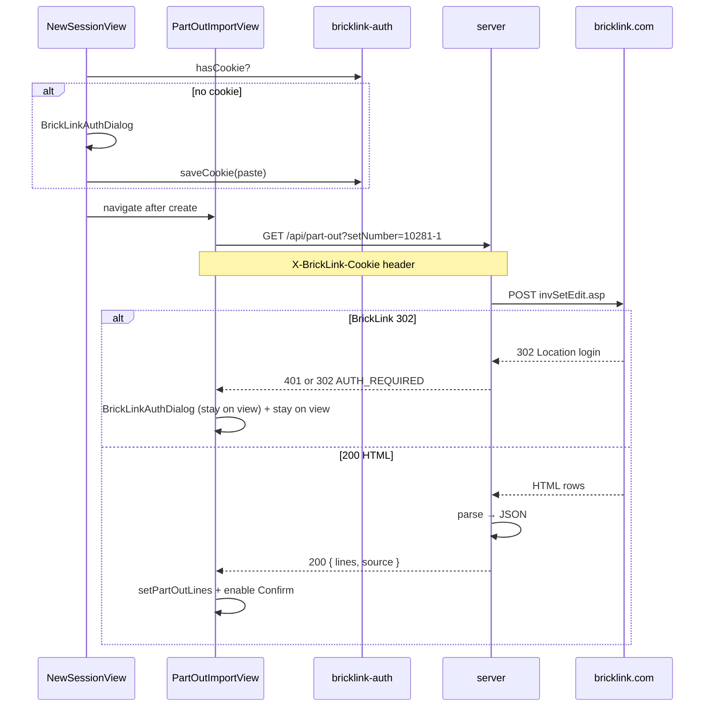

# Tech Spec — Unit 1: Load part-out import from BrickLink

**AIDLC phase:** Design (one **Unit** per Tech Spec)  
**Grounding:** Implements [product-spec.md](./product-spec.md) (approved 2026-06-16). Aligns with [ADR-0001](../../../adr/0001-frontend-vue-js-shadcn-stack.md), [ADR-0004](../../../adr/0004-lot-identity-and-counting-model.md). BrickLink scrape contract: [bricklink-part-out-reference.md](./bricklink-part-out-reference.md).

---

## Overview

| Field | Value |
|-------|-------|
| **Unit / scope** | Minimal Node `server/` proxy → BrickLink `invSetEdit.asp`; HTML→JSON parser; client cookie auth + `BrickLinkAuthDialog`; `PartOutImportView` async load; `NewSessionView` auth gate; fixture fallback for dev/CI |
| **Feature** | [load-part-out-import](./) |
| **Product Spec** | [product-spec.md](./product-spec.md) — **Approved** 2026-06-16 |
| **Status** | **Draft — awaiting approval** |
| **Author** | David Vezzani (with AI draft) |
| **Created** | 2026-06-16 |
| **Last updated** | 2026-06-16 |
| **PR target** | `main` |

## Context

### Summary

Replace fixture `partOutLines` with a **live BrickLink part-out preview** fetched when the coordinator opens **Part-out import**. A new **`server/`** package POSTs to `https://www.bricklink.com/invSetEdit.asp` using the coordinator’s **pasted session cookie** (forwarded from the browser), parses the HTML into `partOutLines` JSON, and returns it to the Vue client.

Authentication is **cookie paste** (not OAuth): `BrickLinkAuthDialog` on New session when no cookie is stored, and on any view when the API reports auth required. **Both HTTP `401` and `302`** from the app API mean `AUTH_REQUIRED` (BrickLink upstream uses `302` redirect-to-login; the app API may surface that as `401` and/or `302` — client treats either the same). The import view shows a **loading skeleton**, handles **retry**, **empty state**, and **error toasts**; confirm stays disabled until a successful load.

### Existing system & documentation

| Artifact | Relevance |
|----------|-----------|
| [product-spec.md](./product-spec.md) | Approved scope, auth UX, success criteria |
| [bricklink-part-out-reference.md](./bricklink-part-out-reference.md) | POST body, HTML field map, JSON shape |
| [invSetEdit.asp.request.md](./invSetEdit.asp.request.md) | Canonical curl + `incInstr=N` / `incParts=N` |
| [invSetEdit.asp.html](./invSetEdit.asp.html) | Parser fixture (10281-1) |
| [invSetEdit.asp.html.md](./invSetEdit.asp.html.md) | Single-row parser contract |
| `src/views/PartOutImportView.vue` | Import shell — add async load |
| `src/lib/storyboard-session.js` | Session store; add `setPartOutLines` |
| `src/lib/set-catalog.js` | `normalizeSetNumber` — reuse for `itemNo`/`itemSeq` |
| `src/lib/feedback.js` | Toasts |
| `src/components/TableLoadingSkeleton.vue` | Loading state |
| `src/components/ConfirmDialog.vue` | Pattern reference (AlertDialog) |
| [ui-feedback-primitives tech-spec](../../00-shipped/ui-feedback-primitives/tech-spec.md) | Toast + skeleton patterns |
| [ADR-0001](../../../adr/0001-frontend-vue-js-shadcn-stack.md) | Vue 3 + JS |
| [ADR-0004](../../../adr/0004-lot-identity-and-counting-model.md) | `partOutLines` shape |

### Out of scope for this Unit

Per approved Product Spec:

- Official BrickLink OAuth / Store API
- Live set search (fixture `set-catalog` unchanged)
- WebSockets, multi-user coordinator, session DB persistence
- Resetting lots / reconciliation / cups on part-out load
- `invSetVerify.asp` submit (preview only)
- Playwright e2e (unit + integration + manual UI validation)
- CI against live BrickLink (mocked server responses only)

## Architecture

### High-level design

```
┌──────────────────────────────────────────────────────────────────────────┐
│  Browser (Vue SPA)                                                        │
│  ┌─────────────────┐  ┌──────────────────────┐  ┌─────────────────────┐ │
│  │ NewSessionView  │  │ PartOutImportView    │  │ BrickLinkAuthDialog   │ │
│  │ auth gate       │  │ load + table + retry │  │ (global via composable)│ │
│  └────────┬────────┘  └──────────┬───────────┘  └──────────┬──────────┘ │
│           │                      │                          │             │
│           └──────────────────────┼──────────────────────────┘             │
│                                  ▼                                        │
│                    bricklink-auth.js (localStorage cookie)                │
│                    part-out-client.js (fetch /api/part-out)               │
└──────────────────────────────────┬───────────────────────────────────────┘
                                   │ GET /api/part-out?setNumber=…
                                   │ Header: X-BrickLink-Cookie
                                   ▼
┌──────────────────────────────────────────────────────────────────────────┐
│  server/ (Node 24, API_PORT)                                              │
│  ┌──────────────────┐   ┌─────────────────────┐   ┌──────────────────┐ │
│  │ routes/part-out  │──▶│ bricklink-client.js │──▶│ invSetEdit.asp   │ │
│  │                  │   │ POST + cookie       │   │ (bricklink.com)  │ │
│  └────────┬─────────┘   └─────────────────────┘   └──────────────────┘ │
│           ▼                                                               │
│  ┌──────────────────┐   ┌─────────────────────┐                          │
│  │ parse-inv-set-   │   │ fixture fallback    │                          │
│  │ edit-html.js     │   │ (no cookie + flag)  │                          │
│  └──────────────────┘   └─────────────────────┘                          │
└──────────────────────────────────────────────────────────────────────────┘
```



### Boundaries

| Layer | Responsibility |
|-------|----------------|
| `server/` | BrickLink HTTP, HTML parse, JSON API, fixture fallback — **no Vue** |
| `src/lib/bricklink-auth.js` | Cookie read/write `localStorage`; `hasBrickLinkCookie()` |
| `src/lib/part-out-client.js` | `fetchPartOutLines(setNumber)` → API; map errors to auth dialog / toast |
| `src/composables/useBrickLinkAuth.js` | Dialog open state, save handler, `requireAuth()` helper |
| `src/components/BrickLinkAuthDialog.vue` | Textarea + instructions + Save |
| `src/views/NewSessionView.vue` | Show dialog on mount if `!hasBrickLinkCookie()` |
| `src/views/PartOutImportView.vue` | `onMounted` load, skeleton, empty, retry, disable confirm |
| `src/lib/storyboard-session.js` | `setPartOutLines`; seed with `partOutLines: []` on create |
| `vite.config.js` | Dev proxy `/api` → `API_PORT` |

### Integration points

| System | Contract | Notes |
|--------|----------|-------|
| BrickLink | `POST /invSetEdit.asp` | See [bricklink-part-out-reference.md](./bricklink-part-out-reference.md) |
| App API | `GET /api/part-out` | JSON response; errors as JSON + HTTP status |
| `part-catalog.js` | Reads `session.partOutLines` | No code changes required if shape preserved |
| AIDLC ports | `API_PORT`, `PORT` | `git-worktree-port-registry` + `.aidlc/dev.env` |
| Vite dev proxy | `/api/*` → localhost:`API_PORT` | Production: same-origin reverse proxy TBD (document in Learn) |

## Data

### `partOutLine` (unchanged contract)

```javascript
{
  id: 'po-0',           // string, stable within load
  partId: '88292',      // BrickLink part id
  name: 'Arch 1 x 3 x 2 with Curved End',
  color: 'Reddish Brown',
  colorId: 88,          // number
  quantity: 2           // number
}
```

### Session changes

| Field | Before | After |
|-------|--------|-------|
| `session.setNumber` | Set on create | Unchanged |
| `session.partOutLines` | Four fixture rows in seed | **`[]` on create**; populated after successful fetch |
| `lots`, `reconciliationRows`, etc. | Fixture seed | **Unchanged** (Product decision) |

### BrickLink cookie (client)

| Key | Value |
|-----|-------|
| Storage | `localStorage` key `bricklink.sessionCookie` |
| Format | Raw `Cookie` header string pasted by user (may include multiple `name=value` pairs separated by `;`) |
| Validity | `hasBrickLinkCookie()` → non-empty after trim; **no** proactive expiry parse in v1 |
| Lifetime | Until user clears, replaces via dialog, or BrickLink returns 302 |
| Security | Never log cookie value; never commit to repo; not in `VITE_*` env |

### Set number → BrickLink POST

Reuse `normalizeSetNumber` from `set-catalog.js` (import in server via shared module or duplicate minimal regex — **prefer** `server/lib/parse-set-number.js` mirroring catalog rules):

| `setNumber` | `itemNo` | `itemSeq` |
|-------------|----------|-----------|
| `10281` / `10281-1` | `10281` | `1` |
| `10281-2` | `10281` | `2` |

## APIs & contracts

### `GET /api/part-out`

**Query**

| Param | Required | Example |
|-------|----------|---------|
| `setNumber` | yes | `10281-1` |

**Request headers**

| Header | Required | Notes |
|--------|----------|-------|
| `X-BrickLink-Cookie` | yes* | User session cookie string |

\*Omitted only when server `PART_OUT_FALLBACK=true` and server returns fixture data.

**Success `200`**

```json
{
  "source": "bricklink",
  "setNumber": "10281-1",
  "lines": [
    {
      "id": "po-0",
      "partId": "88292",
      "name": "Arch 1 x 3 x 2 with Curved End",
      "color": "Reddish Brown",
      "colorId": 88,
      "quantity": 2
    }
  ]
}
```

`source` is `"fixture"` when fallback path used.

**Error responses**

BrickLink signals expired/invalid session with an HTTP **`302`** redirect to login. The app API normalizes that to **`AUTH_REQUIRED`**. The client must treat **`401` or `302`** from `/api/part-out` as auth required (open dialog, stay on view) — do not follow redirects in `fetch`.

| HTTP | `code` | When | Client action |
|------|--------|------|---------------|
| **`401` or `302`** | `AUTH_REQUIRED` | Missing cookie, or BrickLink returned **`302`** (login redirect) | Open `BrickLinkAuthDialog`; **stay on view**; do not navigate |
| `404` | `SET_NOT_FOUND` | HTML indicates unknown set (parser/heuristic) | Error toast + retry |
| `422` | `EMPTY_PART_OUT` | 200 HTML but zero parseable rows | Empty state on import; confirm disabled |
| `502` | `BRICKLINK_ERROR` | Network / unexpected HTML / 5xx from BL | Error toast + retry |
| `503` | `BRICKLINK_UNAVAILABLE` | Timeout | Error toast + retry |

```json
{
  "code": "AUTH_REQUIRED",
  "message": "BrickLink sign-in required. Paste an updated cookie."
}
```

### BrickLink upstream request

Built in `server/lib/bricklink-inv-set-edit.js`:

- URL: `https://www.bricklink.com/invSetEdit.asp`
- Method: `POST`
- Body: `application/x-www-form-urlencoded` per [invSetEdit.asp.request.md](./invSetEdit.asp.request.md) — **`incInstr=N`**, **`incParts=N`**
- Headers: `Cookie` (from `X-BrickLink-Cookie`), `User-Agent` (fixed desktop string), `Origin`, `Referer: https://www.bricklink.com/invSet.asp?utm_content=subnav`
- Redirect: `fetch` with `redirect: 'manual'` — any BrickLink **`302`** (or 3xx to login) → handler returns app response with **`code: AUTH_REQUIRED`** and HTTP **`401`** (preferred) or **`302`** (allowed — same client handling)

### HTML parser (`server/lib/parse-inv-set-edit-html.js`)

Input: HTML string. Output: `lines[]`.

**Algorithm (v1)**

1. Load HTML with **`node-html-parser`** (server dependency).
2. Find all `input[name^="itemNo"]` — extract index `{n}` from name `itemNo{n}`.
3. For each index, read:
   - `itemNo{n}` → `partId`
   - `colorID{n}` → `colorId` (parse int)
   - `colorName{n}` → `color`
   - `nQ{n}` → `quantity` (parse int)
   - `img#img{n}` attribute `title` or `alt` → parse `Name: …` for `name`; fallback strip `color` prefix from description cell
4. Assign `id: po-{n}`.
5. Skip rows missing `partId` or `quantity`.

**Tests:** full [invSetEdit.asp.html](./invSetEdit.asp.html) (optional slow test); fast tests on [invSetEdit.asp.html.md](./invSetEdit.asp.html.md) + 3-row excerpt committed under `server/fixtures/inv-set-edit-snippet.html`.

## UI / client

### `BrickLinkAuthDialog.vue`

| Prop / event | Contract |
|--------------|----------|
| `open` / `update:open` | v-model |
| `required` | When `true`, hide Cancel (blocking auth on import after 302) |
| `@save` | `(cookie: string) => void` |
| Content | Instructions + `Textarea` (`data-testid="bricklink-cookie-input"`) |
| Primary | **Save authentication** |
| A11y | Focus trap via AlertDialog; label linked to textarea |

Copy (draft):

> Sign in at [bricklink.com](https://www.bricklink.com) in a **new browser tab**, then copy your cookie string from developer tools and paste it below. This app uses your BrickLink session to load the part-out list — there is no official API.

### `useBrickLinkAuth.js`

```javascript
// exports (illustrative)
hasBrickLinkCookie()
getBrickLinkCookie()
setBrickLinkCookie(raw)
clearBrickLinkCookie()
useBrickLinkAuthDialog() // { open, openAuth, save, required }
```

Mount `BrickLinkAuthDialog` once in `App.vue` (or `SessionLayout` + `NewSessionView`) wired to composable so **import** can open dialog without routing.

### `NewSessionView.vue`

```javascript
onMounted(() => {
  if (!hasBrickLinkCookie()) {
    openAuth({ required: false }) // Cancel allowed
  }
})
```

Submit unchanged; does **not** prefetch part-out.

### `PartOutImportView.vue`

| State | UI |
|-------|-----|
| `idle` / `loading` | `TableLoadingSkeleton`; hide table; confirm **disabled** |
| `success` + lines | `ResponsiveDataTable`; confirm **enabled** |
| `success` + `lines.length === 0` | Empty state message; confirm **disabled** |
| `error` | Error toast; **Retry** button in `ViewActions`; confirm disabled |
| `fallback` | Table + `showInfoToast('Using storyboard part-out data — not live BrickLink.')` |

```javascript
onMounted(() => loadPartOut())
async function loadPartOut() {
  status = 'loading'
  const result = await fetchPartOutLines(session.setNumber)
  if (result.code === 'AUTH_REQUIRED') {
    openAuth({ required: true, onSaved: () => loadPartOut() })
    return
  }
  if (!result.ok) {
    showErrorToast(result.message)
    status = 'error'
    return
  }
  setPartOutLines(sessionId, result.lines)
  if (result.source === 'fixture') showInfoToast('…')
  status = result.lines.length ? 'success' : 'empty'
}
```

**Do not** render seed fixture rows while loading.

### `part-out-client.js`

```javascript
const API_BASE = import.meta.env.VITE_API_BASE ?? '/api'

function isAuthRequiredResponse(res, body) {
  return (
    res.status === 401 ||
    res.status === 302 ||
    body?.code === 'AUTH_REQUIRED'
  )
}

export async function fetchPartOutLines(setNumber) {
  const res = await fetch(
    `${API_BASE}/part-out?setNumber=${encodeURIComponent(setNumber)}`,
    {
      headers: { 'X-BrickLink-Cookie': getBrickLinkCookie() },
      redirect: 'manual', // never follow BL login redirect in browser
    },
  )
  const body = await res.json().catch(() => ({}))
  if (isAuthRequiredResponse(res, body)) {
    return { ok: false, code: 'AUTH_REQUIRED', message: body.message }
  }
  if (!res.ok) return { ok: false, code: body.code, message: body.message }
  return { ok: true, lines: body.lines, source: body.source }
}
```

**Rule:** `401` and `302` are equivalent for auth UX — both open `BrickLinkAuthDialog` without route change. Upstream BrickLink **`302`** is the root signal; the app API may map it to `401` in JSON, pass through `302`, or both — client checks **status and** `body.code`.

### `storyboard-session.js`

```javascript
export function setPartOutLines(sessionId, lines) {
  const session = getSession(sessionId)
  if (session) session.partOutLines = lines
}

export function createDemoSessionSeed(setNumber) {
  return {
    // ...
    partOutLines: [], // was fixture rows
  }
}
```

Keep fixture rows in `src/fixtures/part-out-fallback.js` for server + client fallback tests.

## Security & privacy

| Topic | Approach |
|-------|----------|
| Cookie handling | Client stores; sent per request in header; server uses in-memory only for upstream call |
| Logging | Log `setNumber`, status codes — **never** log cookie |
| CORS | Server sets `Access-Control-Allow-Origin` to dev app origin (`PORT`); allow header `X-BrickLink-Cookie` |
| CSRF | API is read-only GET; cookie not auto-sent cross-site (custom header) |
| Scraping | Interim; document fragility; parser tests against captured HTML |
| iframe | None — per Product Spec |

## Server package layout

```
server/
  index.js                    # HTTP listen on API_PORT
  lib/
    bricklink-inv-set-edit.js # build body, POST, detect 302
    parse-inv-set-edit-html.js
    parse-set-number.js
    part-out-handler.js       # GET /api/part-out orchestration
    fixture-fallback.js       # returns lines from fixtures
  fixtures/
    inv-set-edit-snippet.html # 3 rows for fast parser tests
  package.json                # { "type": "module", "dependencies": { "node-html-parser": "..." } }
```

Root `package.json` scripts (add):

```json
{
  "dev:api": "sh scripts/with-aidlc-env.sh node server/index.js",
  "dev:app": "sh scripts/with-aidlc-env.sh vite",
  "dev:full": "sh scripts/with-aidlc-env.sh sh -c 'node server/index.js & vite'"
}
```

`vite.config.js` proxy:

```javascript
server: {
  port: appPort,
  proxy: {
    '/api': {
      target: `http://127.0.0.1:${process.env.API_PORT || 3001}`,
      changeOrigin: true,
    },
  },
},
```

Env:

| Var | Where | Purpose |
|-----|-------|---------|
| `API_PORT` | `.aidlc/dev.env` | Server listen |
| `PORT` | `.aidlc/dev.env` | Vite app |
| `PART_OUT_FALLBACK` | server env | `true` → fixture when no cookie |
| `VITE_API_BASE` | optional | Default `/api` |

## Acceptance criteria (for Review)

- [ ] `server/` responds `GET /api/part-out?setNumber=10281-1` with JSON `lines[]` when given valid cookie (manual) or mocked upstream in tests
- [ ] Parser extracts rows from `invSetEdit.asp.html.md` and snippet fixture matching reference contract
- [ ] POST body uses `incInstr=N`, `incParts=N`, correct `itemNo`/`itemSeq` for `10281-1` and `10281-2`
- [ ] BrickLink upstream **`302`** → app API `AUTH_REQUIRED` (**`401` or `302`**) → client opens auth dialog on import **without** route change
- [ ] Client `fetch` uses `redirect: 'manual'`; treats **`401` and `302`** identically as auth required
- [ ] New session opens auth dialog when `localStorage` cookie missing
- [ ] Pasted cookie persisted in `localStorage` and sent on subsequent fetches
- [ ] Import view: skeleton while loading; no fixture flash; confirm disabled until success with lines
- [ ] Retry button re-invokes fetch after error
- [ ] Empty parse result → empty state, confirm disabled
- [ ] `PART_OUT_FALLBACK=true` + no cookie → fixture lines + client info toast
- [ ] `setPartOutLines` only updates part-out; lots/reconciliation seed unchanged
- [ ] `npm test` and `npm run build` pass in CI (no live BrickLink)

## Testing approach

| Layer | What we prove | Location |
|-------|----------------|----------|
| Unit (server) | `parse-set-number`, POST body builder, HTML parser on fixtures | `tests/unit/server/*.test.js` |
| Unit (client) | `bricklink-auth` storage, `part-out-client` error mapping | `tests/unit/lib/*.test.js` |
| Component | `BrickLinkAuthDialog` save emit; `PartOutImportView` states (mock fetch) | `tests/unit/components/*.test.js` |
| Integration | API handler with mocked `fetch` to BrickLink | `tests/integration/part-out-api.test.js` |
| Manual | Paste real cookie, load 10281-1, confirm → lot entry | Validate scorecard |

Vitest imports server modules via relative path from `tests/unit/server/` (no separate test runner).

## Rollout & operations

### Rollout plan

1. Merge `server/` + client behind dev proxy.
2. Local dev: run `dev:api` + `dev:app` (or `dev:full`) with `.aidlc/dev.env` ports.
3. Production hosting: **out of scope** — document need for API reverse proxy in Learn.

### Monitoring

- Server logs: request id, `setNumber`, HTTP status to BrickLink, line count, `code` on errors — no cookies.

### Rollback

- Revert PR; app falls back to previous fixture seed behavior if server unavailable (optional: client detect connection refused → error toast, not crash).

## Design review passes

### Architecture

- **Clean split:** `server/` owns scrape + parse; client owns cookie UX + session binding. Shared contract is JSON `partOutLine[]`.
- **Shared parse-set-number:** Duplicate minimal logic in `server/lib/parse-set-number.js` with comment linking `set-catalog.js` — avoid cross-package import from `src/` into `server/` in v1.
- **Global auth dialog** via composable avoids duplicating modal on each view.

### Frontend

- Reuse `AlertDialog` + `Textarea` from shadcn-vue; `TableLoadingSkeleton`; `feedback.js` toasts.
- `onMounted` fetch in import view; watch `sessionId` if route reuse ever matters (demo uses fixed `demo` id).

### Backend

- `redirect: 'manual'` essential for 302 detection.
- `node-html-parser` sufficient for hidden input scrape; avoid regex-only parser.

### Testing

- Commit small HTML snippet for fast tests; gate full 300KB fixture behind optional test tag `@slow` or one integration test.

### DevOps

- CI: no server process required if handler tests import modules directly.
- Add `server/package.json` dependencies installed from root via `npm install` in `server/` or hoist in root — **prefer** root `package.json` `"workspaces": ["server"]` or single root dep on `node-html-parser` used only from `server/`.

**Decision:** Add `node-html-parser` to **root** `devDependencies` (server imported by tests from `server/` path) to keep one `npm install`.

## Risks & open technical questions

| Risk / question | Mitigation |
|-----------------|------------|
| BrickLink HTML changes | Parser tests on captured fixtures; fail loudly with `BRICKLINK_ERROR` |
| Cookie format variance | Accept full paste string; trim only leading/trailing whitespace |
| Large sets (800+ rows) | Acceptable for v1 table; no virtualization required |
| `dev:full` background process | Document two-terminal workflow as primary; `dev:full` best-effort |
| Production API URL | `VITE_API_BASE` for deploy; Learn follow-up |

| # | Question | Proposal |
|---|----------|----------|
| 1 | Block New session submit without cookie? | **No** — dialog on mount is sufficient; import will fail loudly if they bypass |
| 2 | `SET_NOT_FOUND` detection | Heuristic: 200 HTML without `itemNo0` input and without parts table heading |
| 3 | ADR for cookie scraping | Draft **ADR-0006** in `/learn` if approved at ship |

## Change history

| Date | Author | Changes |
|------|--------|---------|
| 2026-06-16 | David Vezzani (AI draft) | Initial Tech Spec from approved Product Spec + BrickLink reference captures |
| 2026-06-16 | David Vezzani (chat) | Client treats app API **`401` and `302`** as `AUTH_REQUIRED` (BrickLink login redirect) |
