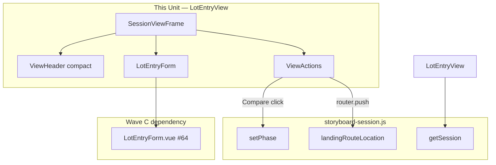

# Tech Spec — Unit 1: Lot entry cockpit shell

**AIDLC phase:** Design (one **Unit** per Tech Spec)  
**Grounding:** Implements [product-spec.md](./product-spec.md) (approved 2026-06-15). Aligns with [ADR-0001](../../../../adr/0001-frontend-vue-js-shadcn-stack.md). Parent context: [lot-entry-cockpit product-spec](../../product-spec.md) · [#10](https://github.com/dcvezzani/brick-counter-coordinator-02/issues/10).

---

## Overview

| Field | Value |
|-------|-------|
| **Unit / scope** | Replace read-only lot table on `LotEntryView` with **compact worker chrome** + mounted `LotEntryForm`; preserve sticky **Compare with Part-Out List** phase gate; update view unit tests |
| **Feature** | [lot-entry-cockpit-shell](./) · child of [#10](https://github.com/dcvezzani/brick-counter-coordinator-02/issues/10) |
| **Product Spec** | [product-spec.md](./product-spec.md) — **Approved** |
| **Child work item** | [#65](https://github.com/dcvezzani/brick-counter-coordinator-02/issues/65) |
| **Status** | **Draft** (pending human approval) |
| **Author** | David Vezzani (with AI draft) |
| **Created** | 2026-06-15 |
| **Last updated** | 2026-06-15 |
| **PR target** | `feature/lot-entry-cockpit` (integration branch) — **not** `main` |

## Context

### Summary

Deliver the **counting cockpit shell** on `/session/:sessionId/lot`: remove the storyboard read-only `ResponsiveDataTable`, mount Wave C `LotEntryForm` as primary content during the `counting` phase, and apply **compact worker chrome** (shorter header copy, tighter vertical rhythm) so counting controls sit higher on short viewports. **Preserve unchanged** the sticky `ViewActions` **Compare with Part-Out List** CTA and `compareWithPartOut` navigation when `session.phase === 'counting'`.

This Unit is **Wave D** — one view SFC + view unit test updates only. Form behavior, pickers, and save semantics remain in [#64 lot-entry-form](../lot-entry-form/tech-spec.md).

### Existing system & documentation

| Artifact | Relevance |
|----------|-----------|
| [product-spec.md](./product-spec.md) | Approved scope — shell + Compare gate |
| [AIDLC.md](./AIDLC.md) | File ownership; branch `feature/lot-entry-cockpit-lot-entry-cockpit-shell` |
| [lot-entry-form tech-spec](../lot-entry-form/tech-spec.md) | `LotEntryForm.vue` props/emits contract — **upstream dependency** |
| [Parent product-spec](../../product-spec.md) | Compact chrome decision; Compare gate; worker-first pattern E |
| [storyboard-ui tech-spec](../../../../feature/00-shipped/storyboard-ui/tech-spec.md) | `SessionViewFrame`, `ViewHeader`, `ViewActions` patterns |
| [docs/ui-rules.md](../../../../docs/ui-rules.md) | Touch targets; sticky phase CTAs |
| [docs/support/application-views.md](../../../../docs/support/application-views.md) | Route `/session/:sessionId/lot`; phase landing |
| Current `LotEntryView.vue` | Baseline: table + placeholder + Compare CTA |

### Out of scope for this Unit

Per approved Product Spec and [AIDLC.md](./AIDLC.md) ownership:

- `LotEntryForm.vue` implementation — [#64 lot-entry-form](../lot-entry-form/tech-spec.md)
- Picker/catalog/model/condition modules — Wave A/B
- `ListLotsView` / browse presentation — [#66 migrate-list-lots-browse](../migrate-list-lots-browse/product-spec.md)
- Full `SessionWorkerShell` taxonomy — [#11](https://github.com/dcvezzani/brick-counter-coordinator-02/issues/11)
- Changes to `SessionViewFrame.vue`, `ViewHeader.vue`, `ViewActions.vue` shared primitives (compact chrome via **view-level** copy and spacing only)
- Playwright e2e
- Production API / persistence

## Architecture

### High-level design

```
┌──────────────────────────────────────────────────────────────────┐
│  SessionLayout (unchanged) — progress, SessionNav, safe areas     │
└───────────────────────────────┬──────────────────────────────────┘
                                │
                                ▼
┌──────────────────────────────────────────────────────────────────┐
│  LotEntryView.vue (this Unit)                                     │
│  SessionViewFrame                                                 │
│    ├── ViewHeader (compact title + short description)             │
│    ├── LotEntryForm (counting phase only)  ← Wave C #64           │
│    └── ViewActions (phase === counting)                           │
│          └── Compare with Part-Out List → reconciling             │
└───────────────────────────────┬──────────────────────────────────┘
                                │
                                ▼
┌──────────────────────────────────────────────────────────────────┐
│  LotEntryForm.vue (#64) — part, color, condition, qty, save       │
└──────────────────────────────────────────────────────────────────┘
```



### Boundaries

| Layer | Responsibility |
|-------|----------------|
| `src/views/LotEntryView.vue` | Route session binding; compact chrome; mount `LotEntryForm`; Compare gate |
| `src/components/LotEntryForm.vue` (#64) | Four-field form — **read-only dependency** |
| `SessionViewFrame` | Shared bordered frame — **no changes in this PR** |
| `ViewHeader` | Title/description — **props only from this view** |
| `ViewActions` | Sticky footer slot — **same usage as today** |
| `tests/unit/views/LotEntryView.test.js` | Shell wiring, Compare gate, no table |

### Integration points

| Upstream | Contract consumed by this Unit | Notes |
|----------|-------------------------------|-------|
| [#64 lot-entry-form](../lot-entry-form/tech-spec.md) | `<LotEntryForm :session-id="sessionId" :session="session" />` | Required props; optional `@saved` ignored unless tests need it |
| `storyboard-session.js` | `getSession`, `setPhase`, `landingRouteLocation` | Compare CTA — **unchanged** from current view |
| `vue-router` | `useRoute`, `useRouter` | `sessionId` from params; push reconciliation route |

### Compare gate (preserve exactly)

Current behavior in `LotEntryView.vue` must remain:

| Aspect | Contract |
|--------|----------|
| Visibility | `ViewActions` rendered **only** when `session.phase === 'counting'` |
| Button label | `Compare with Part-Out List` |
| Click handler | `setPhase(sessionId, 'reconciling')` then `router.push(landingRouteLocation(sessionId, 'reconciling'))` |
| Sticky footer | Provided by `ViewActions` — no class/structure changes |

### Compact worker chrome (locked)

Parent [#10](../../product-spec.md) decision: lot entry uses **less vertical filler** than coordinator browse views (e.g. List lots), without full #11 worker shell.

| Element | Coordinator browse baseline (List lots) | Lot entry cockpit (this Unit) |
|---------|----------------------------------------|------------------------------|
| `ViewHeader` title | `"List lots"` | `"Lot entry"` (unchanged) |
| `ViewHeader` description | Long explanatory sentence | **Short:** `"Count parts into lots."` |
| Placeholder / table | N/A on lot entry | **Remove** table + `"Production will add…"` note |
| Frame interior spacing | Default `SessionViewFrame` `space-y-4` on outer wrapper | Wrap body in `div.space-y-3` inside frame slot for tighter rhythm between header, form, actions |
| Primary content | Table | `LotEntryForm` when `phase === 'counting'` |

**Do not** add a second title inside `LotEntryForm` — `ViewHeader` remains the page `h1`.

### Phase behavior

| `session.phase` | Shell content |
|-----------------|---------------|
| `counting` | `ViewHeader` + `LotEntryForm` + `ViewActions` (Compare) |
| Other phases | `ViewHeader` + muted one-line note: `"Counting is available during the Count phase."` — **no** table, **no** form, **no** Compare CTA |

Rationale: parent scenario 6 — cockpit not primary outside counting; avoids mounting form without save context. Form unit tests cover form logic; shell tests cover counting-phase mount.

## Data

No session shape or fixture changes in this Unit. `LotEntryForm` reads/writes lots via `saveLot` (#62) — owned by Wave C.

## APIs & contracts

No HTTP API. View-level contract:

### Removed from `LotEntryView`

| Artifact | Reason |
|----------|--------|
| `lotColumns` | Read-only table removed |
| `ResponsiveDataTable` import/usage | Replaced by form |
| Storyboard placeholder `<p>` | Superseded by real form |

### `LotEntryForm` wiring

```vue
<LotEntryForm
  v-if="session.phase === 'counting'"
  :session-id="sessionId"
  :session="session"
  data-testid="lot-entry-form-mount"
/>
```

| Prop | Source | Notes |
|------|--------|-------|
| `session-id` | `route.params.sessionId` (computed `sessionId`) | String |
| `session` | `getSession(sessionId)` computed | Reactive session object |

Optional: listen `@saved` only if future shell analytics needed — **not required** for Review.

### `data-testid` contract (shell)

| Element | id |
|---------|-----|
| Form mount guard | `lot-entry-form-mount` on `LotEntryForm` root (wrapper in view or inherited from child `lot-entry-form`) |
| Compare region | `view-actions` (existing on `ViewActions`) |

## UI / client

### Stack

| Layer | Choice |
|-------|--------|
| View | Vue 3 `<script setup>` JavaScript SFC |
| Layout | `SessionViewFrame` + `ViewHeader` + `ViewActions` (existing #5 / storyboard-ui) |
| Content | `LotEntryForm` (#64) |
| Compare CTA | shadcn `Button` in `ViewActions` — `min-h-11` (mobile policy) |

### Target files (after Build)

```
src/
└── views/
    └── LotEntryView.vue              # MODIFY — shell wiring

tests/unit/
└── views/
    └── LotEntryView.test.js          # MODIFY — table removed; form mount; Compare preserved
```

**Do not modify** paths outside [AIDLC.md](./AIDLC.md) ownership in this child PR.

### Accessibility

- Single page `h1` via `ViewHeader` (existing test asserts no Card shell)
- Compare button remains keyboard-activatable via `ViewActions` sticky footer
- Form a11y owned by `LotEntryForm` (#64)

## Security & privacy

- Client-only storyboard; no new network surface.
- Session id from route params — same as current view.

## Acceptance criteria (for Review)

- [ ] `ResponsiveDataTable` and read-only lot table **removed** from `LotEntryView`
- [ ] Storyboard placeholder text **removed**
- [ ] `LotEntryForm` mounted when `session.phase === 'counting'` with `session-id` + `session` props
- [ ] `ViewHeader` uses compact description: `"Count parts into lots."`
- [ ] Non-counting phases show muted phase note; **no** form; **no** Compare CTA
- [ ] **Compare with Part-Out List** visible only when `phase === 'counting'`
- [ ] Compare click sets phase to `reconciling` and navigates to reconciliation landing route (existing behavior)
- [ ] Compare button uses `min-h-11` (add class if not inherited)
- [ ] `npm test` and `npm run build` pass after rebase on merged Wave C (#64)
- [ ] PR targets `feature/lot-entry-cockpit`; references [#65](https://github.com/dcvezzani/brick-counter-coordinator-02/issues/65)

## Testing approach

| Layer | What we prove | Notes |
|-------|----------------|-------|
| Unit | `LotEntryForm` present in counting phase | `findComponent(LotEntryForm)` or `[data-testid="lot-entry-form"]` |
| Unit | No read-only table content | `text()` does not contain fixture lot labels (`Lot A`); `ResponsiveDataTable` absent |
| Unit | Compare CTA phase gate | **Preserve** existing three tests (header h1, Compare only counting, advance to reconciling) |
| Unit | Non-counting phase note | Mount with `importing` phase; expect phase note; no Compare |
| Integration | N/A | Form save flows tested in #64 |
| E2E / manual | Mobile above-the-fold | Parent Validate / [#67](../lot-entry-cockpit-validate/product-spec.md) |

**Test conventions:**

- Stub `LotEntryForm` as `{ template: '<div data-testid="lot-entry-form-stub" />' }` to avoid Wave C import failures during isolated shell PR review **or** import real component after #64 merge
- `createDemoSession()` + `setPhase(DEMO_SESSION_ID, 'counting')`
- `beforeEach`: `__resetSessionsForTests()`

**Example new scenario:**

```javascript
it('mounts LotEntryForm during counting phase', async () => {
  createDemoSession()
  setPhase(DEMO_SESSION_ID, 'counting')
  const router = createTestRouter()
  await router.push(`/session/${DEMO_SESSION_ID}/lot`)

  const wrapper = mount(LotEntryView, {
    global: {
      plugins: [router],
      stubs: { LotEntryForm: { template: '<div data-testid="lot-entry-form-stub" />' } },
    },
  })

  expect(wrapper.find('[data-testid="lot-entry-form-stub"]').exists()).toBe(true)
  expect(wrapper.findComponent({ name: 'ResponsiveDataTable' }).exists()).toBe(false)
})
```

**Update existing test:** `'uses ViewHeader with h1 title instead of Card shell'` — remove `Lot A` / `3001` table assertions; assert compact description text instead.

## Rollout & operations

### Rollout plan

1. Merge Wave **C** [#64 lot-entry-form](../lot-entry-form/tech-spec.md) to `feature/lot-entry-cockpit`
2. Rebase `feature/lot-entry-cockpit-lot-entry-cockpit-shell` worktree
3. Implement `LotEntryView.vue` + test updates
4. Merge child PR to integration branch
5. Wave **E** [#67 lot-entry-cockpit-validate](../lot-entry-cockpit-validate/product-spec.md) runs parent Validate

### Monitoring & observability

N/A — local storyboard client.

### Rollback

Revert child merge; route returns to read-only table placeholder until re-landed.

## Risks & open technical questions

| Risk / question | Mitigation or owner |
|-----------------|---------------------|
| Build before #64 merged | **Block Build** until `LotEntryForm.vue` on integration branch |
| Parallel Wave D `migrate-list-lots-browse` | Independent paths — low conflict risk |
| Existing tests assert table fixture text | Update assertions in same PR |
| Compact chrome insufficient on 375px | Parent Validate + #67 scorecard; optional `space-y-2` tweak in Build if MCP shows overflow |
| `SessionViewFrame` still adds border padding | Accept for this Unit — #11 may extract worker frame later |

### Open technical questions (for human)

| # | Question | Recommendation |
|---|----------|----------------|
| T1 | Omit `ViewHeader` description entirely vs short line? | **Short line** `"Count parts into lots."` — keeps screen-reader context without List-lots verbosity |
| T2 | Auto-focus part search on mount? | **Yes** — `onMounted` → `lotEntryFormRef.focusPart()` if #64 exposes `defineExpose`; optional polish, not blocking |
| T3 | Show form in non-counting phases read-only? | **No** — phase note only; simpler boundary with Compare gate |
| T4 | Add `min-h-11` to Compare button explicitly? | **Yes** — `class="min-h-11"` on Compare `Button` for ui-rules parity |

### Blockers

| Blocker | Status |
|---------|--------|
| #64 `lot-entry-form` merged to `feature/lot-entry-cockpit` | **Required** — `LotEntryForm.vue` must exist |

## Design review passes (merged findings)

### Architecture

- **Correct Unit boundary:** Shell owns view composition and phase gating; form owns save/picker orchestration ([#64](../lot-entry-form/tech-spec.md)).
- **No shared primitive edits:** Compact chrome achieved via view props/spacing — avoids ripple to List lots / reconciliation views.
- **Compare gate frozen:** Reuse existing handler verbatim — satisfies parent criterion #8 with minimal regression risk.
- **Phase split:** Mount form only in `counting` — aligns parent wrong-phase scenario without duplicating form validation in shell.
- **Advisory:** Pass `session` as computed ref unwrap (object) — same pattern as current `session` computed.

### Frontend

- Matches ADR-0001 (JS SFC, existing layout primitives).
- Compact description + `space-y-3` interior supports parent pattern E (counting above fold) without #11 shell.
- `min-h-11` on Compare satisfies mobile touch policy.
- **Advisory:** Import `LotEntryForm` from `@/components/LotEntryForm.vue` — consistent with project alias.
- **Advisory:** Do not nest another card inside `SessionViewFrame` for the form — `LotEntryForm` already uses `FormField` spacing.

### Backend / API

- N/A — skipped (no server surface).

### Testing

- Preserve all three existing Compare-gate tests — high value, already stable.
- Replace table assertions with form-stub mount + absence of `ResponsiveDataTable`.
- Add one non-counting phase test for phase note — covers Product Spec implicit gate.
- Stub `LotEntryForm` acceptable until #64 on branch; switch to real component after merge for stronger integration signal.
- No Playwright — consistent with parent and child Product Spec.

### CI / deploy

- Existing `.github/workflows/ci.yml` — PR to `feature/lot-entry-cockpit` runs `npm ci`, `npm test`, `npm run build`.
- CI currently triggers on PRs to `main` only — integration PRs may rely on local/pre-merge checks until parent merges; **no workflow change** in this Unit.

## Change history

| Date | Author | Changes |
|------|--------|---------|
| 2026-06-15 | AI draft | Initial Tech Spec for lot-entry-cockpit-shell (#65) |

## Related documents

- [product-spec.md](./product-spec.md)
- [AIDLC.md](./AIDLC.md)
- [Parent product-spec](../../product-spec.md)
- [lot-entry-form tech-spec](../lot-entry-form/tech-spec.md)
- [sub-features/README.md](../README.md)
- [ADR-0001](../../../../adr/0001-frontend-vue-js-shadcn-stack.md)
- [storyboard-ui tech-spec](../../../../feature/00-shipped/storyboard-ui/tech-spec.md)
- [#65](https://github.com/dcvezzani/brick-counter-coordinator-02/issues/65) · [#64](https://github.com/dcvezzani/brick-counter-coordinator-02/issues/64) · [#10](https://github.com/dcvezzani/brick-counter-coordinator-02/issues/10)
