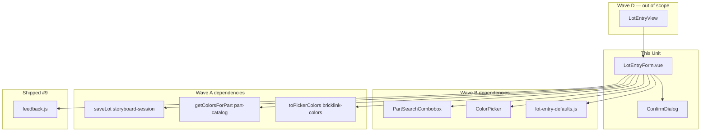
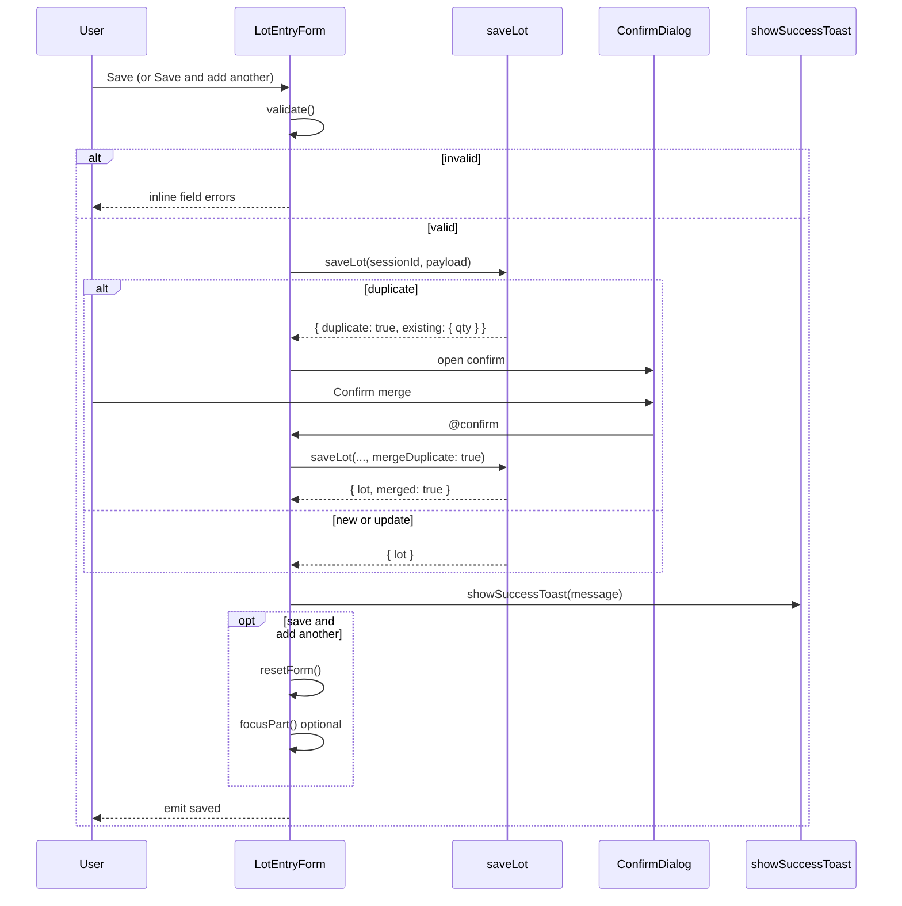

# Tech Spec — Unit 1: Lot entry form

**AIDLC phase:** Design (one **Unit** per Tech Spec)  
**Grounding:** Implements [product-spec.md](./product-spec.md) (approved 2026-06-15). Aligns with [ADR-0001](../../../../adr/0001-frontend-vue-js-shadcn-stack.md). Parent context: [lot-entry-cockpit product-spec](../../product-spec.md) · [#10](https://github.com/dcvezzani/brick-counter-coordinator-02/issues/10).

---

## Overview

| Field | Value |
|-------|-------|
| **Unit / scope** | Port `LotEntryForm.vue` from sibling `LotForm.vue` **minus** `SteppedSwipeNumberInput`; compose Wave B pickers + condition + `+`/`−` stepper + Save actions; duplicate confirm via [#9 ConfirmDialog](../../../../feature/00-shipped/ui-feedback-primitives/tech-spec.md); success toast; unit tests |
| **Feature** | [lot-entry-form](./) · child of [#10](https://github.com/dcvezzani/brick-counter-coordinator-02/issues/10) |
| **Product Spec** | [product-spec.md](./product-spec.md) — **Approved** |
| **Child work item** | [#64](https://github.com/dcvezzani/brick-counter-coordinator-02/issues/64) |
| **Status** | **Draft** (pending human approval) |
| **Author** | David Vezzani (with AI draft) |
| **Created** | 2026-06-15 |
| **Last updated** | 2026-06-15 |
| **PR target** | `feature/lot-entry-cockpit` (integration branch) — **not** `main` |

## Context

### Summary

Deliver the **four-field counting form** for coordinator-02: part id, color id, condition, and quantity — composed from upstream Wave A/B children and persisting via `saveLot` from [#62 lot-data-model](../lot-data-model/tech-spec.md). Port interaction and save semantics from sibling `LotForm.vue`, replacing swipe quantity input with large **`+` / `−` stepper buttons** per parent decision. Handle duplicate triples with `ConfirmDialog` + `mergeDuplicate: true`; show success toast via `showSuccessToast` ([#9](../../../../feature/00-shipped/ui-feedback-primitives/tech-spec.md)).

This Unit is **Wave C** — one Vue SFC + unit tests. **No** `LotEntryView` shell changes ([#65 lot-entry-cockpit-shell](../lot-entry-cockpit-shell/product-spec.md) mounts this component). Form is usable in isolation (unit tests) and via shell integration in Wave D.

### Existing system & documentation

| Artifact | Relevance |
|----------|-----------|
| [product-spec.md](./product-spec.md) | Approved scope — four fields, save, duplicate confirm, toast |
| [AIDLC.md](./AIDLC.md) | File ownership; branch `feature/lot-entry-cockpit-lot-entry-form` |
| [filterable-picker tech-spec](../filterable-picker/tech-spec.md) | Underlying picker primitive (via combobox/color children) |
| [part-color-catalog tech-spec](../part-color-catalog/tech-spec.md) | `getColorsForPart` for color list wiring |
| [part-search-combobox tech-spec](../part-search-combobox/tech-spec.md) | `PartSearchCombobox.vue` contract |
| [color-picker tech-spec](../color-picker/tech-spec.md) | `ColorPicker.vue` + `toPickerColors` wiring |
| [lot-data-model tech-spec](../lot-data-model/tech-spec.md) | `saveLot`, duplicate detection, `mergeDuplicate` |
| [lot-condition-defaults tech-spec](../lot-condition-defaults/tech-spec.md) | `resolveDefaultLotCondition`, read-only vs choosable |
| [ui-feedback-primitives tech-spec](../../../../feature/00-shipped/ui-feedback-primitives/tech-spec.md) | `showSuccessToast`, `ConfirmDialog.vue` |
| [docs/ui-rules.md](../../../../docs/ui-rules.md) | Touch targets (`min-h-11`, no `size="xs"` on primary actions) |
| Sibling prior art | [`LotForm.vue`](https://github.com/dcvezzani/brick-counter-coordinator/blob/main/src/components/LotForm.vue) — port minus swipe input |

### Out of scope for this Unit

Per approved Product Spec and [AIDLC.md](./AIDLC.md) ownership:

- `LotEntryView` chrome, compact worker shell, Compare CTA — [#65 lot-entry-cockpit-shell](../lot-entry-cockpit-shell/product-spec.md)
- `SteppedSwipeNumberInput` / swipe quantity control
- Picker/catalog/model/condition module implementation — Wave A/B children
- List lots presentation — [#66 migrate-list-lots-browse](../migrate-list-lots-browse/product-spec.md)
- Playwright e2e
- Production API / persistence

## Architecture

### High-level design

```
┌─────────────────────────────────────────────────────────────────┐
│  Consumer (Wave D — not this Unit)                              │
│  LotEntryView.vue — passes sessionId + session; mounts form      │
└───────────────────────────────┬─────────────────────────────────┘
                                │
                                ▼
┌─────────────────────────────────────────────────────────────────┐
│  LotEntryForm.vue (this Unit)                                    │
│  ├── PartSearchCombobox  v-model partId                          │
│  ├── ColorPicker         v-model colorId  (:colors from catalog) │
│  ├── Condition           read-only label OR N/U toggle (mixed)     │
│  ├── Qty stepper         +/− buttons (no swipe)                  │
│  ├── Save · Save and add another                                 │
│  └── ConfirmDialog       duplicate triple merge                  │
└───────┬─────────────┬──────────────┬──────────────┬─────────────┘
        │             │              │              │
        ▼             ▼              ▼              ▼
  PartSearchCombobox  ColorPicker   lot-entry-    storyboard-session
  (#60)               (#61)         defaults.js   saveLot (#62)
                                    (#63)              │
                                                       ▼
                                              feedback.js (#9)
                                              showSuccessToast
```



### Boundaries

| Layer | Responsibility |
|-------|----------------|
| `src/components/LotEntryForm.vue` | Form state, validation, save orchestration, duplicate UX, qty stepper |
| `PartSearchCombobox.vue` (#60) | Part search → part id — **read-only dependency** |
| `ColorPicker.vue` (#61) | Color search → color id — **read-only dependency** |
| `src/lib/part-catalog.js` (#59) | `getColorsForPart` — form computes `pickerColors` |
| `src/lib/bricklink-colors.js` (#61) | `toPickerColors` — catalog row mapping |
| `src/lib/lot-entry-defaults.js` (#63) | Condition mode + default + display label |
| `src/lib/storyboard-session.js` (#62) | `saveLot(sessionId, payload)` |
| `src/lib/feedback.js` (#9) | `showSuccessToast` |
| `src/components/ConfirmDialog.vue` (#9) | Controlled duplicate confirm shell |
| `tests/unit/components/LotEntryForm.test.js` | Save, duplicate, toast, stepper, reset |

### Integration points

| Upstream | Contract consumed by this Unit | Notes |
|----------|-------------------------------|-------|
| [#60 part-search-combobox](../part-search-combobox/tech-spec.md) | `v-model` part id; `session` prop; `@tabForward` / `@tabBackward`; `defineExpose({ focus })` | Tab chain to color picker |
| [#61 color-picker](../color-picker/tech-spec.md) | `v-model` numeric color id; `:colors` from parent mapping; `disabled` when `colors` empty | Parent clears `colorId` on `partId` change |
| [#59 part-color-catalog](../part-color-catalog/tech-spec.md) | `getColorsForPart(partId, { session })` | See wiring snippet below |
| [#63 lot-condition-defaults](../lot-condition-defaults/tech-spec.md) | `resolveDefaultLotCondition`, `isConditionReadOnly`, `isConditionChoosable`, `CONDITION_OPTIONS`, `conditionDisplayLabel` | Read-only vs toggle |
| [#62 lot-data-model](../lot-data-model/tech-spec.md) | `saveLot(sessionId, { partId, colorId, condition, qty, mergeDuplicate? })` → `{ lot, duplicate?, merged?, existing? }` | Duplicate UX in this form |
| [#9 ui-feedback](../../../../feature/00-shipped/ui-feedback-primitives/tech-spec.md) | `showSuccessToast`, `ConfirmDialog` controlled `v-model:open` | No new feedback primitives |

### Port adaptation (sibling `LotForm.vue` → `LotEntryForm.vue`)

| Sibling | Coordinator-02 change |
|---------|------------------------|
| `useFixtureSession()` composable | `sessionId` + `session` props; call `saveLot(sessionId, …)` module |
| `SteppedSwipeNumberInput` | **`+` / `−` `Button` stepper** — parent-locked decision |
| `useSession()` for colors | `getColorsForPart` + `toPickerColors` in form `computed` |
| Condition field | Same rules via `lot-entry-defaults.js` (#63) |
| Duplicate confirm | `ConfirmDialog` (#9) instead of inline alert-dialog wiring if sibling differs |
| `saveAndAddAnother` | Reset form fields; re-apply `resolveDefaultLotCondition` |

All other save/duplicate/validation semantics should match sibling unless review finds a coordinator-02 convention conflict.

## Data

### Form state (local `ref`s)

| Field | Type | Initial | Notes |
|-------|------|---------|-------|
| `partId` | `string` | `''` | From `PartSearchCombobox` |
| `colorId` | `number \| null` | `null` | From `ColorPicker` |
| `condition` | `'N' \| 'U'` | `resolveDefaultLotCondition(session)` | Worker may change when choosable |
| `qty` | `number` | `1` | Integer ≥ 1; stepper floor 1 |

### Catalog color wiring (in form)

```javascript
import { computed, ref, watch } from 'vue'
import { getColorsForPart } from '@/lib/part-catalog'
import { toPickerColors } from '@/lib/bricklink-colors'

const pickerColors = computed(() =>
  partId.value
    ? toPickerColors(getColorsForPart(partId.value, { session: props.session }))
    : [],
)

watch(partId, () => {
  colorId.value = null
})
```

### Save payload (`saveLot`)

| Field | Type | Source |
|-------|------|--------|
| `partId` | `string` | form |
| `colorId` | `number` | form |
| `condition` | `'N' \| 'U'` | form |
| `qty` | `number` | form |
| `mergeDuplicate` | `boolean` | `true` only after user confirms duplicate dialog |

No fixture or session shape changes in this Unit.

## APIs & contracts

No HTTP API. Component contract:

### Props

| Prop | Type | Default | Notes |
|------|------|---------|-------|
| `sessionId` | `String` | **required** | Passed to `saveLot` |
| `session` | `Object` | **required** | Storyboard session (reactive); pickers + condition helpers |

### Emits

| Event | Payload | When |
|-------|---------|------|
| `saved` | `{ lot, merged?: boolean }` | After successful save (including post-merge) — optional hook for shell/tests |

### `defineExpose`

| Method | Behavior |
|--------|----------|
| `focusPart()` | `partSearchRef.focus()` — opens part filter |
| `reset()` | `resetForm()` — same as save-and-add-another clear |

### Validation (pre-save)

| Rule | Error surface |
|------|---------------|
| `partId` non-empty | Inline `FormField` error on part row |
| `colorId` not `null` | Inline error on color row |
| `condition` is `'N'` or `'U'` | Should always hold; defensive check |
| `qty` ≥ 1 | Inline error on quantity row |

Validation failures do **not** call `saveLot`. Use inline errors per [ui-rules.md](../../../../docs/ui-rules.md) (no error toast for field validation).

### Save flow



### Duplicate confirm copy (default)

| Field | Value |
|-------|-------|
| `title` | `Lot already exists` |
| `description` | `This part, color, and condition already has {{ existingQty }} counted. Add {{ qty }} more?` |
| `cancelLabel` | `Cancel` |
| `confirmLabel` | `Add to lot` |

### Success toast messages (default)

| Outcome | Message |
|---------|---------|
| New lot | `Lot saved` |
| Merged duplicate | `Lot updated` |

### Quantity stepper UI

| Element | Spec |
|---------|------|
| Layout | Horizontal row: `−` button · qty display · `+` button |
| Buttons | shadcn `Button`, `size="default"`, `class="min-h-11 min-w-11"` (square touch targets) |
| Qty display | `text-2xl font-semibold tabular-nums` centered, `aria-live="polite"` |
| Decrement | Disabled when `qty <= 1` |
| Increment | No upper cap in storyboard |
| Label | `FormField label="Quantity"` |

**Explicitly excluded:** `SteppedSwipeNumberInput`, swipe gestures, hidden numeric `<input type="number">` as primary control (display-only span is fine).

### Condition UI

| Session mode | Control |
|--------------|---------|
| Read-only (`new` / `used`) | `FormField` with static text: `conditionDisplayLabel(condition)` |
| Choosable (`mixed`) | Two `Button`s in a row (`New` / `Used`) — `variant="default"` when selected, `outline` when not; `min-h-11`; bind to `condition` `'N'` / `'U'` |

Initialize `condition` from `resolveDefaultLotCondition(session)` on mount and on `resetForm()`. In mixed mode, **retain worker’s last choice** across save-and-add-another within the same mount (form local state — per [#63](../lot-condition-defaults/tech-spec.md)).

### Action buttons

| Button | Variant | Class | Behavior |
|--------|---------|-------|----------|
| Save | `default` | `min-h-11 flex-1` | Save; keep form values |
| Save and add another | `outline` | `min-h-11 flex-1` | Save then `resetForm()` |

Stack actions in `flex gap-2` row for thumb reach. Primary actions never use `size="xs"`.

### Tab order / focus chain

Forward `tabForward` / `tabBackward` from `PartSearchCombobox` to `ColorPicker.focusFilter()` / `focus()` per [#60](../part-search-combobox/tech-spec.md) — optional polish; not blocking Review if deferred.

### `data-testid` contract

| Element | id |
|---------|-----|
| Form root | `lot-entry-form` |
| Part field | `lot-entry-part` (delegate to `part-search` via child) |
| Color field | `lot-entry-color` |
| Condition read-only | `lot-entry-condition-readonly` |
| Condition New | `lot-entry-condition-new` |
| Condition Used | `lot-entry-condition-used` |
| Qty value | `lot-entry-qty` |
| Qty minus | `lot-entry-qty-minus` |
| Qty plus | `lot-entry-qty-plus` |
| Save | `lot-entry-save` |
| Save and add another | `lot-entry-save-add` |
| Duplicate dialog | `lot-entry-duplicate-confirm` (on `ConfirmDialog` wrapper or `open` guard) |

## UI / client

### Stack

| Layer | Choice |
|-------|--------|
| Component | Vue 3 `<script setup>` JavaScript SFC |
| Field chrome | `FormField.vue` (existing #5 primitive) |
| Pickers | `PartSearchCombobox`, `ColorPicker` (Wave B) |
| Actions | shadcn `Button` |
| Confirm | `ConfirmDialog.vue` |
| Styling | Tailwind; compact vertical `space-y-4` stack |

### Accessibility

- One labelled group per field via `FormField`
- Qty stepper buttons: `aria-label="Decrease quantity"` / `"Increase quantity"`
- Condition toggles: `aria-pressed` on selected button
- Duplicate dialog inherits alert-dialog roles from `ConfirmDialog`
- Keyboard: buttons and pickers operable without pointer

### Target files (after Build)

```
src/
└── components/
    └── LotEntryForm.vue              # NEW — port from sibling LotForm

tests/unit/
└── components/
    └── LotEntryForm.test.js          # NEW
```

**Do not modify** paths outside [AIDLC.md](./AIDLC.md) ownership in this child PR.

## Security & privacy

- Client-only storyboard; no network or PII beyond demo session.
- Vue text interpolation for labels and confirm copy.

## Acceptance criteria (for Review)

- [ ] `LotEntryForm.vue` composes `PartSearchCombobox`, `ColorPicker`, condition control, qty stepper, Save actions
- [ ] **No** `SteppedSwipeNumberInput` or swipe quantity control
- [ ] `saveLot` called with `partId`, `colorId`, `condition`, `qty` on valid Save
- [ ] Duplicate triple opens `ConfirmDialog`; confirm calls `saveLot` with `mergeDuplicate: true`
- [ ] `showSuccessToast` on successful save (mocked in unit test)
- [ ] `+` / `−` update `qty`; decrement disabled at 1; buttons `min-h-11`
- [ ] Save and add another clears `partId` / `colorId`, resets `qty` to 1, resets `condition` to session default
- [ ] `partId` change clears `colorId`
- [ ] Read-only condition when session `new` or `used`; choosable when `mixed`
- [ ] `pickerColors` wired via `getColorsForPart` + `toPickerColors`
- [ ] `npm test` and `npm run build` pass after rebase on merged Wave A + B (#58–#63)
- [ ] PR targets `feature/lot-entry-cockpit`; references [#64](https://github.com/dcvezzani/brick-counter-coordinator-02/issues/64)

## Testing approach

| Layer | What we prove | Notes |
|-------|----------------|-------|
| Unit | Save payload to `saveLot` | Mock `storyboard-session.js`; assert `partId`, `colorId`, `condition`, `qty` |
| Unit | Success toast | `vi.mock('@/lib/feedback.js')`; assert `showSuccessToast` called |
| Unit | Duplicate confirm + merge | `saveLot` mock returns `duplicate: true` then success; assert dialog + second call with `mergeDuplicate: true` |
| Unit | Qty stepper | Click `+`/ `−`; assert `lot-entry-qty` text |
| Unit | Save and add another reset | After save, fields cleared / defaulted |
| Unit | Condition read-only vs choosable | Mount with session fixtures `{ condition: 'used' }` vs `{ condition: 'mixed' }` |
| Integration | N/A | Shell (#65) mounts form in Wave D |
| E2E / manual | Mobile stepper + pickers | Parent Validate / shell Review |

**Test conventions:**

- `tests/unit/components/LotEntryForm.test.js`
- Stub `PartSearchCombobox` and `ColorPicker` with simple inputs emitting `update:modelValue` **or** shallow mount with global stubs
- `createDemoSession()` + `DEMO_SESSION_ID` for session prop
- `beforeEach`: reset session via `__resetSessionsForTests()` if available

**Example scenarios:**

```javascript
it('save calls saveLot with four fields', async () => {
  // set partId, colorId, condition, qty via stubs or exposed refs
  await wrapper.find('[data-testid="lot-entry-save"]').trigger('click')
  expect(saveLot).toHaveBeenCalledWith(DEMO_SESSION_ID, {
    partId: '3001',
    colorId: 5,
    condition: 'U',
    qty: 3,
  })
})

it('shows success toast after save', async () => {
  saveLot.mockReturnValue({ lot: { id: 'lot-x' }, duplicate: false })
  await save()
  expect(showSuccessToast).toHaveBeenCalled()
})
```

## Rollout & operations

### Rollout plan

1. Merge Wave **A** (#58, #59, #62) and Wave **B** (#60, #61, #63) to `feature/lot-entry-cockpit`
2. Rebase `feature/lot-entry-cockpit-lot-entry-form` worktree
3. Implement `LotEntryForm.vue` + tests
4. Merge child PR to integration branch
5. Wave **D** `lot-entry-cockpit-shell` mounts form on `LotEntryView`

### Monitoring & observability

N/A — local storyboard client.

### Rollback

Revert child merge on integration branch; shell continues to show placeholder until re-landed.

## Risks & open technical questions

| Risk / question | Mitigation or owner |
|-----------------|---------------------|
| Build before Wave A/B merged | **Block Build** until #58–#63 on integration branch; rebase worktree |
| Sibling `LotForm.vue` unavailable for diff | Contracts locked in upstream child tech specs + product spec; reconcile on `/build` |
| `saveLot` not yet on integration branch | Same rebase gate as pickers |
| Color id fixture drift (catalog vs lot-data-model) | Use numeric ids from merged catalog; tests use demo session |
| Tab focus chain incomplete | Advisory — optional follow-up in Build |
| Form mounted nowhere until Wave D | Unit tests + optional thin dev harness **not** required (shell owns route) |

### Open technical questions (for human)

| # | Question | Recommendation |
|---|----------|----------------|
| T1 | Auto-focus part search after save-and-add-another? | **Yes** — call `focusPart()` after reset (sibling parity) |
| T2 | Mixed mode condition: two toggle buttons vs `Select`? | **Two buttons** — better thumb targets on phone |
| T3 | Show inline validation on first Save click only vs on blur? | **On Save click** — simpler; match sibling |
| T4 | Emit `saved` for shell analytics? | **Yes** — optional emit; low cost |

### Blockers

| Blocker | Status |
|---------|--------|
| #58 `filterable-picker` merged to `feature/lot-entry-cockpit` | Required — picker primitive |
| #59 `part-color-catalog` merged | Required — `getColorsForPart` |
| #62 `lot-data-model` merged | Required — `saveLot` |
| #60 `part-search-combobox` merged | Required — part field |
| #61 `color-picker` merged | Required — color field |
| #63 `lot-condition-defaults` merged | Required — condition helpers |

## Design review passes (merged findings)

### Architecture

- **Composition root:** `LotEntryForm` is the correct orchestration layer — pickers stay presentational; save/duplicate logic does not leak into children.
- **Dependency direction:** Form → Wave B SFCs + pure libs + `saveLot` + feedback; no changes to upstream modules in this PR.
- **Sibling parity** on save/duplicate/reset semantics reduces Validate risk; intentional divergence only on quantity input (stepper vs swipe).
- **Session via props** matches coordinator-02 module pattern (no `useFixtureSession` composable).
- **Advisory:** Keep `resetForm()` as a single function used by save-and-add-another and `defineExpose({ reset })`.

### Frontend

- Port matches ADR-0001 (JS SFC, shadcn Button, existing `FormField`).
- `min-h-11` on stepper and save actions satisfies parent mobile policy and child Product Spec.
- `space-y-4` compact stack supports parent “compact chrome” when shell embeds form ([#65](../lot-entry-cockpit-shell/product-spec.md)).
- Condition two-button toggle preferred over `Select` for mixed mode — larger touch targets.
- **Advisory:** Use `tabular-nums` on qty display to prevent layout shift.
- **Advisory:** `watch(partId)` clear `colorId` — required per [#61 color-picker](../color-picker/tech-spec.md) parent wiring contract.

### Backend / API

- N/A — skipped per orchestration (no server surface).

### Testing

- Mock `saveLot` and `showSuccessToast` — proves Product Spec criteria #1 and #3 without full picker integration.
- One duplicate-merge test covers parent merge-on-duplicate decision.
- Stepper test satisfies criterion #2 at unit level; manual/ui-rules in parent Validate.
- Stub pickers to keep tests fast and focused on form orchestration.
- No Playwright — consistent with parent and child Product Spec.

### CI / deploy

- Existing `.github/workflows/ci.yml` — PR to `feature/lot-entry-cockpit` runs `npm ci`, `npm test`, `npm run build`.
- No workflow changes required.

## Change history

| Date | Author | Changes |
|------|--------|---------|
| 2026-06-15 | AI draft | Initial Tech Spec for lot-entry-form (#64) |

## Related documents

- [product-spec.md](./product-spec.md)
- [AIDLC.md](./AIDLC.md)
- [Parent product-spec](../../product-spec.md)
- [filterable-picker tech-spec](../filterable-picker/tech-spec.md)
- [part-color-catalog tech-spec](../part-color-catalog/tech-spec.md)
- [part-search-combobox tech-spec](../part-search-combobox/tech-spec.md)
- [color-picker tech-spec](../color-picker/tech-spec.md)
- [lot-data-model tech-spec](../lot-data-model/tech-spec.md)
- [lot-condition-defaults tech-spec](../lot-condition-defaults/tech-spec.md)
- [sub-features/README.md](../README.md)
- [ADR-0001](../../../../adr/0001-frontend-vue-js-shadcn-stack.md)
- [ui-feedback-primitives tech-spec](../../../../feature/00-shipped/ui-feedback-primitives/tech-spec.md)
- Sibling prior art: [LotForm.vue](https://github.com/dcvezzani/brick-counter-coordinator/blob/main/src/components/LotForm.vue)
- [#64](https://github.com/dcvezzani/brick-counter-coordinator-02/issues/64) · [#10](https://github.com/dcvezzani/brick-counter-coordinator-02/issues/10)
