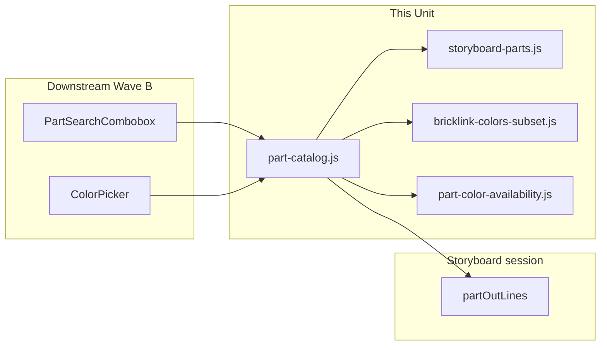

# Tech Spec — Unit 1: Storyboard part & color catalog

**AIDLC phase:** Design (one **Unit** per Tech Spec)  
**Grounding:** Implements [product-spec.md](./product-spec.md) (approved 2026-06-15). Aligns with [ADR-0001](../../../../adr/0001-frontend-vue-js-shadcn-stack.md). Parent context: [../product-spec.md](../product-spec.md) · [#10](https://github.com/dcvezzani/brick-counter-coordinator-02/issues/10).

---

## Overview

| Field | Value |
|-------|-------|
| **Unit / scope** | Pure-JS catalog module (`searchParts`, `lookupPart`, `resolvePartId`, `getColorsForPart`); BrickLink color id subset fixture; extend demo part-out lines with `colorId` |
| **Feature** | [part-color-catalog](./) · child [#59](https://github.com/dcvezzani/brick-counter-coordinator-02/issues/59) · parent [#10](https://github.com/dcvezzani/brick-counter-coordinator-02/issues/10) |
| **Product Spec** | [product-spec.md](./product-spec.md) — **Approved** |
| **Status** | **Draft** |
| **Author** | David Vezzani (with AI draft) |
| **Created** | 2026-06-15 |
| **Last updated** | 2026-06-15 |

## Context

### Summary

Deliver a **session-aware, fixture-backed catalog layer** in `src/lib/` so Wave B pickers (`part-search-combobox`, `color-picker`) and the lot entry form can resolve **part id** and **color id** from searchable names without a live BrickLink API. Part search **ranks session part-out lines first**; color lookup returns **numeric BrickLink color ids** plus display names (and optional hex for downstream swatches). Extend `demo-session.js` part-out rows with `colorId` only — lot row migration remains [#62 lot-data-model](./lot-data-model/product-spec.md).

This Unit is **library + fixtures + unit tests** — no Vue components, no save semantics, no picker UI.

### Existing system & documentation

| Artifact | Relevance |
|----------|-----------|
| [feature/00-shipped/storyboard-ui/tech-spec.md](../../00-shipped/storyboard-ui/tech-spec.md) | `demo-session.js`, `storyboard-session.js`, `partOutLines` shape |
| [feature/lot-entry-cockpit/product-spec.md](../product-spec.md) | Part-out favoritism, id-in-storage / names-in-UI |
| [feature/lot-entry-cockpit/sub-features/part-search-combobox/product-spec.md](../part-search-combobox/product-spec.md) | Consumer — calls `searchParts` / `resolvePartId` |
| [feature/lot-entry-cockpit/sub-features/color-picker/product-spec.md](../color-picker/product-spec.md) | Consumer — calls `getColorsForPart`; owns `bricklink-colors.js` **swatch helper** |
| [feature/lot-entry-cockpit/sub-features/lot-data-model/product-spec.md](../lot-data-model/product-spec.md) | Owns lot `colorId` / `condition` fixture migration — **do not change lot rows here** |
| [ADR-0001](../../../../adr/0001-frontend-vue-js-shadcn-stack.md) | JavaScript-only client |
| [docs/tech-stack.md](../../../../docs/tech-stack.md) | `src/lib/`, `src/fixtures/` layout |

### Out of scope for this Unit

Per approved Product Spec — do not implement:

- Vue picker UI (`FilterablePicker`, `PartSearchCombobox`, `ColorPicker`)
- Lot save, merge-on-duplicate, `lotKey` ([#62](../lot-data-model/product-spec.md))
- Migrating `lots[]`, `reconciliationRows[]`, or list-lots views to `colorId`
- Live BrickLink catalog API or image URLs
- `src/lib/bricklink-colors.js` swatch/CSS helper (owned by [#61 color-picker](../color-picker/product-spec.md))
- Condition defaults ([#63](../lot-condition-defaults/product-spec.md))
- Playwright e2e

## Architecture

### High-level design

```
┌─────────────────────────────────────────────────────────────────┐
│  Wave B consumers (future)                                       │
│  PartSearchCombobox.vue ──searchParts / resolvePartId──┐         │
│  ColorPicker.vue ─────────getColorsForPart──────────────┤         │
└────────────────────────────────────────────────────────┼─────────┘
                                                         ▼
                                              src/lib/part-catalog.js
                                                         │
                    ┌────────────────────────────────────┼────────────────────┐
                    ▼                                    ▼                    ▼
     fixtures/storyboard-parts.js      fixtures/bricklink-colors-subset.js   session.partOutLines
     (catalog parts beyond import)     (id → name, hex)                      (ranked first in search)
                    │                                    │
                    └──────────────── fixtures/part-color-availability.js ────┘
                                         (partId → colorIds for storyboard)
```



### Boundaries

| Layer | Responsibility |
|-------|----------------|
| `src/lib/part-catalog.js` | Public API — search, lookup, resolve, colors-for-part |
| `src/fixtures/storyboard-parts.js` | Static part catalog (id + name) for storyboard search beyond import list |
| `src/fixtures/bricklink-colors-subset.js` | Minimal BrickLink color id map used by demo fixtures (id, name, hex) |
| `src/fixtures/part-color-availability.js` | Which color ids each part id may have in storyboard (when not implied by part-out) |
| `src/fixtures/demo-session.js` | Add `colorId` on **part-out lines only** |
| `src/lib/storyboard-session.js` | Unchanged API — session object passed into catalog functions |

### Integration points

| Consumer | Contract | Notes |
|----------|----------|-------|
| [#60 part-search-combobox](../part-search-combobox/product-spec.md) | `searchParts(query, { session })`, `lookupPart(partId)`, `resolvePartId(input)` | Session required for part-out ranking |
| [#61 color-picker](../color-picker/product-spec.md) | `getColorsForPart(partId, { session })` | Returns `{ colorId, name, hex? }[]`; swatch rendering is color-picker’s job |
| [#62 lot-data-model](../lot-data-model/product-spec.md) | Reads `colorId` on part-out lines for reconcile prep | Coordinate merge order on `demo-session.js` if both touch same file |
| Vitest / CI | `npm test`, `npm run build` | `tests/unit/lib/part-catalog.test.js` |

## Data

### BrickLink color id subset (storyboard)

Fixture file: `src/fixtures/bricklink-colors-subset.js`

| colorId | name | hex (storyboard swatch) |
|---------|------|-------------------------|
| `1` | Blue | `#0055BF` |
| `5` | Red | `#C91A09` |
| `11` | Black | `#05131D` |

Ids are **numbers** in fixture data; public API may accept string coercion (`"5"` → `5`) for form v-models.

### Part-out line extension (`demo-session.js`)

Add `colorId` aligned with existing `color` name string:

| partOut line | partId | color (name) | colorId |
|--------------|--------|--------------|---------|
| po-1 | `3001` | Red | `5` |
| po-2 | `3023` | Blue | `1` |
| po-3 | `3069b` | Black | `11` |
| po-4 | `3710` | Red | `5` |

**Do not** remove legacy `color` name field in this Unit — downstream migration children may still read it until lot/reconcile shape updates land.

### Storyboard part catalog

`src/fixtures/storyboard-parts.js` — array of `{ partId, name }`:

- Includes all part ids present in demo part-out lines
- Adds a small number of extra parts (e.g. `3003` Brick 2×2) so search can return non-import hits **after** part-out matches

### Part → color availability

`src/fixtures/part-color-availability.js` — map `partId → number[]` of allowed color ids for storyboard. Minimum: colors appearing on that part in part-out **plus** at least one additional color per demo part where product scenarios need it (e.g. `3001` also allows Blue for “same part, different color” parent scenario).

## APIs & contracts

No HTTP API. Module: `src/lib/part-catalog.js` (JavaScript, tree-shakeable named exports).

### `searchParts(query, options?)`

| Param | Type | Notes |
|-------|------|-------|
| `query` | `string` | User filter text; trim + case-insensitive match |
| `options.session` | `object \| null` | Storyboard session; when present, `session.partOutLines` ranked first |

**Returns:** `Array<{ partId: string, name: string, source: 'part-out' | 'catalog' }>`

**Ranking algorithm:**

1. Normalize `query` (trim, lowercase). Empty query → all part-out unique parts (in line order), then catalog parts not already listed.
2. Collect matches from `session.partOutLines` where `partId` or `name` contains `query` (case-insensitive).
3. **Dedupe by `partId`**, preserving first hit order (part-out line order).
4. Append matches from `storyboard-parts` not already included, stable catalog order.
5. Tag each row with `source` for tests and debugging.

### `lookupPart(partId)`

| Param | Type | Notes |
|-------|------|-------|
| `partId` | `string` | BrickLink-style part number |

**Returns:** `{ partId, name } | null` — resolves from storyboard catalog; may synthesize name from part-out fixture when id only appears on import lines.

### `resolvePartId(input)`

| Param | Type | Notes |
|-------|------|-------|
| `input` | `string` | Part id or display name fragment |

**Returns:** `string | null` — part id if uniquely resolved.

**Resolution order:**

1. Exact `partId` match (case-insensitive for alphanumeric ids like `3069b`)
2. Unique `name` match in storyboard catalog
3. Otherwise `null` (callers must not treat free text as an id)

### `getColorsForPart(partId, options?)`

| Param | Type | Notes |
|-------|------|-------|
| `partId` | `string` | Selected part |
| `options.session` | `object \| null` | Optional — union colors from part-out lines for this part |

**Returns:** `Array<{ colorId: number, name: string, hex?: string }>` sorted by `name` ascending.

**Sources (union, dedupe by `colorId`):**

1. Colors on matching `session.partOutLines` for `partId` (uses line `colorId` when present, else map `color` name via subset fixture)
2. Colors listed in `part-color-availability` for `partId`
3. Enrich `name` / `hex` from `bricklink-colors-subset`

**Unknown `partId`:** return `[]` (color picker stays disabled downstream).

### Error model

Pure functions — no throws for expected misses; return `null`, `[]`, or empty search results. Invalid inputs (non-string) → treat as empty string / return empty/null.

## UI / client

**N/A for this Unit** — no new routes, components, or styles.

Downstream pickers import the catalog module only; no global state registration required.

## Security & privacy

- Static fixture data only; no network, secrets, or PII.
- No user input persistence beyond in-memory session already owned by storyboard module.

## Acceptance criteria (for Review)

- [ ] `src/lib/part-catalog.js` exports `searchParts`, `lookupPart`, `resolvePartId`, `getColorsForPart`.
- [ ] `searchParts('3023', { session })` returns part-out hit for Plate 1×2 **before** any catalog-only part with the same ranking rules.
- [ ] `searchParts` dedupes multiple part-out lines sharing the same `partId`.
- [ ] `lookupPart` and `resolvePartId` return consistent `partId` values for demo fixture parts.
- [ ] `getColorsForPart('3001', { session })` includes Red (`5`) with name and hex; includes colors from availability map.
- [ ] `demo-session.js` part-out lines include `colorId` per table above; existing views still render (name field retained).
- [ ] Fixture files live under `src/fixtures/` as specified; no `bricklink-colors.js` swatch helper added (reserved for #61).
- [ ] `tests/unit/lib/part-catalog.test.js` covers success criteria #1–#3 from Product Spec.
- [ ] `npm test` and `npm run build` pass on branch targeting `feature/lot-entry-cockpit`.
- [ ] No Vue SFCs, lot save API, or picker components added in this PR.

## Testing approach

| Layer | What we prove | Notes |
|-------|----------------|-------|
| Unit | Ranking, dedupe, id resolution, color union | `tests/unit/lib/part-catalog.test.js` — use `createDemoSessionSeed()` for session fixture |
| Integration | N/A | No UI boundary in this Unit |
| E2E / manual | N/A | Pickers validate in Wave B children |

**Test cases (minimum):**

1. `searchParts` with query matching a part-out `partId` lists that part first with `source: 'part-out'`.
2. `searchParts` with query matching only a catalog-only part returns it with `source: 'catalog'` after part-out section.
3. `lookupPart` / `resolvePartId` round-trip for `3001`, `3069b`, and a name fragment.
4. `getColorsForPart` returns objects with numeric `colorId`, non-empty `name`, and `hex` for subset colors.
5. `getColorsForPart` for unknown part returns `[]`.

Vitest config: `tests/**/*.test.js` per `vite.config.js`; exclude `.claude/**`.

## Rollout & operations

### Rollout plan

- Merge child PR to integration branch `feature/lot-entry-cockpit` (not `main`).
- Wave B worktrees rebase onto merged catalog API before picker implementation.

### Monitoring & observability

N/A — client-side fixtures only.

### Rollback

Revert PR; remove catalog module and fixture additions. Downstream pickers not yet merged remain unaffected.

## Risks & open technical questions

| Risk / question | Mitigation or owner |
|-----------------|---------------------|
| Concurrent edits to `demo-session.js` with [#62 lot-data-model](../lot-data-model/product-spec.md) | Touch **part-out lines only** in this child; coordinate merge conflicts on integration branch |
| `color` name string vs `colorId` drift on part-out lines | Build derives `colorId` from name via subset map in tests; seed documents both explicitly |
| color-picker expects `bricklink-colors.js` path | Catalog uses `bricklink-colors-subset.js`; #61 may re-export or import subset — document in color-picker Design |
| Over-large fixture catalog | Keep storyboard parts to ~10 rows; expand only when a demo scenario requires it |
| Part id case (`3069b` vs `3069B`) | Normalize to lowercase for compare; preserve canonical fixture casing in returned `partId` |

### Resolved decisions

| # | Decision | Resolved |
|---|----------|----------|
| 1 | Module filename | `src/lib/part-catalog.js` |
| 2 | Color map location | `src/fixtures/bricklink-colors-subset.js` (not `bricklink-colors.js`) |
| 3 | `colorId` type | **number** in API payloads |
| 4 | Lot row migration | **Out of scope** — #62 |
| 5 | Swatch helper | **Out of scope** — #61 |

### Open technical questions (for human Design approval)

| # | Question | Proposed default |
|---|----------|------------------|
| 1 | How many catalog-only parts beyond part-out? | **3–5** extras (e.g. `3003`, `3004`, `3024`) |
| 2 | Should `searchParts` match substring on name only, or also token boundaries? | **Substring** (match sibling filterable-picker behavior) |
| 3 | Export `PART_CATALOG` constants for tests, or keep fixtures private? | **Private fixtures**; test via public API only |

## Design review passes (merged findings)

### Architecture

- Single pure-JS module with fixture imports is the correct boundary — independently testable, no Vue dependency, parallel-safe with Wave A `filterable-picker` and `lot-data-model`.
- Session passed as an argument (not imported from `storyboard-session.js` inside catalog) keeps catalog unit tests simple and avoids circular imports.
- Separate `bricklink-colors-subset.js` avoids file ownership clash with color-picker’s planned `bricklink-colors.js` swatch module.

### Frontend

- No UI in this Unit — ADR-0001 satisfied (JS modules only).
- Returned DTO shapes (`partId`, `colorId`, `name`, optional `hex`) are stable contracts for Wave B SFCs; pickers should not parse fixture files directly.

### Backend / API

- N/A — skipped per orchestration (no server surface).

### Testing

- Vitest unit tests in `tests/unit/lib/` match repo convention (`tests/**/*.test.js`).
- Use `createDemoSessionSeed()` rather than mutating global session state.
- One focused test file is sufficient for Review gate; ranking and color union are the highest-value cases.

### CI / deploy

- Existing `.github/workflows/ci.yml` — PR to `feature/lot-entry-cockpit` runs `npm ci`, `npm test`, `npm run build`.
- No workflow changes required.

## Change history

| Date | Author | Changes |
|------|--------|---------|
| 2026-06-15 | AI draft | Initial Tech Spec (Design **Draft**) |

## Related documents

- [product-spec.md](./product-spec.md)
- [AIDLC.md](./AIDLC.md)
- [Parent product spec](../product-spec.md)
- [sub-features README](../README.md)
- [ADR-0001](../../../../adr/0001-frontend-vue-js-shadcn-stack.md)
- [GitHub issue #59](https://github.com/dcvezzani/brick-counter-coordinator-02/issues/59)
