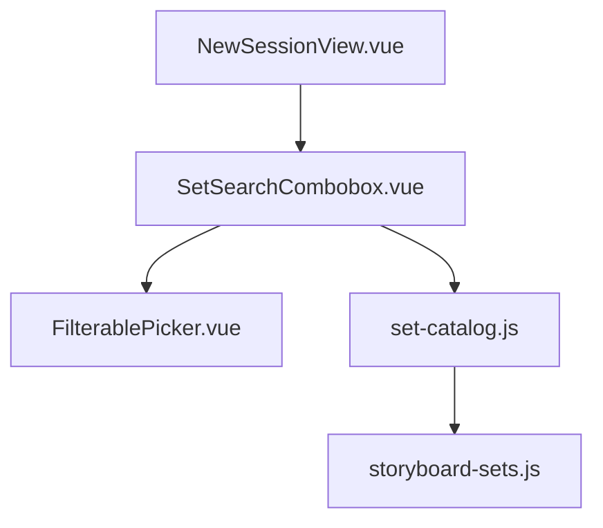

# Tech Spec — Unit 1: New session set search picker

**AIDLC phase:** Design (one **Unit** per Tech Spec)  
**Grounding:** Implements [product-spec.md](./product-spec.md) (approved 2026-06-16). Aligns with [ADR-0001](../../../adr/0001-frontend-vue-js-shadcn-stack.md). Work item [#88](https://github.com/dcvezzani/brick-counter-coordinator-02/issues/88).

---

## Overview

| Field | Value |
|-------|-------|
| **Unit / scope** | Add `SetSearchCombobox.vue` + `set-catalog.js` + fixture set list; wire into `NewSessionView.vue`; unit tests for normalization, search, v-model, and FilterablePicker integration |
| **Feature** | [new-session-use-filterable-picker](./) · [#88](https://github.com/dcvezzani/brick-counter-coordinator-02/issues/88) |
| **Product Spec** | [product-spec.md](./product-spec.md) — **Approved** |
| **Status** | **Approved for build** |
| **Author** | David Vezzani (with AI draft) |
| **Created** | 2026-06-16 |
| **Last updated** | 2026-06-16 |
| **Approved** | 2026-06-16 — David Vezzani (chat) |
| **PR target** | `main` |

## Context

### Summary

Deliver a **set-number search combobox** for the storyboard **New session** form: stores a **normalized** BrickLink-style set number (`{base}-{variant}`) via `v-model`, shows the resolved set **name** after selection, and filters a **fixture catalog** (~6 entries). The component wraps shipped `FilterablePicker` using the same adapter pattern as `PartSearchCombobox.vue`. `NewSessionView` replaces its plain `Input` with this picker and defaults to `10281-1`.

No HTTP API, no session-scoped ranking (sets are global fixtures), no condition picker changes.

### Existing system & documentation

| Artifact | Relevance |
|----------|-----------|
| [product-spec.md](./product-spec.md) | Approved scope, normalization rules, copy |
| [AIDLC.md](./AIDLC.md) | Branch, worktree, file ownership |
| [part-search-combobox tech-spec](../../00-shipped/lot-entry-cockpit/sub-features/part-search-combobox/tech-spec.md) | Picker adapter pattern, tests, FilterablePicker contract |
| `src/components/PartSearchCombobox.vue` | Primary implementation template |
| `src/components/FilterablePicker.vue` | Shared picker primitive — read-only dependency |
| `src/lib/part-catalog.js` | Catalog module shape to mirror (`search*`, `lookup*`, `resolve*`) |
| Sibling [new-session.md](https://github.com/dcvezzani/brick-counter-coordinator/blob/main/docs/view-specs/new-session.md) | Target normalization semantics (not yet implemented in sibling code) |
| [ADR-0001](../../../adr/0001-frontend-vue-js-shadcn-stack.md) | Vue 3 + JS SFCs + shadcn-vue |

### Out of scope for this Unit

Per approved Product Spec:

- Live BrickLink / coordinator `GET /bricklink/sets`
- Condition (New/Used) radios on New session
- Display-name route guard, Back to Home, client pattern validation alerts
- `ViewHeader` migration for New session
- Changes to `FilterablePicker.vue`
- Playwright e2e (unit + manual UI validation sufficient for this Unit)

## Architecture

### High-level design

```
┌─────────────────────────────────────────────────────────────────┐
│  NewSessionView.vue                                              │
│  ├── setNumber ref (default '10281-1')                           │
│  ├── SetSearchCombobox v-model="setNumber"                       │
│  └── submit → createDemoSession({ setNumber })                   │
└───────────────────────────────┬─────────────────────────────────┘
                                │
                                ▼
┌─────────────────────────────────────────────────────────────────┐
│  SetSearchCombobox.vue                                           │
│  ├── Label + resolved name (set-search-resolved)                 │
│  ├── helper: "Search by set number or name."                     │
│  ├── maps catalog rows → PickerOption { value, label, data }       │
│  ├── filterSetOptions → searchSets(query)                        │
│  └── onClose blur-resolve via resolveSetNumber                   │
└───────────────┬─────────────────────────────┬───────────────────┘
                │                             │
                ▼                             ▼
┌───────────────────────────┐   ┌───────────────────────────────┐
│  FilterablePicker.vue      │   │  set-catalog.js                │
│  (read-only)               │   │  searchSets · lookupSet ·      │
│                            │   │  resolveSetNumber ·            │
│                            │   │  normalizeSetNumber            │
└───────────────────────────┘   └───────────────┬───────────────┘
                                                │
                                                ▼
                                ┌───────────────────────────────┐
                                │  fixtures/storyboard-sets.js   │
                                │  STORYBOARD_SETS (~6 rows)     │
                                └───────────────────────────────┘
```



### Boundaries

| Layer | Responsibility |
|-------|----------------|
| `src/components/SetSearchCombobox.vue` | Set-specific picker wrapper; v-model set number; label + helper + resolved name |
| `src/lib/set-catalog.js` | Pure search, lookup, resolve, normalize — no Vue imports |
| `src/fixtures/storyboard-sets.js` | Static set rows `{ setNumber, name }` |
| `src/views/NewSessionView.vue` | Host form; default `10281-1`; submit unchanged |
| `src/components/FilterablePicker.vue` | Generic UI — **not owned** |
| `tests/unit/lib/set-catalog.test.js` | Catalog + normalization |
| `tests/unit/components/SetSearchCombobox.test.js` | Component contract |

### Integration points

| System | Contract | Notes |
|--------|----------|-------|
| `FilterablePicker` | `v-model`, `options`, `filterOptions`, `minFilterChars`, slots, `test-id` | `test-id="set-search"`; `minFilterChars` **2** (match part picker) |
| `set-catalog.js` | `searchSets`, `lookupSet`, `resolveSetNumber`, `normalizeSetNumber` | See APIs section |
| `storyboard-session.js` | `createDemoSession({ setNumber })` | No API change; receives normalized string |
| CI | `npm test` / `npm run build` | PR to `main` |

## Data

### Fixture catalog (`STORYBOARD_SETS`)

Minimal list per Product Spec — demo set family + additional entries (~6 rows):

| `setNumber` | `name` |
|-------------|--------|
| `10281-1` | Bonsai Tree |
| `10281-2` | Bonsai Tree (variant 2) |
| `21309-1` | NASA Apollo Saturn V |
| `42115-1` | Lamborghini Sián FKP 37 |
| `70404-1` | Iconic Chess Set |
| `60316-1` | Police Station |

All fixture ids are pre-normalized. `10281-2` exists to prove variant preservation in tests.

### v-model

| Field | Type | Notes |
|-------|------|-------|
| `modelValue` / `update:modelValue` | `string` | Normalized set number (e.g. `10281-1`); empty string when cleared |

### `select` emit payload

`{ setNumber: string, name: string }` — catalog row shape from `searchSets` / `lookupSet`.

No persistence schema changes. `demo-session.js` continues to accept `setNumber` on `createDemoSessionSeed(setNumber)`.

## APIs & contracts

No HTTP API.

### `set-catalog.js` exports

```javascript
/**
 * @typedef {{ setNumber: string, name: string }} StoryboardSet
 */

/** Trim; bare digits → `{digits}-1`; `{digits}-{variant}` preserved. */
export function normalizeSetNumber(input) { /* ... */ }

/** Substring match on setNumber or name (case-insensitive). Empty query → full list. */
export function searchSets(query) { /* ... */ }

/** Exact match on normalized setNumber; null if unknown. */
export function lookupSet(setNumber) { /* ... */ }

/**
 * Normalize input, then resolve to catalog setNumber if known.
 * Returns normalized string when catalog match; null when empty/unknown.
 */
export function resolveSetNumber(input) { /* ... */ }
```

#### Normalization algorithm (`normalizeSetNumber`)

1. `trim` input.
2. If empty → `''`.
3. If matches `/^\d+$/` → append `-1` (e.g. `10281` → `10281-1`).
4. If matches `/^\d+-\d+$/` → return trimmed as-is.
5. Otherwise return trimmed string unchanged (allows resolve to fail gracefully for garbage).

`resolveSetNumber` applies `normalizeSetNumber` then `lookupSet`; returns catalog `setNumber` on hit, else `null` (same spirit as `resolvePartId`).

### `SetSearchCombobox.vue` — props / emits

| Prop | Type | Default | Notes |
|------|------|---------|-------|
| `modelValue` | `String` | `''` | Selected set number |

No `session` prop — unlike parts, set search is not session-scoped.

| Event | Payload | When |
|-------|---------|------|
| `update:modelValue` | `string` | Selection, clear, blur-resolve (normalized) |
| `select` | `{ setNumber, name }` | User selects option or blur resolves known set |
| `tabForward` / `tabBackward` | — | Forwarded from `FilterablePicker` |

`defineExpose({ focus })` → `pickerRef.focusFilter()`.

#### Internal mapping

```javascript
searchSets('').map((set) => ({
  value: set.setNumber,
  label: set.setNumber,
  data: set,
}))

// filterSetOptions(query)
searchSets(query.trim()).map(/* same shape */)

// onUpdate(value)
emit('update:modelValue', resolveSetNumber(String(value)) ?? normalizeSetNumber(String(value)) ?? '')

// onClose — sibling parity with PartSearchCombobox
// When not fromSelection: resolve filterQuery or modelValue via resolveSetNumber; emit + select if hit
```

`onUpdate` should emit normalized catalog id when resolvable; when user clears, emit `''`.

#### `data-testid` contract

| Element | id |
|---------|-----|
| Resolved name | `set-search-resolved` |
| Picker chrome | `set-search`, `set-search-trigger`, `set-search-filter`, … (via `test-id="set-search"`) |

### `NewSessionView.vue` changes

| Before | After |
|--------|-------|
| `const setNumber = ref('10281')` | `const setNumber = ref('10281-1')` |
| `FormField` + `Input` | `SetSearchCombobox v-model="setNumber"` only (component owns label + helper) |
| — | `submit()` calls `normalizeSetNumber(setNumber.value)` before `createDemoSession` (defense in depth) |

Remove unused `Input` import if no longer referenced.

## UI / client

### Stack

| Layer | Choice |
|-------|--------|
| Component | Vue 3 `<script setup>` JS SFC |
| Picker | `FilterablePicker` |
| Label | shadcn-vue `Label` (inside `SetSearchCombobox`, same as part picker) |
| Helper | `<p class="text-xs text-muted-foreground">` under label |

### FilterablePicker configuration

| Prop | Value |
|------|-------|
| `minFilterChars` | `2` |
| `placeholder` | `Search sets…` |
| `filterPlaceholder` | `Filter sets` |
| `emptyFilterMessage` | `No sets match` |
| `test-id` | `set-search` |

### Option label slot

```html
<span class="block font-medium">{{ option.data.setNumber }}</span>
<span class="text-muted-foreground block text-xs">{{ option.data.name }}</span>
```

### Accessibility

- Inherited listbox / `aria-expanded` from `FilterablePicker`
- Helper text associated visually under label; full `aria-describedby` wiring optional follow-up if `FormField` wrapper is not used

## Security & privacy

Fixture data only; no PII, no network calls, no auth changes.

## Acceptance criteria (for Review)

- [ ] `src/lib/set-catalog.js` with `searchSets`, `lookupSet`, `resolveSetNumber`, `normalizeSetNumber`
- [ ] `src/fixtures/storyboard-sets.js` with ~6 entries including `10281-1`, `10281-2`, and 4 other sets
- [ ] `SetSearchCombobox.vue` wraps `FilterablePicker`; mirrors `PartSearchCombobox` adapter pattern
- [ ] Label **Set number**; helper **Search by set number or name.**; resolved name via `set-search-resolved`
- [ ] `normalizeSetNumber('10281')` → `10281-1`; `10281-2` unchanged
- [ ] `NewSessionView` uses picker; default `10281-1`; submit still creates demo session and routes to import
- [ ] Unit tests pass (`npm test`)
- [ ] `npm run build` clean
- [ ] No changes to `FilterablePicker.vue`

## Testing approach

| Layer | What we prove | Notes |
|-------|----------------|-------|
| Unit (`set-catalog`) | `normalizeSetNumber`, `searchSets` filter by number/name, `lookupSet`, `resolveSetNumber` | Pure functions; fixture data |
| Unit (`SetSearchCombobox`) | v-model normalized id; resolved label; Enter vs blur-resolve; `minFilterChars` 2 | Port patterns from `PartSearchCombobox.test.js`; mock `set-catalog` or use real module |
| Manual / UI validation | `/session/new` shows picker; search + create session | Chrome DevTools MCP during `/review` or `/ship` |

### Test cases (catalog)

- `normalizeSetNumber(' 10281 ')` → `10281-1`
- `normalizeSetNumber('10281-2')` → `10281-2`
- `searchSets('bonsai')` includes `10281-1`
- `searchSets('21309')` includes `21309-1`
- `resolveSetNumber('10281')` → `10281-1`
- `resolveSetNumber('unknown')` → `null`

### Test cases (component)

- Enter-select does not overwrite with raw filter query (part picker parity)
- Blur-resolve typed `10281` → model `10281-1` + resolved name
- Default mount with `modelValue="10281-1"` shows resolved name

Use `vi.useFakeTimers()` + `vi.advanceTimersByTime(150)` for debounce.

## Rollout & operations

Single PR to `main`. No feature flag. Storyboard-only; rollback = revert PR.

## Risks & open technical questions

| Risk / question | Mitigation |
|-----------------|------------|
| `NewSessionView` loses `FormField` aria grouping for set field | Acceptable — picker component owns label; matches lot entry part field pattern |
| Demo session elsewhere still references `10281` without suffix | Grep and update tests/fixtures if any assert bare `10281` |
| Set names in fixture are approximate | Storyboard placeholders; not BrickLink API truth |

## Design review passes

| Pass | Finding | Severity |
|------|---------|----------|
| Architecture | Thin adapter + pure catalog module; no reverse deps into session layer | OK |
| Frontend | Reuses proven `PartSearchCombobox` / `FilterablePicker` stack | OK |
| Backend | N/A — no server | OK |
| Testing | Unit coverage on normalization + picker contract; manual New session walkthrough | OK |
| DevOps | Standard `npm test` / CI on PR to `main` | OK |

## Change history

| Date | Author | Changes |
|------|--------|---------|
| 2026-06-16 | David Vezzani (AI draft) | Initial Tech Spec from approved Product Spec |
