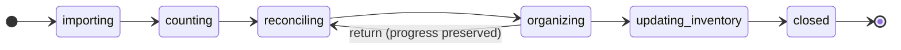

# Product Spec — Storyboard UI

**AIDLC phase:** Plan  
**Audience:** Product, engineering leads, stakeholders — **product language only** (no implementation or stack). Unresolved product questions should be **asked in chat** first; this file records **decisions** after they are made.

---

## Overview

| Field | Value |
|-------|-------|
| **Feature** | Storyboard UI — MVP views and navigation for demo |
| **Status** | Approved |
| **Author** | David Vezzani (with AI draft) |
| **Created** | 2026-06-12 |
| **Last updated** | 2026-06-12 |
| **Approved** | 2026-06-12 — David Vezzani |
| **Related Tech Spec** | [tech-spec.md](./tech-spec.md) — **Approved** |
| **Parent work item** | [GitHub issue #3](https://github.com/dcvezzani/brick-counter-coordinator-02/issues/3) |

## Problem & audience

### Problem statement

Brick Counter Coordinator has a working scaffold (hello landing page) but **no visible product surface** yet. Stakeholders and collaborators cannot walk through how a counting session works — from starting a part-out through counting, reconciliation, organizing, and inventory update — without reading diagrams or imagining the flow.

This Feature delivers **navigable MVP screens** wired together with **simple routing** and **fixture data**, so the team can storyboard the concept, gather feedback, and align on screen boundaries before building the coordinator server or BrickLink integration.

### Who it's for

- **Primary:** David (product owner) — needs a clickable demo to explain the workflow to others.
- **Secondary:** Future build agents and contributors — need a stable view map and navigation shell that production will extend, not throw away.
- **Tertiary:** Stakeholders (family, fellow builders, potential users) — need to understand the session lifecycle without backend setup.

### Current experience (baseline)

After `initial-setup`, the app shows only **hello** on `/`. There are no session views, no navigation chrome, no fixture data, and no way to preview how workers move through importing → counting → reconciling → organizing → updating inventory → closed (per [docs/session-phases-state.mmd](../../docs/session-phases-state.mmd)).

## Outcomes & business impact

### Desired outcomes

- A reviewer can open the dev app and **reach every MVP screen** without a backend or BrickLink account.
- Navigation reflects the **session phase relationships** from the state diagram — which screens exist, which nav items appear, and which route is the natural landing for each phase — even if transitions are simulated in storyboard mode.
- Each screen communicates **purpose and primary actions** at a glance (labels, section headings, placeholder content tied to real workflow steps).
- The hello-only home is replaced or upgraded into a **session hub** that starts or resumes a demo session and links into the flow.
- Stakeholders can follow a **coherent demo script** (start session → import part-out → count lots → reconcile → organize → export/complete) using fixture data.

### Success criteria (for Validate)

These tie directly to the **scorecard** in `/ship`. Each should be **testable** or **evidence-based** without reading code.

| # | Criterion | How we'll verify |
|---|-----------|------------------|
| 1 | All MVP views listed in Scope are reachable via in-app navigation or direct URL | Manual walkthrough or UI validation: visit each route; screenshot or MCP evidence per view |
| 2 | SessionNav visibility matches phase rules from the state diagram (hidden on import-only screen; Reconcile and Cups rules honored) | Demo session at each phase; nav items present/absent as specified |
| 3 | Phase-appropriate default landing routes work when entering a demo session at that phase | e.g. counting → lot entry; reconciling/updating_inventory → reconciliation; organizing → lots organizer mode |
| 4 | Closed session routes redirect to Home | Navigate to session URLs after marking complete; land on Home |
| 5 | No backend required | Fresh clone → `npm run dev` → full demo works offline with fixtures |
| 6 | Home no longer shows only literal hello | Home presents session hub content (start/resume demo, brief context) |

### Business impact

De-risks product direction before investing in the coordinator server and BrickLink APIs. Enables early feedback on screen boundaries, nav labels, and workflow order. No revenue impact — this is a **concept demo** milestone.

## User experience & scenarios

### Session lifecycle (product view)

The app supports a **coordinator-led counting session** that moves through phases. Storyboard mode **simulates** phase and session state with fixtures; live mode (future Features) will use the server.

*Source: [docs/session-phases-state.mmd](../../docs/session-phases-state.mmd)*

### MVP views and routes

Each row is one **storyboard screen** (one primary view component). Exact URL paths belong in Tech Spec; product intent is:

| View | Role in workflow | Phase(s) | Route intent (from state diagram) | SessionNav |
|------|------------------|----------|-----------------------------------|------------|
| **Home** | Start or resume a demo session; app entry when no active session | Pre-session, closed | `/` | N/A (not in session) |
| **New session** | Coordinator creates a session (set number, workers, part-out source) | Pre-import (submit → importing) | Linked from Home | Hidden until session exists |
| **Part-out import** | Confirm part-out list; begin counting | **importing** only | `/session/:id/import` | **Hidden** (only session-scoped screen in this phase) |
| **Lot entry** | Workers record counts into lots | **counting** (default landing) | Session lot form route | Visible: Home, Lot, Lots, Reconcile, Cups |
| **List lots** | Browse and inspect lots | counting, reconciling, organizing | Session lots list | Same nav set |
| **List cups** | Browse cups (physical sort containers) | counting through organizing; hidden in updating_inventory | Session cups list | Cups nav item |
| **Reconciliation** | Compare part-out lines vs lot counts; resolve discrepancies | **reconciling**, **updating_inventory** (post-join landing) | `/reconciliation` (session-scoped) | Reconcile visible; Cups per phase rules |
| **Organizer lots** | Pick lists — mark moved / needs location; complete lists | **organizing** (default landing) | `/lots?mode=organizer` (session-scoped) | Reconcile still visible; Cups available |

**SessionNav** (when visible): primary links — **Home**, **Lot**, **Lots**, **Reconcile**, **Cups** — matching the state diagram notes for counting through updating_inventory.

### Key scenarios

1. **Stakeholder demo — full happy path** — Given the storyboard app is running, when the coordinator starts a demo session from Home, confirms part-out import, records sample lots, opens reconciliation and resolves rows, switches to organizer pick lists, then marks ready to import and completes the session, then every step is reachable in order with understandable placeholder content and nav that matches the phase.

2. **Jump to a phase for focused review** — Given a demo session fixture, when the coordinator selects a phase (or opens a phase-specific entry link from Home), then the app lands on the correct default screen for that phase (lot form, reconciliation, or organizer lots) with appropriate SessionNav.

3. **Return from organizing to reconciling** — Given organizer progress exists, when the coordinator chooses to return to reconciling (storyboard control simulating the phase transition), then reconciliation is shown and organizer progress is still represented in fixture state (not silently discarded).

4. **Closed session cleanup** — Given a session is marked complete, when anyone navigates to session-scoped URLs, then they are redirected to Home.

5. **Import-only focus** — Given a session in importing phase, when the worker is on part-out import, then SessionNav is not shown and the screen stands alone until counting begins.

6. **Cups hidden late in session** — Given updating_inventory phase, when viewing reconciliation/export actions, then Cups is not offered in SessionNav (per state diagram).

### Experience principles

- **Story-order walkthrough:** The primary demo path follows the session lifecycle in order so the coordinator can **tell the story** while clicking through — start session → import → count → reconcile → organize → export/complete. Phase-advance controls move the demo forward; each step lands on the right screen for that chapter.
- **Reuse views across phases:** One screen may serve multiple phases when the state diagram says so (e.g. **Reconciliation** for both reconciling and updating_inventory). Phase changes what actions and copy are shown, not necessarily which route exists.
- **Demo-first, honest labels:** Screens say what they will do in production; placeholders are clearly sample data, not fake success states.
- **Phase-aware navigation:** Nav chrome reflects the state diagram — users learn the real workflow by clicking, not by reading the mmd file.
- **Simple paths:** Prefer obvious URLs and a small route table; avoid deep nesting or clever abstractions in storyboard mode.
- **Reuse for production:** Same view components and routes will later swap fixtures for API/WebSocket data — storyboard is not a throwaway prototype UI.
- **Accessible enough to review:** Headings, buttons, and nav items are readable and keyboard-reachable; full a11y audit is out of scope for MVP storyboard.

## Scope

### In scope

- MVP implementations (layout + headings + primary actions + fixture-driven sample content) for all views in the table above.
- **Vue Router** routes for each view, aligned to route intents in the state diagram.
- **SessionNav** component shown on session screens per phase rules.
- **Storyboard session state** — in-memory or fixture-backed demo session with configurable phase for demo jumps (mechanism in Tech Spec).
- **Fixture data** for at least one demo session: sample part-out lines, lots, cups, reconciliation rows, organizer pick lists.
- Replace or upgrade **Home** from literal hello to a session hub entry point.
- **Phase transition controls** for storyboard only (e.g. advance phase, return to reconciling) so demos do not require a backend.
- Minimal shadcn-vue components needed for credible placeholders (buttons, cards, tables/lists, nav).
- Unit tests for critical navigation behavior (e.g. closed redirect, nav visibility by phase) where cheap to add.
- Update README / PROJECT.md pointers in **Learn** (not required at Plan approval).

### Out of scope

- Coordinator Node.js server, WebSockets, and real persistence.
- BrickLink API calls, session-backed fetch, XML export implementation, or mass inventory update.
- Full form validation, retry logic, and error handling described for production (e.g. 422 invalid set, 3× fetch retry on import).
- Worker join flows, multi-device sync, and permissions.
- `config/app-preferences.json` loader and production behavior toggles (unless Design pulls in a minimal storyboard flag).
- Playwright e2e suite (optional stretch; MCP/manual validation acceptable).
- Pixel-perfect visual design, print layouts for pick lists, swipe-number input widget.
- Writing full `docs/view-specs/*.md` prose specs — those may come later; this Feature delivers **working screens** grounded in the existing state diagram.

### Dependencies on other teams or features

- **Depends on:** [initial-setup](../initial-setup/) (complete) — Vue scaffold, router, shadcn-vue toolchain, CI.
- **Informed by:** [docs/session-phases-state.mmd](../../docs/session-phases-state.mmd) and [docs/support/application-views.md](../../docs/support/application-views.md).
- **Blocks (softly):** Future coordinator server Feature — storyboard defines the UI contract to implement against.

## Constraints (non-technical where possible)

- Must follow AIDLC: Product Spec approval before `/design`.
- Parent work item links to `feature/storyboard-ui/`.
- Client remains **JavaScript** (no TypeScript in Vue SFCs) per [ADR-0001](../../adr/0001-frontend-vue-js-shadcn-stack.md).
- Storyboard uses **fixture/mock data only** — no secrets or live BrickLink credentials.
- BrickLink integration pattern (session-backed fetch, no iframes) applies to future live mode, not this Feature.
- Routing architecture stays **simple** — flat session routes where possible; query params only where the state diagram already specifies them (`mode=organizer`).

## Decisions (optional)

| Date | Decision |
|------|----------|
| 2026-06-12 | Feature slug: `storyboard-ui`. |
| 2026-06-12 | Source of truth for phase ↔ screen ↔ nav relationships: [docs/session-phases-state.mmd](../../docs/session-phases-state.mmd). |
| 2026-06-12 | Purpose: navigate and **demo the concept** to other people — not production-ready workflow enforcement. |
| 2026-06-12 | **View reuse OK** — shared routes across phases (e.g. Reconciliation for reconciling and updating_inventory) as long as the coordinator can walk through the app while narrating the intended workflow. |
| 2026-06-12 | **Story-order demo** — primary UX is phase-by-phase walkthrough with advance controls; direct URLs may exist for dev/review but are not the main stakeholder path. |
| 2026-06-12 | **Home** — replace literal hello with a session hub (start/resume demo, brief context); no requirement to keep hello copy. |
| 2026-06-12 | Parent issue [#3](https://github.com/dcvezzani/brick-counter-coordinator-02/issues/3) created with link to `feature/storyboard-ui/`. |
| 2026-06-12 | **Fixtures:** sample rows with plausible part IDs/names (enough to tell the story — not production BrickLink accuracy). |
| 2026-06-12 | **Demo session:** one fixed in-memory demo session, start/resume from Home (simplest narrative; no persist). |
| 2026-06-12 | Product Spec **approved** by David Vezzani. |

## Related documents

- Session phases: [docs/session-phases-state.mmd](../../docs/session-phases-state.mmd)
- Tech stack (storyboard vs live): [docs/tech-stack.md](../../docs/tech-stack.md)
- Prior feature: [feature/initial-setup/product-spec.md](../initial-setup/product-spec.md)
- AIDLC process: [docs/AIDLC.md](../../docs/AIDLC.md)
- Issue tracker: [AGENTS.md](../../AGENTS.md)
- ADR (frontend stack): [adr/0001-frontend-vue-js-shadcn-stack.md](../../adr/0001-frontend-vue-js-shadcn-stack.md)
