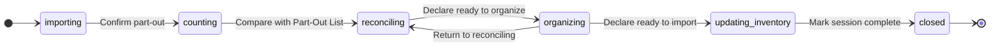

# Tech Spec — Unit 1: Storyboard views, routing, and demo session

**AIDLC phase:** Design (one **Unit** per Tech Spec)  
**Grounding:** Implements [product-spec.md](./product-spec.md) (approved 2026-06-12). Aligns with [ADR-0001](../../adr/0001-frontend-vue-js-shadcn-stack.md) and [docs/tech-stack.md](../../docs/tech-stack.md).

---

## Overview

| Field | Value |
|-------|-------|
| **Unit / scope** | MVP storyboard views, Vue Router map, SessionNav, in-memory demo session + fixtures, phase story controls |
| **Feature** | [storyboard-ui](./) · [GitHub issue #3](https://github.com/dcvezzani/brick-counter-coordinator-02/issues/3) |
| **Product Spec** | [product-spec.md](./product-spec.md) — **Approved** |
| **Status** | **Approved** |
| **Author** | David Vezzani (with AI draft) |
| **Created** | 2026-06-12 |
| **Last updated** | 2026-06-12 |
| **Approved** | 2026-06-12 — David Vezzani |

## Context

### Summary

Replace the hello-only landing with a **session hub** and **eight MVP views** wired through **Vue Router**, backed by a **fixed demo session** (`demo`) and **fixture data**. A small in-memory session module holds phase and sample entities; **SessionNav** and **storyboard phase controls** let the coordinator walk stakeholders through importing → counting → reconciling → organizing → updating inventory → closed without a backend.

Routes and nav rules are documented in [docs/support/application-views.md](../../docs/support/application-views.md) and grounded in [docs/session-phases-state.mmd](../../docs/session-phases-state.mmd).

### Existing system & documentation

| Artifact | Relevance |
|----------|-----------|
| [feature/initial-setup/tech-spec.md](../initial-setup/tech-spec.md) | Delivered scaffold: Vue 3, Router, Vitest, shadcn-vue toolchain, `views/` pattern |
| [ADR-0001](../../adr/0001-frontend-vue-js-shadcn-stack.md) | JS-only client, shadcn-vue, Vue Router |
| [docs/tech-stack.md](../../docs/tech-stack.md) | Storyboard vs live; `src/fixtures/`; route alignment to `application-views.md` |
| [docs/session-phases-state.mmd](../../docs/session-phases-state.mmd) | Phase ↔ screen ↔ nav source of truth |
| [docs/support/application-views.md](../../docs/support/application-views.md) | **Created by this Design** — canonical route map |
| [AGENTS.md](../../AGENTS.md) | UI validation at `http://localhost:5173` |

### Out of scope for this Unit

Per approved Product Spec:

- Coordinator server, WebSockets, persistence
- BrickLink fetch, XML export implementation, mass inventory update
- Production validation (422, retry logic, worker join)
- `config/app-preferences.json` / `app-config.js` loader
- Playwright e2e (optional stretch)
- Full `docs/view-specs/*.md` prose library
- Pinia or other state library (use composable module instead)

## Architecture

### High-level design

```
┌──────────────────────────────────────────────────────────────┐
│  Browser (Vue 3 SPA)                                          │
│                                                               │
│  HomeView ──start demo──▶ NewSessionView ──submit──▶ import   │
│       ▲                         │                             │
│       │                         └── creates session `demo`    │
│       │ closed redirect                                       │
│       │                                                       │
│  SessionLayout (+ SessionNav except import)                   │
│    ├── PartOutImportView     (importing, nav hidden)          │
│    ├── LotEntryView          (counting landing)               │
│    ├── ListLotsView          (lots / ?mode=organizer)         │
│    ├── ListCupsView                                           │
│    └── ReconciliationView    (reconciling + updating_inventory)│
│                                                               │
│  storyboard-session.js ◀── fixtures/demo-session.js           │
│  StoryboardPhaseControls (advance / return / complete)        │
└──────────────────────────────────────────────────────────────┘
         ▲
         │  Vite dev / static build — no HTTP API
```

### Session phase flow (storyboard)



### Integration points

| System | Contract | Notes |
|--------|----------|-------|
| None (storyboard) | N/A | Fixtures only; future coordinator replaces `storyboard-session.js` internals |

## Data

### In-memory demo session

Module: `src/lib/storyboard-session.js` — module-scoped reactive state (Vue `reactive` + exported functions). **No Pinia** for this Unit.

| Field | Type | Description |
|-------|------|-------------|
| `id` | string | Always `demo` for storyboard |
| `phase` | enum | `importing` \| `counting` \| `reconciling` \| `organizing` \| `updating_inventory` \| `closed` |
| `setNumber` | string | e.g. `"10281"` — display only |
| `partOutLines` | array | Sample part-out rows |
| `lots` | array | Sample lot entries |
| `cups` | array | Sample cup labels / counts |
| `reconciliationRows` | array | Part-out vs lot diff rows with `resolved` flag |
| `organizerLists` | array | Pick lists with line `moved` / `needsLocation` flags |

Seed from `src/fixtures/demo-session.js`. Mutations stay in memory for the browser tab lifetime.

### Exported functions (minimum)

| Function | Purpose |
|----------|---------|
| `getSession(sessionId)` | Return session or `null` |
| `createDemoSession({ setNumber })` | Reset/create demo session at `importing` |
| `setPhase(sessionId, phase)` | Set phase; used by controls |
| `advancePhase(sessionId)` | Storyboard: move to next phase in happy path |
| `returnToReconciling(sessionId)` | `organizing` → `reconciling` (preserve organizer state) |
| `markSessionComplete(sessionId)` | → `closed` |
| `landingRouteName(sessionId, phase)` | Router location for phase default |
| `sessionNavModel(sessionId)` | Which nav items visible for current phase |

### Fixture sample content

Plausible LEGO-ish rows (not BrickLink-accurate):

- Part IDs like `3001`, `3023`; colors `Red`, `Blue`; names `Brick 2×4`, `Plate 1×2`
- 3–5 part-out lines, 2–3 lots, 2 cups, reconciliation rows with at least one unresolved then resolved in demo flow
- One organizer pick list with movable lines

## APIs & contracts

No HTTP API in this Unit.

### UI route contract

See [docs/support/application-views.md](../../docs/support/application-views.md). Summary:

| Route | View |
|-------|------|
| `/` | `HomeView` |
| `/session/new` | `NewSessionView` |
| `/session/:sessionId/import` | `PartOutImportView` |
| `/session/:sessionId/lot` | `LotEntryView` |
| `/session/:sessionId/lots` | `ListLotsView` |
| `/session/:sessionId/cups` | `ListCupsView` |
| `/session/:sessionId/reconciliation` | `ReconciliationView` |

Query: `mode=organizer` on lots route selects organizer layout/actions.

### Router guards

| Guard | Behavior |
|-------|----------|
| Closed session | `beforeEnter` on `/session/:sessionId/*`: if phase is `closed`, redirect `/` |
| Missing session | Unknown `sessionId` (not `demo` after create): redirect `/` |
| Phase vs URL | **Do not block** — direct URLs allowed for dev/review (Product Spec). Primary CTAs advance phase **and** navigate to landing route. |

### SessionNav contract

Component: `src/components/SessionNav.vue`

Props: `sessionId`. Reads phase from `storyboard-session.js`.

| Phase | Nav bar | Cups item |
|-------|---------|-----------|
| `importing` | Hidden on import view (layout meta `hideSessionNav: true`) | — |
| `counting`–`organizing` | All five links | shown |
| `updating_inventory` | Home, Lot, Lots, Reconcile | **hidden** |

Active link styling via `vue-router` `router-link-active`.

### ReconciliationView modes

Same component; branch on `session.phase`:

| Phase | Sections / CTAs |
|-------|-----------------|
| `reconciling` | Diff table; stub **Resolve** per row; **Declare ready to organize** → `organizing` + navigate to organizer lots |
| `updating_inventory` | Export XML button (stub toast or label); **Mark session complete** → `closed` + redirect `/` |

### StoryboardPhaseControls

Component: `src/components/StoryboardPhaseControls.vue` — optional compact banner showing current phase (storyboard-only; visually distinct e.g. muted border + “Storyboard” label).

Embedded on views or via `SessionLayout`. Primary contextual buttons:

| View / phase | CTA |
|--------------|-----|
| PartOutImport | **Confirm and begin counting** → `counting` → `/lot` |
| LotEntry (counting) | **Compare with Part-Out List** → `reconciling` → `/reconciliation` |
| Reconciliation (reconciling) | **Declare ready to organize** → `organizing` → `/lots?mode=organizer` |
| ListLots (organizer) | **Declare ready to import** → `updating_inventory` → `/reconciliation`; **Return to reconciling** → `reconciling` |
| Reconciliation (updating_inventory) | **Mark session complete** → `closed` → `/` |

### HomeView (session hub)

Replace literal `hello`. Content:

- App title + one-line purpose
- **Start demo session** → `/session/new` or create demo inline → import
- **Resume demo** (if session exists and not closed) → phase landing route
- Optional **Jump to phase** `<select>` for stakeholder prep (sets phase + navigates to landing) — satisfies Product scenario 2

## UI / client

### Stack

Unchanged from initial-setup: Vue 3, Vite, Vue Router 4, Tailwind v4, shadcn-vue (JS), Vitest, Lucide optional on nav.

### shadcn-vue components to add (CLI)

Install via `npx shadcn-vue@latest add` as needed during Build:

| Component | Use |
|-----------|-----|
| `button` | CTAs, nav actions |
| `card` | View sections, hub tiles |
| `badge` | Phase label, row status |
| `table` | Part-out, lots, reconciliation lists (fallback: semantic `<table>` + Tailwind if CLI friction) |

Keep components under `src/components/ui/` per ADR-0001.

### Target repository layout (after Build)

```
src/
├── components/
│   ├── SessionNav.vue
│   ├── SessionNav.spec.js
│   ├── StoryboardPhaseControls.vue
│   ├── SessionLayout.vue
│   └── ui/                    # shadcn-vue CLI output
├── fixtures/
│   └── demo-session.js
├── lib/
│   ├── utils.js
│   └── storyboard-session.js
├── lib/storyboard-session.spec.js
├── router/
│   └── index.js               # full route table + guards
├── views/
│   ├── HomeView.vue
│   ├── HomeView.spec.js       # updated — hub, not hello
│   ├── NewSessionView.vue
│   ├── PartOutImportView.vue
│   ├── LotEntryView.vue
│   ├── ListLotsView.vue
│   ├── ListCupsView.vue
│   └── ReconciliationView.vue
└── router/index.spec.js       # closed redirect, optional
docs/support/application-views.md
```

Remove or rewrite `HomeView.spec.js` — must **not** assert `hello`.

### Router structure (nested session layout)

```javascript
// Conceptual — implement in src/router/index.js
{
  path: '/session/:sessionId',
  component: SessionLayout,
  children: [
    { path: 'import', component: PartOutImportView, meta: { hideSessionNav: true } },
    { path: 'lot', component: LotEntryView },
    { path: 'lots', component: ListLotsView },
    { path: 'cups', component: ListCupsView },
    { path: 'reconciliation', component: ReconciliationView },
  ],
}
```

Top-level: `/`, `/session/new`, catch-all → `/`.

## Security & privacy

- Static SPA; fixture data only; no secrets, cookies, or PII.
- Storyboard banner makes clear data is demo/sample.
- `.env` unchanged; no new env vars required.

## Acceptance criteria (for Review)

Review traces implementation to this spec and [application-views.md](../../docs/support/application-views.md).

- [ ] `npm run dev` — full demo path reachable without backend (Home → new → import → lot → reconcile → organizer → complete → Home).
- [ ] All eight views render distinct purpose headings and fixture-driven sample content.
- [ ] `SessionNav` hidden on `/session/demo/import`; visible on other session routes per phase rules.
- [ ] Cups nav hidden when phase is `updating_inventory`; Reconcile visible through `updating_inventory`.
- [ ] `ReconciliationView` shows reconciling vs updating_inventory actions based on phase (shared route).
- [ ] `ListLotsView` shows organizer actions when `?mode=organizer`; **Return to reconciling** preserves organizer fixture state.
- [ ] Closed session: navigating to `/session/demo/lot` redirects to `/`.
- [ ] Home is a session hub (no literal-only `hello`).
- [ ] Client remains JavaScript-only (no `lang="ts"`).
- [ ] `npm test` passes including updated `HomeView` spec + `SessionNav` or `storyboard-session` specs + router guard spec.
- [ ] `npm run build` succeeds; CI green on PR.
- [ ] [docs/support/application-views.md](../../docs/support/application-views.md) matches implemented routes.
- [ ] No coordinator server, Playwright, or `app-preferences.json` added.

## Testing approach

| Layer | What we prove | Notes |
|-------|----------------|-------|
| Unit | `storyboard-session.js` phase transitions, `sessionNavModel`, `landingRouteName` | `storyboard-session.spec.js` |
| Unit | `SessionNav` renders/hides Cups by phase | `SessionNav.spec.js` with stub session |
| Unit | `HomeView` shows hub content (not hello) | Update `HomeView.spec.js` |
| Router | Closed session redirect | `router/index.spec.js` — mount router, push session URL when closed |
| Integration | N/A | No API |
| E2E / manual | Full stakeholder walkthrough | Chrome DevTools MCP per `AGENTS.md` at Validate; screenshot per view optional |

Vitest `exclude: ['.claude/**']` unchanged.

**Test principles:** deterministic; mock `storyboard-session` where views are tested in isolation.

## Rollout & operations

### Rollout plan

- Feature branch `feature/storyboard-ui` → PR to `main`; no deploy.
- README: add link to storyboard-ui specs and note demo flow (Learn may expand).

### Monitoring & observability

N/A — local storyboard only.

### Rollback

Revert PR; no persisted state.

## Risks & open technical questions

| Risk / question | Mitigation or owner |
|-----------------|---------------------|
| shadcn `table` in JS mode | Fallback to styled HTML table + Card |
| Router guard + HMR edge cases | Unit test closed redirect; manual smoke |
| Phase/URL drift vs mmd | Single source: `application-views.md` + session module |
| `HomeView.spec.js` breaking change | Update in same PR as hub rewrite |
| Global session singleton vs multi-tab | Acceptable for storyboard; document in module header |

### Resolved decisions

| # | Decision | Resolved |
|---|----------|----------|
| 1 | Demo session ID | **`demo`** fixed constant |
| 2 | Session route prefix | **`/session/:sessionId/...`** for all session views (incl. reconciliation) |
| 3 | State management | **`src/lib/storyboard-session.js`** module reactive — no Pinia |
| 4 | Phase URL enforcement | **Guards for closed only**; CTAs drive story order |
| 5 | Reconciliation + updating_inventory | **One view**, phase-branched UI |
| 6 | Organizer mode | **`ListLotsView`** + `?mode=organizer` query |
| 7 | Route map doc | **`docs/support/application-views.md`** created at Design |
| 8 | Design gate | **Approved** 2026-06-12 — David Vezzani |

## Design review passes (merged findings)

### Architecture

- Single frontend Unit; no backend coupling — correct split from future coordinator Feature.
- Module singleton for demo session matches “one fixed in-memory demo” Product decision; swap internals later for API without changing view signatures much.
- Nested `SessionLayout` avoids duplicating SessionNav in every view.

### Frontend

- Aligns with ADR-0001 and existing `views/` + `@/` alias pattern.
- SessionNav + phase controls separated — reusable when live WebSocket updates phase.
- `application-views.md` satisfies tech-stack forward reference.

### Backend / API

- N/A. Future POST `/sessions/{id}/phase` maps to `setPhase` / coordinator events.

### Testing

- Add router + session module tests now that navigation is core — addresses initial-setup deferral note.
- MCP manual walkthrough covers Validate criteria #1–#3.

### CI / deploy

- Existing `.github/workflows/ci.yml` sufficient: `npm ci`, `npm test`, `npm run build` on PRs to `main`.
- No workflow changes required unless test count slows CI materially.

## Change history

| Date | Author | Changes |
|------|--------|---------|
| 2026-06-12 | AI draft | Initial Tech Spec Unit 1 + `application-views.md` |
| 2026-06-12 | David Vezzani | Status set to **Approved** (Design gate closed) |

## Related documents

- [product-spec.md](./product-spec.md)
- [docs/support/application-views.md](../../docs/support/application-views.md)
- [docs/session-phases-state.mmd](../../docs/session-phases-state.mmd)
- [docs/tech-stack.md](../../docs/tech-stack.md)
- [ADR-0001](../../adr/0001-frontend-vue-js-shadcn-stack.md)
- [feature/initial-setup/tech-spec.md](../initial-setup/tech-spec.md)
- [GitHub issue #3](https://github.com/dcvezzani/brick-counter-coordinator-02/issues/3)
