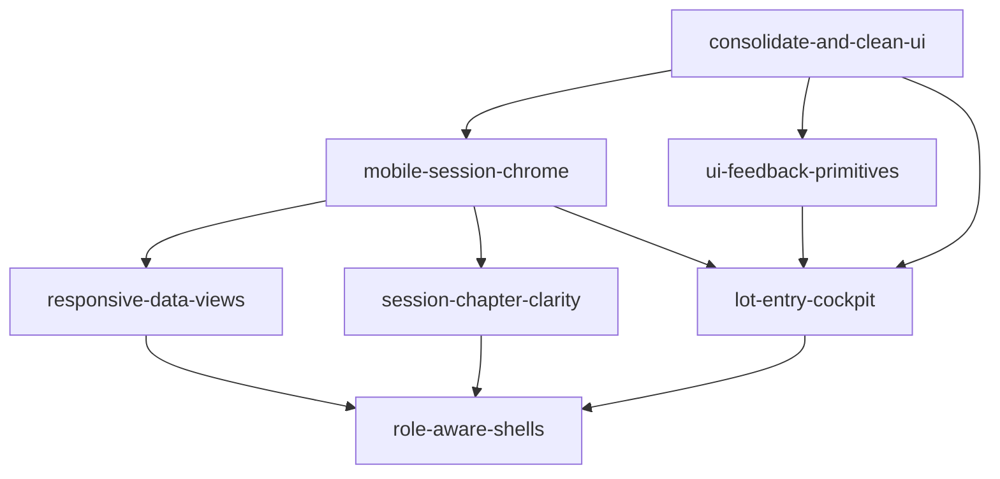

# UX feature roadmap

**Source:** [dcv/ux-concerns.md](../dcv/ux-concerns.md)  
**Last updated:** 2026-06-13  
**Session model:** [docs/session-phases-state.mmd](../docs/session-phases-state.mmd)

Maps UX review concerns and recommendations to AIDLC Features.

## Completed work (parallel UI fixes)

| Merged | Slug | Fix | Issue(s) | Branch | PR | Agent summary |
|--------|------|-----|----------|--------|-----|---------------|
| 2026-06-13 | `import-back-escape` | Back/cancel on Part-out import (concern 6) | [#6](https://github.com/dcvezzani/brick-counter-coordinator-02/issues/6) | `fix/import-back-escape` | [#13](https://github.com/dcvezzani/brick-counter-coordinator-02/pull/13) | [dcv/import-back-escape.md](../dcv/import-back-escape.md) |
| 2026-06-13 | `reconcile-chapter-touch` | Chapter step labels + ban `size="xs"` on Reconciliation resolve | [#6](https://github.com/dcvezzani/brick-counter-coordinator-02/issues/6), [#8](https://github.com/dcvezzani/brick-counter-coordinator-02/issues/8) | `fix/reconcile-chapter-touch` | [#12](https://github.com/dcvezzani/brick-counter-coordinator-02/pull/12) | [dcv/reconcile-chapter-touch.md](../dcv/reconcile-chapter-touch.md) |
| 2026-06-13 | `organizer-chapter-touch` | Organizer chapter labels, Lots nav badge + ban `size="xs"` on organizer rows | [#6](https://github.com/dcvezzani/brick-counter-coordinator-02/issues/6), [#8](https://github.com/dcvezzani/brick-counter-coordinator-02/issues/8) | `fix/organizer-chapter-touch` | [#14](https://github.com/dcvezzani/brick-counter-coordinator-02/pull/14) | [dcv/organizer-chapter-touch.md](../dcv/organizer-chapter-touch.md) |
| 2026-06-13 | `home-shadcn-forms` | shadcn Input/Select + FormField on Home and New session | [#5](https://github.com/dcvezzani/brick-counter-coordinator-02/issues/5) | `fix/home-shadcn-forms` | [#16](https://github.com/dcvezzani/brick-counter-coordinator-02/pull/16) | [dcv/home-shadcn-forms.md](../dcv/home-shadcn-forms.md) |
| 2026-06-13 | `import-sticky-cta` | Sticky "Confirm and begin counting" on Part-out import | [#6](https://github.com/dcvezzani/brick-counter-coordinator-02/issues/6) | `fix/import-sticky-cta` | [#15](https://github.com/dcvezzani/brick-counter-coordinator-02/pull/15) | [dcv/import-sticky-cta.md](../dcv/import-sticky-cta.md) |
| 2026-06-13 | `reconcile-sticky-cta` | Sticky phase CTAs on Reconciliation (reconciling + updating inventory) | [#6](https://github.com/dcvezzani/brick-counter-coordinator-02/issues/6) | `fix/reconcile-sticky-cta` | [#17](https://github.com/dcvezzani/brick-counter-coordinator-02/pull/17) | [dcv/reconcile-sticky-cta.md](../dcv/reconcile-sticky-cta.md) |

## Active work (parallel UI fixes — round 3)

| Status | Slug | Fix | Issue(s) | Branch | PR | Agent summary |
|--------|------|-----|----------|--------|-----|---------------|
| 🔄 In progress | `lot-entry-sticky-cta` | Sticky "Compare with Part-Out List" on Lot entry | [#6](https://github.com/dcvezzani/brick-counter-coordinator-02/issues/6) | `fix/lot-entry-sticky-cta` | — | [dcv/lot-entry-sticky-cta.md](../dcv/lot-entry-sticky-cta.md) |
| 🔄 In progress | `lots-sticky-cta` | Sticky organizer phase CTAs on List lots | [#6](https://github.com/dcvezzani/brick-counter-coordinator-02/issues/6) | `fix/lots-sticky-cta` | — | [dcv/lots-sticky-cta.md](../dcv/lots-sticky-cta.md) |
| 🔄 In progress | `session-progress-strip` | Minimal `SessionProgress` on SessionLayout | [#6](https://github.com/dcvezzani/brick-counter-coordinator-02/issues/6) | `fix/session-progress-strip` | — | [dcv/session-progress-strip.md](../dcv/session-progress-strip.md) |

Plan: [dcv/round-3-plan.md](../dcv/round-3-plan.md)

Each row is a separate `feature/<slug>/` folder with a Product Spec (Plan) and eventual Tech Spec (Design).

## Feature index

| Priority | Slug | Feature | GitHub issue | Addresses (concerns) |
|----------|------|---------|--------------|----------------------|
| — | `consolidate-and-clean-ui` | Shared view chrome, forms, tables baseline | [#5](https://github.com/dcvezzani/brick-counter-coordinator-02/issues/5) | 9; foundation for 7, 8 |
| **P0** | `mobile-session-chrome` | Responsive nav, sticky phase CTAs, progress strip, touch targets | [#6](https://github.com/dcvezzani/brick-counter-coordinator-02/issues/6) | 1, 3, 4, 6, 7, 8; patterns A, B, C, H |
| **P1** | `responsive-data-views` | Table on laptop, card/list + sheet on phone | [#7](https://github.com/dcvezzani/brick-counter-coordinator-02/issues/7) | 2; pattern D |
| **P1** | `ui-feedback-primitives` | Toasts, confirm dialogs, alerts, loading skeletons | [#9](https://github.com/dcvezzani/brick-counter-coordinator-02/issues/9) | 9 (feedback); pattern G |
| **P2** | `session-chapter-clarity` | Chapter labels on shared routes and organizer mode | [#8](https://github.com/dcvezzani/brick-counter-coordinator-02/issues/8) | 5; pattern F |
| **P2** | `lot-entry-cockpit` | Mobile-first counting screen | [#10](https://github.com/dcvezzani/brick-counter-coordinator-02/issues/10) | 2, 7; pattern E |
| **P3** | `role-aware-shells` | Coordinator vs worker layout taxonomy | [#11](https://github.com/dcvezzani/brick-counter-coordinator-02/issues/11) | 10; screen taxonomy |

## Recommended delivery order

1. **consolidate-and-clean-ui** — `ViewFrame`, `ViewHeader`, `ViewSubnav`, `FormField`, shadcn inputs, `DataTable` baseline.
2. **mobile-session-chrome** — Makes session usable on phones (nav, sticky gates, progress).
3. **ui-feedback-primitives** — Can run in parallel with (2); toasts and confirm for export/complete flows.
4. **responsive-data-views** — After shared table/list components exist.
5. **session-chapter-clarity** — Lightweight; can ship with (2) or (4) if desired.
6. **lot-entry-cockpit** — Largest P2; depends on mobile chrome and form primitives.
7. **role-aware-shells** — Caps the taxonomy once shells are proven in (2) and (6).

## Concern → feature mapping

| # | Concern | Primary feature(s) |
|---|---------|-------------------|
| 1 | Horizontal nav fails on mobile | `mobile-session-chrome` |
| 2 | Tables wrong for phone | `responsive-data-views`, `lot-entry-cockpit` |
| 3 | Phase CTAs below scroll | `mobile-session-chrome` |
| 4 | No session progress UI | `mobile-session-chrome` |
| 5 | Same route, different chapter | `session-chapter-clarity` |
| 6 | Import has no escape | `mobile-session-chrome` |
| 7 | Chrome eats vertical space | `mobile-session-chrome`, `lot-entry-cockpit` |
| 8 | Desktop-first assumptions | `mobile-session-chrome`, `ui-rules.md` responsive section |
| 9 | Raw form controls | `consolidate-and-clean-ui`, `ui-feedback-primitives` |
| 10 | Persona collapse | `role-aware-shells` |

## Docs to update as Features ship

| Doc | When |
|-----|------|
| [docs/ui-rules.md](../docs/ui-rules.md) | After `mobile-session-chrome` — responsive & workflow section |
| [docs/support/application-views.md](../docs/support/application-views.md) | If nav presentation changes (not route rules) |
| [PROJECT.md](../PROJECT.md) | After each Feature Validate PASS |
