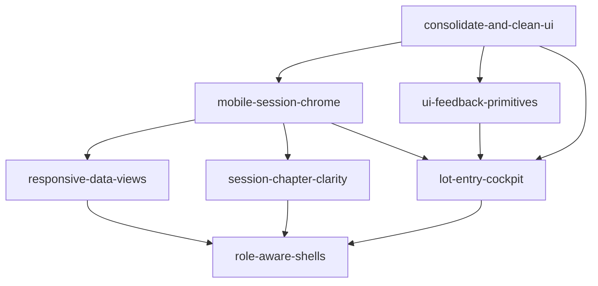

# UX feature roadmap

**Source:** [dcv/ux-concerns.md](../dcv/ux-concerns.md)  
**Last updated:** 2026-06-14  
**Session model:** [docs/session-phases-state.mmd](../docs/session-phases-state.mmd)

Maps UX review concerns and recommendations to AIDLC Features.

## Completed work (parallel UI fixes)

| Merged | Slug | Fix | Issue(s) | Branch | PR | Agent summary |
|--------|------|-----|----------|--------|-----|---------------|
| 2026-06-13 | `import-back-escape` | Back/cancel on Part-out import (concern 6) | [#6](https://github.com/dcvezzani/brick-counter-coordinator-02/issues/6) | `fix/import-back-escape` | [#13](https://github.com/dcvezzani/brick-counter-coordinator-02/pull/13) | [dcv/import-back-escape.md](../dcv/import-back-escape.md) |
| 2026-06-13 | `reconcile-chapter-touch` | Chapter step labels + ban `size="xs"` on Reconciliation resolve | [#6](https://github.com/dcvezzani/brick-counter-coordinator-02/issues/6), [#8](https://github.com/dcvezzani/brick-counter-coordinator-02/issues/8) | `fix/reconcile-chapter-touch` | [#12](https://github.com/dcvezzani/brick-counter-coordinator-02/pull/12) | [dcv/reconcile-chapter-touch.md](../dcv/reconcile-chapter-touch.md) |
| 2026-06-13 | `organizer-chapter-touch` | Organizer chapter labels, Lots nav badge + ban `size="xs"` on organizer rows | [#6](https://github.com/dcvezzani/brick-counter-coordinator-02/issues/6), [#8](https://github.com/dcvezzani/brick-counter-coordinator-02/issues/8) | `fix/organizer-chapter-touch` | [#14](https://github.com/dcvezzani/brick-counter-coordinator-02/pull/14) | [dcv/organizer-chapter-touch.md](../dcv/organizer-chapter-touch.md) |
| 2026-06-13 | `home-shadcn-forms` | shadcn Input/Select + FormField on Home and New session | [#5](https://github.com/dcvezzani/brick-counter-coordinator-02/issues/5) | `fix/home-shadcn-forms` | [#16](https://github.com/dcvezzani/brick-counter-coordinator-02/pull/16) | [dcv/home-shadcn-forms.md](../dcv/home-shadcn-forms.md) |
| 2026-06-13 | `import-sticky-cta` | Sticky "Confirm and begin counting" on Part-out import | [#6](https://github.com/dcvezzani/brick-counter-coordinator-02/issues/6) | `fix/import-sticky-cta` | [#15](https://github.com/dcvezzani/brick-counter-coordinator-02/pull/15) | [dcv/import-sticky-cta.md](../dcv/import-sticky-cta.md) |
| 2026-06-13 | `reconcile-sticky-cta` | Sticky phase CTAs on Reconciliation (reconciling + updating inventory) | [#6](https://github.com/dcvezzani/brick-counter-coordinator-02/issues/6) | `fix/reconcile-sticky-cta` | [#17](https://github.com/dcvezzani/brick-counter-coordinator-02/pull/17) | [dcv/reconcile-sticky-cta.md](../dcv/reconcile-sticky-cta.md) |
| 2026-06-13 | `lot-entry-sticky-cta` | Sticky "Compare with Part-Out List" on Lot entry | [#6](https://github.com/dcvezzani/brick-counter-coordinator-02/issues/6) | `fix/lot-entry-sticky-cta` | [#18](https://github.com/dcvezzani/brick-counter-coordinator-02/pull/18) | [dcv/lot-entry-sticky-cta.md](../dcv/lot-entry-sticky-cta.md) |
| 2026-06-13 | `lots-sticky-cta` | Sticky organizer phase CTAs on List lots | [#6](https://github.com/dcvezzani/brick-counter-coordinator-02/issues/6) | `fix/lots-sticky-cta` | [#19](https://github.com/dcvezzani/brick-counter-coordinator-02/pull/19) | [dcv/lots-sticky-cta.md](../dcv/lots-sticky-cta.md) |
| 2026-06-13 | `session-progress-strip` | Minimal `SessionProgress` on SessionLayout | [#6](https://github.com/dcvezzani/brick-counter-coordinator-02/issues/6) | `fix/session-progress-strip` | [#20](https://github.com/dcvezzani/brick-counter-coordinator-02/pull/20) | [dcv/session-progress-strip.md](../dcv/session-progress-strip.md) |
| 2026-06-13 | `session-nav-bottom-bar` | Responsive bottom session nav on mobile | [#6](https://github.com/dcvezzani/brick-counter-coordinator-02/issues/6) | `fix/session-nav-bottom-bar` | [#21](https://github.com/dcvezzani/brick-counter-coordinator-02/pull/21) | [dcv/session-nav-bottom-bar.md](../dcv/session-nav-bottom-bar.md) |
| 2026-06-13 | `session-layout-safe-area` | Safe-area padding + mobile nav clearance on SessionLayout | [#6](https://github.com/dcvezzani/brick-counter-coordinator-02/issues/6) | `fix/session-layout-safe-area` | [#22](https://github.com/dcvezzani/brick-counter-coordinator-02/pull/22) | [dcv/session-layout-safe-area.md](../dcv/session-layout-safe-area.md) |
| 2026-06-13 | `import-responsive-cards` | Part-out import table → card list on mobile | [#7](https://github.com/dcvezzani/brick-counter-coordinator-02/issues/7) | `fix/import-responsive-cards` | [#23](https://github.com/dcvezzani/brick-counter-coordinator-02/pull/23) | [dcv/import-responsive-cards.md](../dcv/import-responsive-cards.md) |
| 2026-06-13 | `home-view-frame` | Shared `ViewFrame` + wrap Home marketing shell | [#5](https://github.com/dcvezzani/brick-counter-coordinator-02/issues/5) | `fix/home-view-frame` | [#27](https://github.com/dcvezzani/brick-counter-coordinator-02/pull/27) | [dcv/home-view-frame.md](../dcv/home-view-frame.md) |
| 2026-06-13 | `new-session-view-frame` | Wrap New session in `ViewFrame` | [#5](https://github.com/dcvezzani/brick-counter-coordinator-02/issues/5) | `fix/new-session-view-frame` | [#25](https://github.com/dcvezzani/brick-counter-coordinator-02/pull/25) | [dcv/new-session-view-frame.md](../dcv/new-session-view-frame.md) |
| 2026-06-13 | `reconcile-responsive-cards` | Reconciliation resolve rows: table on laptop, cards on phone | [#7](https://github.com/dcvezzani/brick-counter-coordinator-02/issues/7) | `fix/reconcile-responsive-cards` | [#24](https://github.com/dcvezzani/brick-counter-coordinator-02/pull/24) | [dcv/reconcile-responsive-cards.md](../dcv/reconcile-responsive-cards.md) |
| 2026-06-13 | `lots-responsive-cards` | Lots browse + organizer tables → mobile card rows | [#7](https://github.com/dcvezzani/brick-counter-coordinator-02/issues/7) | `fix/lots-responsive-cards` | [#29](https://github.com/dcvezzani/brick-counter-coordinator-02/pull/29) | [dcv/lots-responsive-cards.md](../dcv/lots-responsive-cards.md) |
| 2026-06-13 | `lot-entry-responsive` | Lot entry table → mobile card list | [#10](https://github.com/dcvezzani/brick-counter-coordinator-02/issues/10) | `fix/lot-entry-responsive` | [#28](https://github.com/dcvezzani/brick-counter-coordinator-02/pull/28) | [dcv/lot-entry-responsive.md](../dcv/lot-entry-responsive.md) |
| 2026-06-13 | `cups-sticky-cta` | Sticky footer CTA on List cups (return to counting) | [#6](https://github.com/dcvezzani/brick-counter-coordinator-02/issues/6) | `fix/cups-sticky-cta` | [#26](https://github.com/dcvezzani/brick-counter-coordinator-02/pull/26) | [dcv/cups-sticky-cta.md](../dcv/cups-sticky-cta.md) |
| 2026-06-14 | `ui-feedback-primitives` | Toasts, confirm wrapper, alert/skeleton baseline + export toast | [#9](https://github.com/dcvezzani/brick-counter-coordinator-02/issues/9) | `feature/ui-feedback-primitives` | [#55](https://github.com/dcvezzani/brick-counter-coordinator-02/pull/55) | [validate-scorecard.md](ui-feedback-primitives/validate-scorecard.md) |

## Active work (parallel UI fixes)

| Status | Slug | Fix | Issue(s) | Branch | PR | Agent summary |
|--------|------|-----|----------|--------|-----|---------------|
| — | — | _Next: `acknowledge-mission-complete` ([#54](https://github.com/dcvezzani/brick-counter-coordinator-02/issues/54)) or `lot-entry-cockpit` ([#10](https://github.com/dcvezzani/brick-counter-coordinator-02/issues/10))_ | — | — | — | — |

## Issue #5 child features (Plan — docs created 2026-06-13)

Parent: [#5 Consolidate and clean UI](https://github.com/dcvezzani/brick-counter-coordinator-02/issues/5) · [product-spec.md](00-shipped/consolidate-and-clean-ui/product-spec.md) — **Complete**

| Phase | Slug | GitHub | Product Spec |
|-------|------|--------|--------------|
| Primitives | `view-header` | [#30](https://github.com/dcvezzani/brick-counter-coordinator-02/issues/30) | [product-spec.md](00-shipped/view-header/product-spec.md) |
| Primitives | `view-actions` | [#31](https://github.com/dcvezzani/brick-counter-coordinator-02/issues/31) | [product-spec.md](00-shipped/view-actions/product-spec.md) |
| Primitives | `session-view-frame` | [#32](https://github.com/dcvezzani/brick-counter-coordinator-02/issues/32) | [product-spec.md](00-shipped/session-view-frame/product-spec.md) |
| Primitives | `responsive-data-table` | [#33](https://github.com/dcvezzani/brick-counter-coordinator-02/issues/33) | [product-spec.md](00-shipped/responsive-data-table/product-spec.md) |
| Migration | `migrate-import-view` | [#34](https://github.com/dcvezzani/brick-counter-coordinator-02/issues/34) | [product-spec.md](00-shipped/migrate-import-view/product-spec.md) |
| Migration | `migrate-cups-view` | [#35](https://github.com/dcvezzani/brick-counter-coordinator-02/issues/35) | [product-spec.md](00-shipped/migrate-cups-view/product-spec.md) |
| Migration | `migrate-lot-entry-view` | [#36](https://github.com/dcvezzani/brick-counter-coordinator-02/issues/36) | [product-spec.md](00-shipped/migrate-lot-entry-view/product-spec.md) |
| Migration | `migrate-lots-view` | [#37](https://github.com/dcvezzani/brick-counter-coordinator-02/issues/37) | [product-spec.md](00-shipped/migrate-lots-view/product-spec.md) |
| Migration | `migrate-reconciliation-view` | [#38](https://github.com/dcvezzani/brick-counter-coordinator-02/issues/38) | [product-spec.md](00-shipped/migrate-reconciliation-view/product-spec.md) |
| Closeout | `ui-rules-publish` | [#39](https://github.com/dcvezzani/brick-counter-coordinator-02/issues/39) | [product-spec.md](00-shipped/ui-rules-publish/product-spec.md) |
| Closeout | `consolidate-ui-validate` | [#40](https://github.com/dcvezzani/brick-counter-coordinator-02/issues/40) | [product-spec.md](00-shipped/consolidate-ui-validate/product-spec.md) |

All shipped via integration [PR #52](https://github.com/dcvezzani/brick-counter-coordinator-02/pull/52).

## Feature index

| Priority | Slug | Feature | GitHub issue | Addresses (concerns) |
|----------|------|---------|--------------|----------------------|
| — | `consolidate-and-clean-ui` | Shared view chrome, forms, tables baseline | [#5](https://github.com/dcvezzani/brick-counter-coordinator-02/issues/5) — **Complete** | 9; foundation for 7, 8 |
| — | `mobile-session-chrome` | Responsive nav, sticky phase CTAs, progress strip, touch targets | [#6](https://github.com/dcvezzani/brick-counter-coordinator-02/issues/6) — **Complete** | 1, 3, 4, 6, 7, 8; patterns A, B, C, H |
| — | `responsive-data-views` | Table on laptop, card/list + sheet on phone | [#7](https://github.com/dcvezzani/brick-counter-coordinator-02/issues/7) — **Complete** | 2 (tabular views); pattern D |
| — | `session-chapter-clarity` | Chapter labels on shared routes and organizer mode | [#8](https://github.com/dcvezzani/brick-counter-coordinator-02/issues/8) — **Complete** | 5; pattern F |
| — | `ui-feedback-primitives` | Toasts, confirm dialogs, alerts, loading skeletons | [#9](https://github.com/dcvezzani/brick-counter-coordinator-02/issues/9) — **Complete** | 9 (feedback); pattern G |
| **P2** | `lot-entry-cockpit` | Mobile-first counting screen | [#10](https://github.com/dcvezzani/brick-counter-coordinator-02/issues/10) | 2, 7; pattern E |
| **P3** | `role-aware-shells` | Coordinator vs worker layout taxonomy | [#11](https://github.com/dcvezzani/brick-counter-coordinator-02/issues/11) | 10; screen taxonomy |

**Shipped:** [#6](https://github.com/dcvezzani/brick-counter-coordinator-02/issues/6)–[#8](https://github.com/dcvezzani/brick-counter-coordinator-02/issues/8) closed 2026-06-13; [#5](https://github.com/dcvezzani/brick-counter-coordinator-02/issues/5) via [PR #52](https://github.com/dcvezzani/brick-counter-coordinator-02/pull/52); [#9](https://github.com/dcvezzani/brick-counter-coordinator-02/issues/9) via [PR #55](https://github.com/dcvezzani/brick-counter-coordinator-02/pull/55) (2026-06-14).

## Recommended delivery order

1. ~~**consolidate-and-clean-ui**~~ — **Complete.** `ViewFrame`, `ViewHeader`, `ViewSubnav`, `FormField`, shadcn inputs, `ResponsiveDataTable` baseline.
2. ~~**mobile-session-chrome**~~ — **Complete.** Session usable on phones (nav, sticky gates, progress).
3. ~~**ui-feedback-primitives**~~ — **Complete.** Toasts, `ConfirmDialog`, alert/skeleton baseline; export stub toast; unblocks [#54](https://github.com/dcvezzani/brick-counter-coordinator-02/issues/54).
4. ~~**responsive-data-views**~~ — **Complete.** Shared table/list components on all tabular session views.
5. ~~**session-chapter-clarity**~~ — **Complete.** Chapter badges on reconciliation and organizer routes.
6. **lot-entry-cockpit** — Largest remaining P2; depends on (2) and (3).
7. **role-aware-shells** — Caps the taxonomy once shells are proven in (2) and (6).

## Concern → feature mapping

| # | Concern | Primary feature(s) | Status |
|---|---------|-------------------|--------|
| 1 | Horizontal nav fails on mobile | `mobile-session-chrome` | Addressed |
| 2 | Tables wrong for phone | `responsive-data-views`, `lot-entry-cockpit` | Partial — tabular views done; counting cockpit remains |
| 3 | Phase CTAs below scroll | `mobile-session-chrome` | Addressed |
| 4 | No session progress UI | `mobile-session-chrome` | Addressed |
| 5 | Same route, different chapter | `session-chapter-clarity` | Addressed |
| 6 | Import has no escape | `mobile-session-chrome` | Addressed |
| 7 | Chrome eats vertical space | `mobile-session-chrome`, `lot-entry-cockpit` | Partial — session chrome done; worker counting screen remains |
| 8 | Desktop-first assumptions | `mobile-session-chrome`, `ui-rules.md` responsive section | Addressed |
| 9 | Raw form controls / missing feedback | `consolidate-and-clean-ui`, `ui-feedback-primitives` | Addressed |
| 10 | Persona collapse | `role-aware-shells` | Open |

## Docs to update as Features ship

| Doc | When | Status |
|-----|------|--------|
| [docs/ui-rules.md](../docs/ui-rules.md) | After `mobile-session-chrome` — responsive & workflow section | **Done** (published 2026-06-13 via #39) |
| [docs/support/application-views.md](../docs/support/application-views.md) | If nav presentation changes (not route rules) | **Done** (2026-06-14 — session chrome + chapter labels) |
| [PROJECT.md](../PROJECT.md) | After each Feature Validate PASS | **Done** (2026-06-14 — #6–#8, #9 recorded) |
